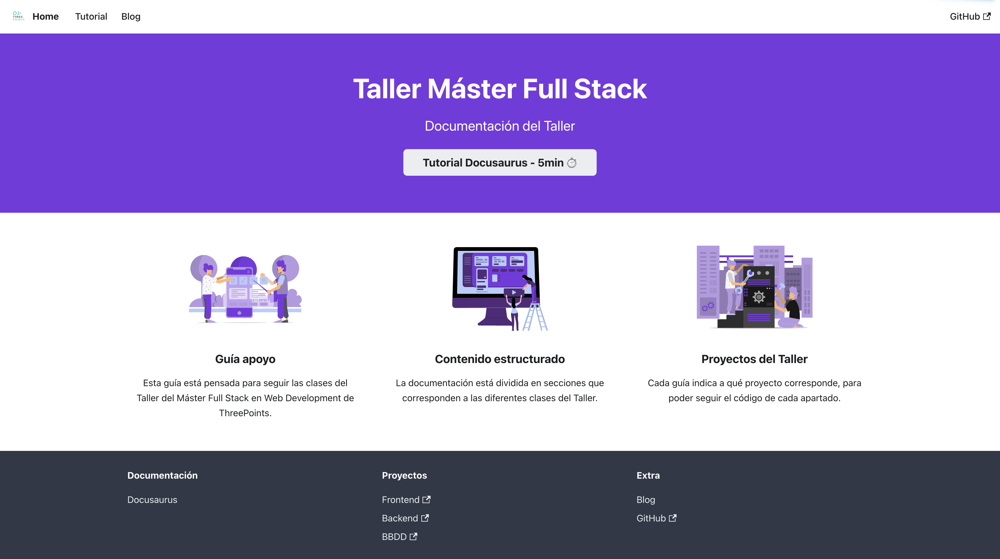

# Documentación



Esta guía se ha construido gracias a[Docusaurus 2](https://docusaurus.io/), un generador de páginas web estático.

## Instalación

Para instalar las dependencias solo hay que ejecutar

``` bash
npm install
```

### Desarrollo local

Para crear un entorno de desarrollo local, ejecuta el siguiente comando:

``` bash
npm run start
```

Este comando lanza un servidor de desarrollo local y abre una ventana del navegarod. La mayoría de cambios se auto-recargan sin necesidad de reiniciar el servidor.

### Compilar

``` bash
npm run build
```

Este comando genera un contenido estático en la carpeta `build` que puede ser utilizado en cualquier servicio de hosting.
