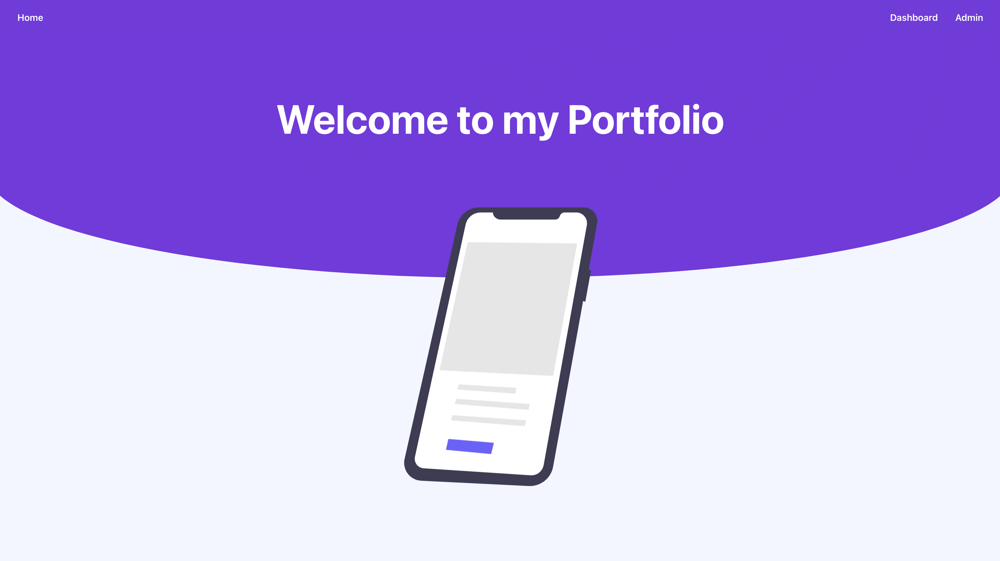

Como ya comentamos, esta documentación sirve como apoyo para el **Taller Proyecto Web** del Máster Full Stack.

Aquí pondremos la documentación pertinente para complementar lo visto en los distintos proyectos:

* [FrontEnd](https://github.com/lucferbux/Taller-FrontEnd)
* [BackEnd](https://github.com/lucferbux/Taller-Backend)
* [BBDD](https://github.com/lucferbux/Taller-BBDD)
* [Firebase](https://github.com/lucferbux/Taller-Firebase)
* [Testing & Security](https://github.com/lucferbux/Taller-Testing-Security)
* [Contenedores y orquestación](https://github.com/lucferbux/Taller-Containerization)
* [CI/CD](https://github.com/lucferbux/Taller-Containerization)

Así podréis consultar detalles como arquitectura, funcionalidades, dependencias y despliegues que mostramos en clase.

¡Espero que os guste!. Y como siempre, si encontráis errores o mejoras, podéis abrir una [issue](https://github.com/lucferbux/Taller-Docusaurus/issues) o proponer una [pull request](https://github.com/lucferbux/Taller-Docusaurus/pulls).
