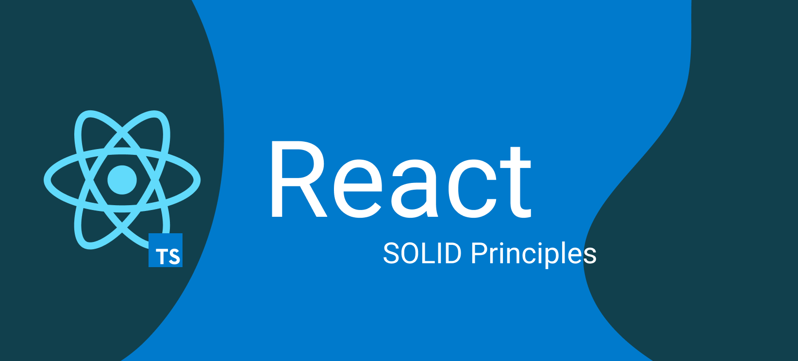

En este post vamos a explicar algunas buenas prácticas que podemos aplicar en React. Estas buenas prácticas son recomendaciones que nos ayudarán a tener un código más limpio, más legible y más fácil de mantener.
Vamos a dividir el post en dos secciones. La primera sección será sobre los principios SOLID y la segunda sobre buenas prácticas en React. Así tendremos una parte más focalizada a principios y otra más a checklist the buenas prácticas que podemos tener en mente.

## Principios SOLID

En el mundo del desarrollo de software, siempre buscamos seguir buenas prácticas y principios para crear aplicaciones escalables, mantenibles y robustas. Uno de los conjuntos de principios más conocidos y ampliamente adoptados es SOLID, propuesto por Robert C. Martin. Estos principios ayudan a los desarrolladores a diseñar código de alta calidad y fácil de mantener. En este artículo, exploraremos cómo aplicar los principios SOLID en el contexto de React y proporcionaremos ejemplos de cómo aplicarlos en componentes funcionales tipados.

### Principio de Responsabilidad Única (SRP)

Un componente debe tener una única responsabilidad y propósito. Al utilizar componentes funcionales y TypeScript, podemos lograr fácilmente este principio.

```tsx
// Antes: Un componente que maneja la entrada de texto y la validación
const InputWithValidation: React.FC = () => {
  /* código de validación y renderizado */
}

// Después: Separar en dos componentes
const TextInput: React.FC = () => {
  /* solo renderizado de entrada de texto */
}

const InputValidation: React.FC = () => {
  /* solo validación */
}
```

### Principio de abierto / cerrado (OCP)

Los componentes deben estar abiertos para extenderse pero cerrados para modificarse. Esto significa que no debe ser necesario modificar un componente existente para extenderlo. En su lugar, podemos crear un nuevo componente que extienda el comportamiento del componente existente.

```tsx
// Antes: Un componente cerrado para modificación
// Button.tsx
import React from 'react';

interface ButtonProps {
  onClick: () => void;
  label: string;
}

const Button: React.FC<ButtonProps> = ({ onClick, label }) => {
  return (
    <button onClick={onClick}>
      {label}
    </button>
  );
};

export default Button;

// Después: Un componente abierto para extensión
import React from 'react';
import Button from './Button';

interface IconButtonProps extends ButtonProps {
  icon: string;
}

const IconButton: React.FC<IconButtonProps> = ({ onClick, label, icon }) => {
  return (
    <Button onClick={onClick} label={label}>
      <span className="icon">{icon}</span>
    </Button>
  );
};

export default IconButton;
```

### Principio de sustitución de Liskov (LSP)

Los componentes deben poder ser reemplazados por sus subtipos sin alterar el comportamiento del programa. Esto significa que los componentes deben ser intercambiables con sus subtipos sin afectar el comportamiento de la aplicación. En el caso de componentes funcionales y TypeScript, podemos lograr esto utilizando la composición en lugar de la herencia.

```tsx
// Componente base
interface ButtonProps {
  className?: string;
}

const Button: React.FC<ButtonProps> = (props) => {
  /* código del componente base */
}

// Componente derivado
const IconButton: React.FC<ButtonProps> = (props) => {
  return <Button {...props} />;
}
```

### Principio de segregación de interfaz (ISP)

Una entidad no debe verse obligada a depender de interfaces que no utiliza. En React y TypeScript, esto se traduce en no pasar props innecesarias a los componentes.

```tsx
// Antes: Pasar props innecesarias
interface Person {
  name: string;
  age: number;
  address: string;
}

interface PersonComponentProps {
  person: Person;
}

function PersonComponent(props: PersonComponentProps) {
  return (
    <div>
      <div>{props.person.name}</div>
      <div>{props.person.age}</div>
    </div>
  );
}

// Después: Pasar solo las props necesarias
interface PersonComponentProps {
  name: string;
  age: number;
}

function PersonComponent(props: PersonComponentProps) {
  return (
    <div>
      <div>{props.name}</div>
      <div>{props.age}</div>
    </div>
  );
}
```

### Principio de inversión de dependencia (DIP)

Los componentes de alto nivel no deben depender de los componentes de bajo nivel. Ambos deben depender de abstracciones. En React y TypeScript, esto significa que los componentes de alto nivel no deben depender de los componentes de bajo nivel. En su lugar, ambos deben depender de abstracciones como interfaces o tipos.

```tsx
// Antes: Componente de alto nivel depende de componente de bajo nivel
import api from '~/common/api'

const DashboardComponent = () => {
    const [data, setData] = useState([]);

    useEffect(() => {
        api.get('/dashboard').then((response) => {
            setData(response.data);
        });
    }, []);

    return (
        <div>
            {data.map((item) => (
                <div>{item.name}</div>
            ))}
        </div>
    );
}

// Después: Ambos componentes dependen de una abstracción
const DashboardComponent = () => {
    const { data, isLoading, error } = useFetchData(apiClient.getDashboardInfo);

    if (isLoading) {
        return <div>Loading...</div>;
    }

    if (error) {
        return <div>Error: {error.message}</div>;
    }

    return (
        <div>
            {data.map((item) => (
                <div>{item.name}</div>
            ))}
        </div>
    );
}
```

## Buenas prácticas en React

Esta lista está conformada con elementos que usamos en nuestro equipo de desarrollo y que nos han ayudado a tener un código más limpio y fácil de mantener. No es una lista exhaustiva, pero espero que os sirva para mejorar la calidad de viestro código.

* Verificar las declaraciones para ignorar de eslint: A veces queremos estas declaraciones (por ejemplo, para logs en consola intencionales), pero lo más probable es que estemos saltándono una buena práctica.

  * No ignorar los errores de dependencia de los React hooks.

  * No hacer uso del tip `any`` sin una muy buena razón (debe estar comentado encima de la declaración de ignorar).

* Verificar las siguientes peculiaridades de React y TypeScript:.

  * `as` es una palabra clave problemática: esto probablemente signifique que estás violando la asistencia de TypeScript y, por lo tanto, probablemente tienes otro error en tus tipos que estás encubriendo.

  * Los valores de encadenamiento opcional (optional chaining) tienen valores de respaldo.

  * ¿Se ha considerado `EitherNotBoth` / `EitherOrNone` cuando las propiedades del objeto/componente están en conflicto?

  * Las propiedades de tipo opcional son opcionales porque son verdaderamente opcionales (se pueden pasar opcionalmente / tienen un buen valor de respaldo), y no porque sea más fácil para los tipos (para evitar un error de tipo).

  * Los componentes se dividen correctamente en esfuerzos bien definidos con un solo objetivo.

  * Los componentes utilizan ampliamente hooks personalizados para almacenar datos y lógica que están fuertemente acoplados.

  * Los componentes evitan el uso de useMemo para procesos que no son computacionalmente costosos.

  * Se ha mantenido la igualdad referencial para las variables a través de los bucles de representación y se han considerado los casos de uso en los que ha cambiado.

    * Todas las funciones pasadas a otro componente tienen integridad referencial (no se autoreferencian y por tanto pueden incurrir en un bucle infinito al renderizarse).

    * Se comprende el uso de la integridad referencial en los nuevos hooks agregados: useMemo, useEffect, useCallback deben depender de variables referencialmente estables.

    * No hay efectos (useEffect) que tomen props entrantes y las calculen para un useState local; esto es useMemo con pasos adicionales.

* Se pasan objetos a componentes que solo necesitan unos pocos atributos (segregación de interfaces).
