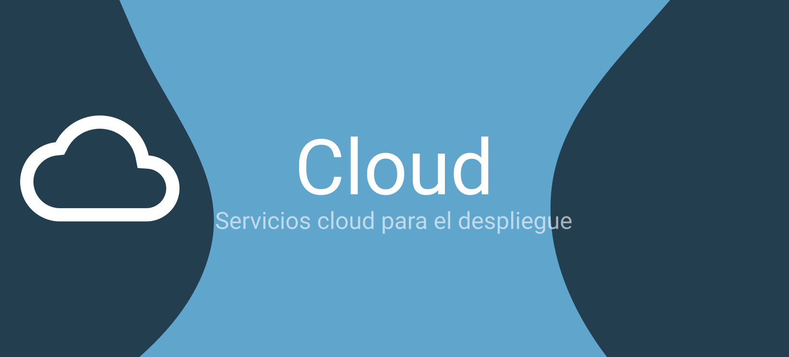

En este post vamos a explicar algunas buenas prácticas que podemos aplicar en React. Estas buenas prácticas son recomendaciones que nos ayudarán a tener un código más limpio, más legible y más fácil de mantener.
Vamos a dividir el post en dos secciones. La primera sección será sobre los principios SOLID y la segunda sobre buenas prácticas en React. Así tendremos una parte más focalizada a principios y otra más a checklist the buenas prácticas que podemos tener en mente.

## Despliegue frontal

En la sección Cloud hemos visto como desplegar nuestro frontend con [Netlify](https://www.netlify.com/). Ahora vamos a mencionar algunas alternativas con funcionalidad similar.

- [Render](https://render.com/): Ya hemos mencionado render en base de datos, pero también se puede usar para el despliegue de nuestra aplicación en React. Es una buena alternativa para centralizar todos los despliegues.
- [Vercel](https://vercel.com/): Vercel es la plataforma de despliegue de aplicaciones web por defecto para Nextjs. Vercel es una herramienta muy completa y el sitio por defecto para funcionalidades como Server Side Rendering, Static Site Generation, etc.
- [Cloudflare Pages](https://pages.cloudflare.com/): Cloudflare Pages es una plataforma de despliegue de aplicaciones web que cuenta con todo el ecosistema de Cloudflare, es una alternativa muy interesante para contar con despliegues con muy poca latencia.

## Despliegue backend

Como ya sabréis, para nuestro backend hemos hecho uso de [Render](https://render.com/), pero existen otras alternativas que podemos utilizar que cuentan con funcionalidades similares. Algunas de estas alternativas son:

- [Heroku](https://www.heroku.com/): Heroku es una plataforma de despliegue de aplicaciones web, hasta hace muy poco el portal de referencia, pero que ha ido perdiendo tracción desde que eliminaron los planes gratuitos. Aún así, es una plataforma muy completa y con una gran comunidad detrás.
- [Railway](https://railway.app/): Una de las alternativas más interesantes y potentes, tiene una interfaz muy cuidada y un equipo impresionante por detrás.

## Despliegue de la base de datos

Además de [Atlass](https://www.mongodb.com/atlas/database), existen otras alternativas para el despliegue de nuestra base de datos en la nube.

- [Render](https://render.com/): Como ya hemos comentado, podemos hacer uso de la funcionalidad de bases de datos para desplegar nuestros datos.
- [Railway](https://railway.app/): Al igual que render, contamos con la funcionalidad de bases de datos para desplegar nuestros datos.

Por otro lado podremos cambiar la conexión y la lógica de nuestra app si hacemos uso de otros cloud providers como [Google Cloud](https://cloud.google.com/gcp), [AWS](https://aws.amazon.com/es), [Azure](https://azure.microsoft.com/es-es/), [Openshift](https://www.redhat.com/en/technologies/cloud-computing/openshift), etc.

## Alternativas BaaS (Backend As A Service)

Ya hemos visto como desplegar nuestro servicio con [Firebase](https://firebase.google.com/), pero existen otras alternativas que podemos utilizar para añadir funcionalidad cloud de forma muy sencilla a nuestro proyecto. Algunas de estas alternativas son:

- [AWS Amplify](https://aws.amazon.com/amplify/): Amplify es un conjunto de herramientas y servicios que nos permiten añadir funcionalidad cloud a nuestras aplicaciones. Amplify nos permite añadir autenticación, bases de datos, almacenamiento, API, etc. Amplify es una herramienta muy completa y con una gran comunidad detrás. Amplify es una herramienta de Amazon, por lo que si ya tenemos una cuenta de AWS, podemos utilizarla sin necesidad de crear una nueva cuenta.
- [Supabase](https://supabase.com/): Supabase es una alternativa a Firebase Open Source. Supabase nos permite añadir funcionalidad cloud a nuestras aplicaciones de forma sencilla. Supabase nos permite añadir autenticación, bases de datos, almacenamiento, API, etc. Supabase es una herramienta muy completa y con una gran comunidad detrás. Supabase es una herramienta Open Source, por lo que podemos utilizarla sin necesidad de crear una cuenta.
- [Pocketbase](https://pocketbase.io/): Al igual que Supabase, es una alternativa Open Source, está escrita en golang y permite de forma muy sencilla desplegar funcionalidades similares a los competidores en cualquier cloud.
