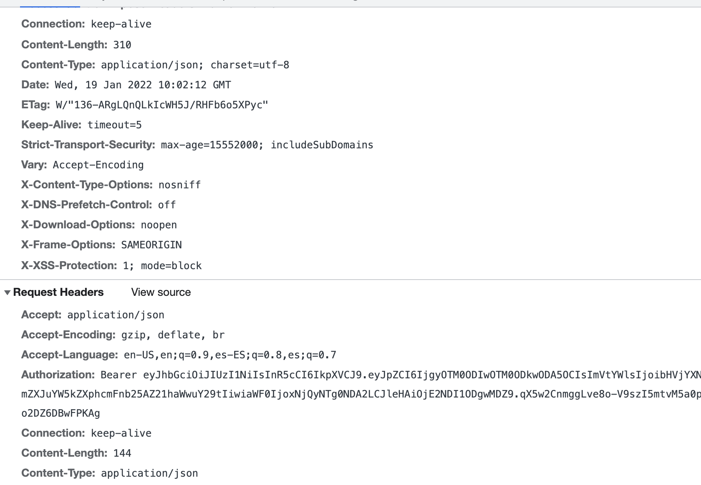

# Autenticación

Por último vamos a hablar como está implementada la autenticación en el backend, como integramos [jwt](./jwt) en nuestro proyecto y como protegemos nuestras rútas para que no acepten peticiones sin autenticar.
## JWT

Como ya habíamos comentado en la sección de [configuración](./express-overview#configuración), podemos crear *middlewares* que modifiquen la funcionalidad de nuestra ruta. Para ello vamos a crear una función que llamaremos `isAuthenticated()`, en la que buscaremos la cabecera *authorization* con nuestro [jwt](./jwt), obtendremos el token a través de la manipulación de la cadena, y mediante la librería [jsonwebtoken](https://www.npmjs.com/package/jsonwebtoken) verificaremos si el token es válido, y obtendremos el usuario que ha realizado la petición. En caso contrario lanzaremos un Error de usuario no autorizado.

```ts title="src/config/middleware/jwtAuth.ts"
export function isAuthenticated(req: RequestWithUser, res: Response, next: NextFunction): void {
    const token: any = req.headers.authorization;

    if (token && token.indexOf('Bearer ') !== -1) {
        try {
            const user: object | string = jwt.verify(token.split('Bearer ')[1], app.get('secret'));

            req.user = user;

            return next();
        } catch (error) {
            return next(new HttpError(HttpStatus.UNAUTHORIZED, http.STATUS_CODES[HttpStatus.UNAUTHORIZED]));
        }
    }

    return next(new HttpError(HttpStatus.BAD_REQUEST, 'No token provided'));
}
```

## Login

Ahora vamos a ver cómo realizamos una petición de *login*. En realidad esto es bastante sencillo, dentro del modelo de `Auth`, tenemos la función `login` que espera en el cuerpo de la petición el `email` y el `password` de un usuario. Ahora llamaremos al servicio de autenticación para comprobar si esas credenciales son válidas. Si son correctas, firmaremos un nuevo [jwt](./jwt) con el id del usuario y su email, con una validez de **60 minutos**, y si no, devolveremos un error de *Login invalido*

```ts title="src/components/Auth/index.ts"
export async function login(req: Request, res: Response, next: NextFunction): Promise<void> {
    try {
        const user: IUserModel = await AuthService.getUser(req.body);

        const token: string = jwt.sign({ id: user.id, email: user.email }, app.get('secret'), {
            expiresIn: '60m',
        });

        res.status(HttpStatus.OK)
            .header({
                Authorization: token,
            })
            .send({
                token: token,
            });
    } catch (error) {
        if (error.code === 500) {
            return next(new HttpError(error.message.status, error.message));
        }
        res.status(HttpStatus.BAD_REQUEST)
            .send({
                message: "Invalid Login",
            });
    }
}
```

## Route protection

Teniendo todo configurado, será muy sencillo proteger una ruta, tan solo tenemos que pasar el *middleware* `jwtConfig.isAuthenticated` para que automáticamente nuestra función requiera de autenticación para ser procesada. Así, rutas como la creación de un proyecto necesitarán de la cabecera `Authorization` con el [jwt](./jwt) para poder ser procesada por el backend.

```ts title="src/routes/ProjectsRouter.ts"
const router: Router = Router();

router.get('/', ProjectsComponent.findAll);

router.post('/', jwtConfig.isAuthenticated, ProjectsComponent.create)

/**
 * @export {express.Router}
 */
export default router;
```


*Petición del front con la caberera Auth habilitada*
