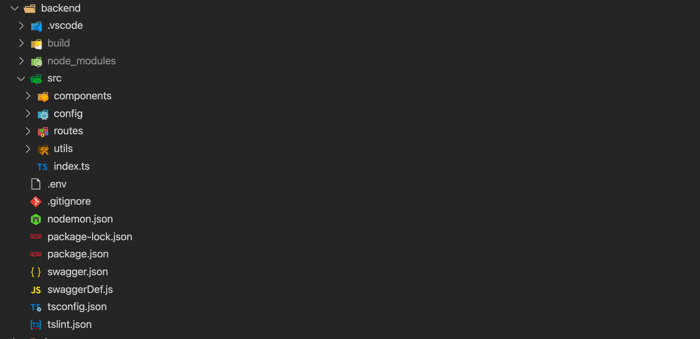

# Express

Express es un framework simple y flexible de **Node.js** que cuenta con un set de funcionalidads robustas para desarrollar aplicaciones web y móviles. Es fácil crear APIs de una forma rápida y sencilla gracias a todos los métodos HTTP y middleware con el que cuenta este Framework. Además, otro de los grandes beneficios de usar este framework es su rendimiento, al ser una fina capa por necima de Node no impacta su funcionamiento en general.

## Overview

En nuestro proyecto, vamos a implementar nuestro backend siguiendo una estructura lógica para separar la navegación o rutas del tratamiento y acceso del modelo de datos. Para ello vamos a organizar nuestro código como vemos a continuación:



Como ya habíamos visto en el *frontend*, tendremos ficheros de configuración, variables de entorno y metadatos en la ruta del proyecto, seguido de la carpeta **src**, que contará con el fichero inicial, `index.ts`, siendo el punto de entrada del servicio, la carpeta `utils`, con funciones de ayuda en el proyecto, la carpeta `routes` con la configuración de *rutas* del servidor, `config` con la configuración del servicio y por último `components`, con el tratamiento de los datos.

## Variables de entorno

Al igual que en proyecto *frontend* tendremos un fichero con variables de entorno que gestionaremos com [DotEnv](https://github.com/motdotla/dotenv). En esta ocasión tenemos `NODE_ENV`, para indicar el modo de ejecución, `PORT` para indicar el puerto en el que se ejecutará el servicio y `SECRET` para la generación de los [JWT](./jwt).

```env title=".env"
#can be 'development' or 'production'
NODE_ENV=development

#your app port
PORT=4000

SECRET=e89f987sdfs9d879f8798dsf78978
```

## Configuración

Vamos a hablar primero de la carpeta `config`. Aquí tendremos toda la lógica de configuración de nuestro servidor, que se ejecutará al levantar el servicio.


En la carpeta `env`, tendremos el código para levantar nuestro servidor en el puerto que hayamos indicado en la variable de entorno con el modo que tengamos configurado, bien desarrollo o producción.

```ts title="src/config/env/index.ts"
const NODE_ENV: string = process.env.NODE_ENV || 'development';

const development: IConfig = {
    port: process.env.PORT || 3000,
    secret: process.env.SECRET || 'secret',
};

const production: IConfig = {
    port: process.env.PORT || 3000,
    secret: process.env.SECRET || 'secret',
};

const test: IConfig = {
    port: process.env.PORT || 3000,
    secret: process.env.SECRET || 'secret',
};

const config: {
    [name: string]: IConfig;
} = {
    test,
    development,
    production,
};
```

Dentro de la carpeta `error` configuramos las clases que pasaremos a *Express* para configurar errores de la aplicación, así como definiremos las funciones con la lógica de tratamiento de errores del servicio.

```ts title="src/config/error/index.ts"
export class HttpError extends Error {
    status: number;
    message: string;
    name: 'HttpError';

    /**
     * Creates an instance of HttpError.
     * @param {number} [status]
     * @param {string} [message]
     * @memberof HttpError
     */
    constructor(status?: number, message?: string) {
        super(message);

        Error.captureStackTrace(this, this.constructor);

        this.status = status || 500;
        this.name = this.name;
        this.message = message || http.STATUS_CODES[this.status] || 'Error';
    }
}
```

```ts title="src/config/error/sendHttpError.ts"
export function sendHttpErrorModule(req: Request, res: any, next: NextFunction): void {
    res.sendHttpError = (error: HttpError): void => {
        res.status(error.status);

        /**
         * if this looks like an AJAX request
         * if this request has a "json" content-type AND ALSO has its "Accept" header set
         * if this request DOESN'T explicitly want HTML
         */
        if (req.xhr || req.is('json') || (req.is('json') && req.get('Accept')) || !(req.get('Accept') && req.get('Accept').indexOf('html') !== -1)) {
            res.json({
                status: error.status,
                name: error.name,
                message: error.message,
            });
        } else {
            res.send(generateHTML(error));
        }
    };

    next();
}
```

En la carpeta `middleware` tendremos todas las funciones [middleware](https://expressjs.com/en/guide/using-middleware.html) con las configuraciones de nuestro servicio, bien sean configuraciones de *cookies*, *cors*, *cabeceras* o *parseo de JSON*, como la lógica para determinar si un usario está autenticado con *JWT*.

```ts title="src/config/middleware/middleware.ts"
export function configure(app: express.Application): void {
    // express middleware
    app.use(
        bodyParser.urlencoded({
            extended: false,
        })
    );
    app.use(bodyParser.json());
    // parse Cookie header and populate req.cookies with an object keyed by the cookie names.
    app.use(cookieParser());
    // returns the compression middleware
    app.use(compression());
    // helps you secure your Express apps by setting various HTTP headers
    app.use(helmet());
    // providing a Connect/Express middleware that can be used to enable CORS with various options
    app.use(cors({
        exposedHeaders: ['Authorization'],
        optionsSuccessStatus: HttpStatus.OK,
    }));

    // custom errors
    app.use(sendHttpErrorModule);
}
```

```ts title="src/config/middleware/jwtAuth.ts"
export function isAuthenticated(req: RequestWithUser, res: Response, next: NextFunction): void {
    const token: any = req.headers.authorization;

    if (token && token.indexOf('Bearer ') !== -1) {
        try {
            const user: object | string = jwt.verify(token.split('Bearer ')[1], app.get('secret'));

            req.user = user;

            return next();
        } catch (error) {
            return next(new HttpError(HttpStatus.UNAUTHORIZED, http.STATUS_CODES[HttpStatus.UNAUTHORIZED]));
        }
    }

    return next(new HttpError(HttpStatus.BAD_REQUEST, 'No token provided'));
}
```

Por último tenemos la carpeta `server` que se encarga de levantar el servicio principal, configurar los *middlewares*, iniciar las *rutas* y los *eventos*

```ts title="src/config/server/index.ts"
const Server: http.Server = http.createServer(server);

/**
 * Binds and listens for connections on the specified host
 */
Server.listen(server.get('port'));

/**
 * Server Events
 */
Server.on('error', (error: Error) => serverHandlers.onError(error, server.get('port')));
Server.on('listening', serverHandlers.onListening.bind(Server));

```

```ts title="src/config/server/server.ts"
/**
 * @constant {express.Application}
 */
const app: express.Application = express();

/**
 * @constructs express.Application Middleware
 */
Middleware.configure(app);

/**
 * @constructs express.Application Routes
 */
Routes.init(app);

/**
 * @constructs express.Application Error Handler
 */
Middleware.initErrorHandler(app);

/**
 * sets port 3000 to default or unless otherwise specified in the environment
 */
app.set('port', config.port || 3000);

/**
 * sets secret to 'superSecret', otherwise specified in the environment
 */
app.set('secret', config.secret || 'superSecret');

/**
 * @exports {express.Application}
 */
export default app;
```
