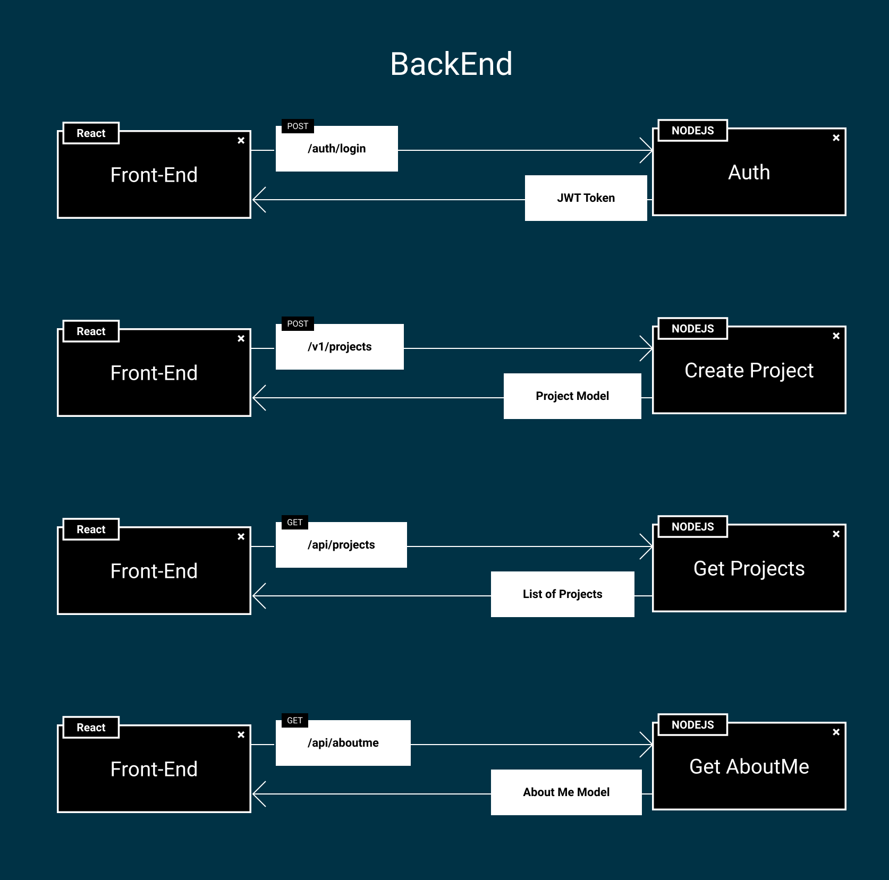
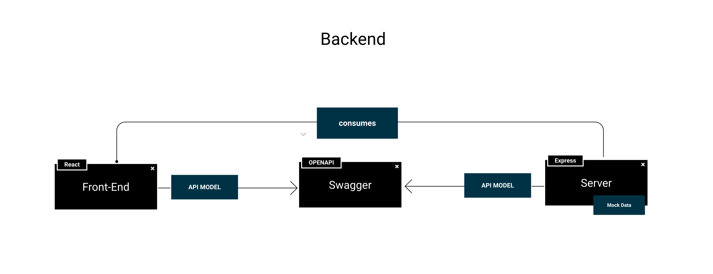

# Introducción

[Enlace del proyecto en Github](https://github.com/lucferbux/Taller-Backend)

Vamos a continuar ahora con el backend de nuestro proyecto. Para ello, tendremos que modificar ligeramente el frontend desarrollado en la [sesión anterior](../frontend/intro) y añadir un servicio que construiremos con [Express](http://expressjs.com).

## Arquitectura

Como podemos observar abajo, la arquitectura de nuestra aplicación ha cambiado. Ahora tenemos un nuevo componente, nuestro *servicio backend*, con los datos *mock* que habíamos creado en la sesión anterior en nuestro *frontend*. Esto crea la necesidad de conectar el *frontend* con el *backend* para así poder poblar los datos de nuestra webapp. Para ello tendremos que definir una **api** que los conecte y mantener un modelo de datos común entre ambas partes del proyecto. Para ello contamos con **Swagger**, que nos permitirá definir todas las llamadas y el modelo de datos que se comparte para tener sincronizados todos los componentes.

## Monorepo

Para mantener nuestra codebase, hemos decidido usar la estructura de **monorepo** por tener unificado todo el código. Si queréis aprender un poco más de los monorepos os dejo [este enlace](https://www.atlassian.com/git/tutorials/monorepos).
