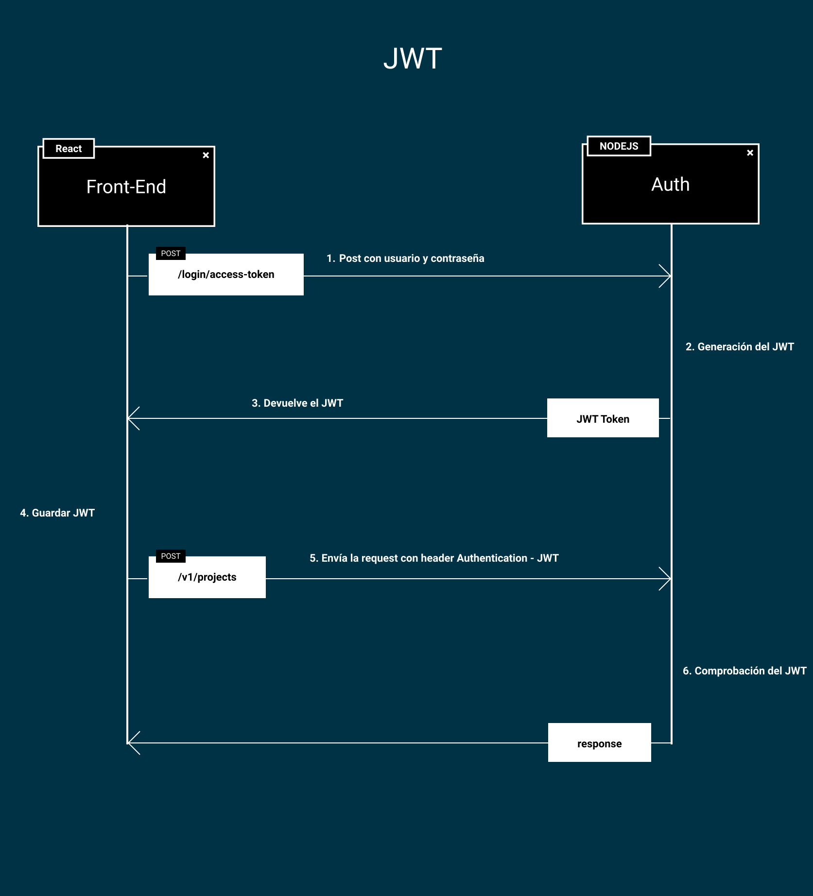
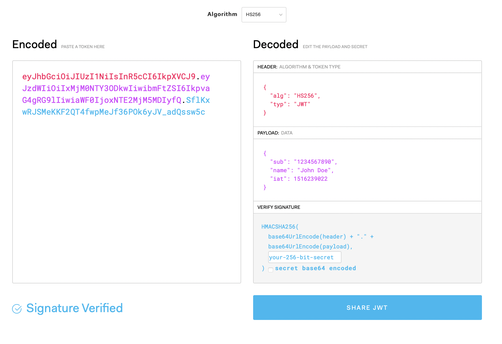

# JWT

JWT es una especificación de Autenticación que se utiliza sobre todo para control de autenticación entre dos actores. Se introdujo con la especificación [RFC 7519](https://tools.ietf.org/html/rfc7519) por el IEFT.

Aunque se puede usar con todo tipo de comunicaciones, JWT es muy popular para el control de autenticación y autorización mediante HTTP, es por ello que lo hemos introducido en nuestra API.

HTTP es un protocolo sin estado, es por ello que el servidor no tiene control sobre peticiones anteriores para el cliente, es por ello que tener un token que controle la sesión entre cliente y servidor con un flujo controlado hace que podamos autenticar y contorlar algunas rutas sensibles dentro de una sesión.

La **estructura de un JWT** es la siguiente: Se compone de información codificada en Base64 con una cabecera, un payload y una firma única. Dentro de la página oficial de [https://jwt.io](jwt) podemos comprobar un token.

La cabecera tiene información acerca del algoritomo que se usa y que tipo de token, el payload contiene datos acerca del usuario y su rol y la firma se utiliza para validar la veracidad de este token.
