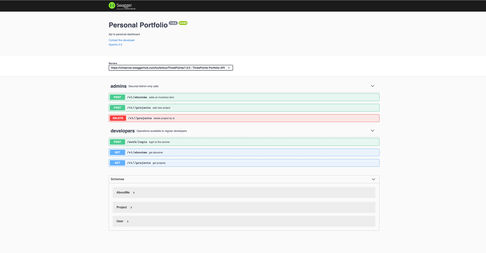

# Swagger

Swagger es una especificación de la API que vamos a utilizar en el proyecto, permite conocer las rutas, su configuración de roles y el modelo de datos. Existe una [live version](https://app.swaggerhub.com/apis/lucferbux/ThreePoints/1.0.0) configurada, pero nuestro propio backend soporta la especificación.



La documentación se encuentra en la ruta:

```bash
[NodeRoute]/docs
Default -> http://localhost:4000/docs
```
