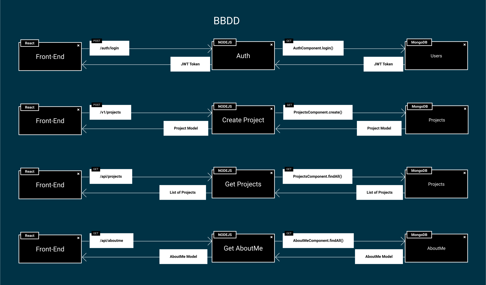
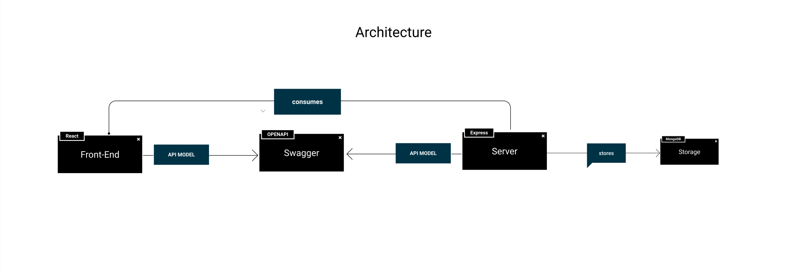

# Introducción

[Enlace del proyecto en Github](https://github.com/lucferbux/Taller-BBDD)

Continuamos esta tercera sesión con el esqueleto que montamos en las dos sesiones anteriores. Como podemos observar en el diagrama de abajo, vamos aumentar la complejidad de nuestras peticiones añadiendo una nueva interacción: la comunicación de nuestro backend con una **base de datos** que almacene la información de la aplicación.

## Arquitectura

A partir de ahora vamos a tener tres componentes en nuestro proyecto, nuestro [frontend](../frontend/intro) en *React*, nuestro [backend](../backend/intro) con *Express* y por último vamos a incluir una base de datos *MongoDB*. Al querer visualizar los datos en nuestro *frontend*, realizamos una petición mediante nuestra [api rest](../backend/swagger.md) al *backend*, éste procesa la llamada, consulta la *base de datos* mediante una operación de lectura o escritura y devuelve la información al *frontend*

Como vemos, la arquitectura se va complicando, por lo que es conveniente seguir estructurando de una manera correcta nuestro monorepo para poder gestionar bien todos los componenetes de nuestro proyecto.
