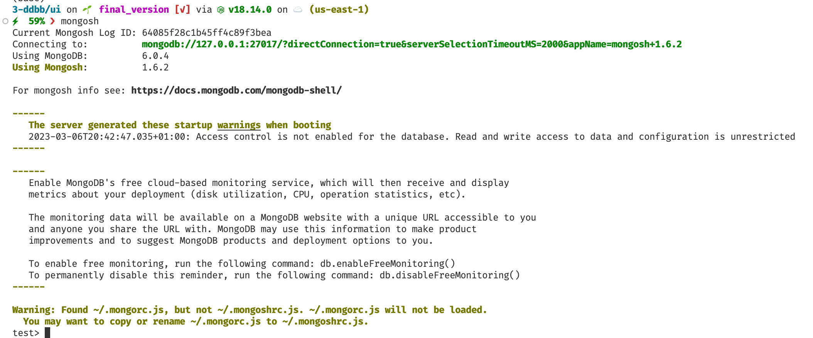

# MongoDB

## Overview

Base de Datos No Relacional orientado a documentos, pero, ¿qué es esto en realidad?, vamos a hablar un poco de ello.

### Base de Datos orientada a documentos

Un registro en MongoDB es un documento, que es una estructura de datos compuesto de pares con *clave/valor*. Los documentos de MongoDB son parecidos a los objetos JSON, siendo que sus valores pueden incluir otros documentos, arrays e incluso arrays de documentos.

```JSON
{
    name: "Lucas Fernández Aragón",
    birthday: 765817712000,
    nationality: "Spain",
    job: "Red Hat",
    github: "https://github.com/lucferbux"
}
```

Las ventajas de usar documentos con respecto a otros sistemas de almacenamiento son:

* Los *Documentos* corresponden a tipos de datos nativos en muchos lenguajes de programación (como JavaScript).
* Documentos anidados y arrays reducen la necesidad de *"joins"* que pueden ser costosos computacionalmente.
* Esquemas dinámicos soportan polimorfismo fluido.

MongoDB almacena documentos en colecciones. Las colecciones son elementos análogos a las tablas en *bases de datos relacionales*.

### Alto rendimiento

MongoDB aporta persistencia de información con un alto rendimiento. En particular permite:

* Soporte para modelos anidados, que reducen la activada de lectura/escritura en una base de datos.
* Los índices soportan consultas o *queries* más rápidas y pueden incluir claves de documentos anidados o arrays.
* Un lenguaje de consulta muy rico.

Este lenguaje de consulta permite operaciones de lectura y escritura (**CRUD**) además de otros elementos:

* Agregación de datos.
* Búsqueda de texto y *queries* geoespaciales.

### Alta disponibilidad

La funcionalidad de replicación de MongoDB, llamada *replica set*, permite lo siguiente:

* Tolerancia ante fallos automática.
* Redundancia de datos

Un *replica set* es un grupo de servidores MongoDB que mantienen el mismo set de datos, aportando redundancia y aportando disponibilidad de la información.

### Escalabilidad horizontal

MongoDB aporta escalabilidad horizontal como parte de su funcionalidad fundamental:

* MongoDB distribuye los datos mediante *sharding*, un método de distribución de la información a través de un *cluster* de máquinas.
* A partir de MongoDB 3.4, MongoDB permite crear zonas de datos basados en la clave *shard*. En un cluster balanceado, MongoDB direcciona las lecturas/escrituras dirigidas a una zona mediante múltiples motores de almacenamiento.


## MongoDB en nuestro proyecto

Lo primero de todo, vamos a tener que instalar mongoDB en nuestro entorno local. Para ello lo mejor es dirigirse a la [https://docs.mongodb.com/manual/installation/](sección de instalación) de MongoDB para elegir la forma correcta para nuestro sistema.

Posteriormente vamos a inicializar el servicio de mongoDB mediante el comando `make mongo-start`. Con esto podemos comprobar que nuestro servicio está levantado escribiendo en la terminal `mongo`.


*Mongo init en la terminal*

Ahora que sabemos que nuestro servicio está levantado podemos explorar los diferentes [scripts que hemos creado en nuestro proyecto](./scripts)

## Compass

[Compass](https://www.mongodb.com/products/compass) es una herramienta interactiva para gestionar, analizar y consultar nuestros datos de MongoDB. La herramienta permite conectarse a bases de datos locales y remotos y gestionar nuestra información de forma visual.


*MongoDB Compass*

Con esta herramienta podremos gestionar la información de nuestro proyecto de una forma sencilla e interactiva.
