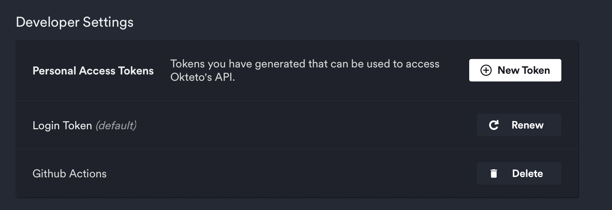
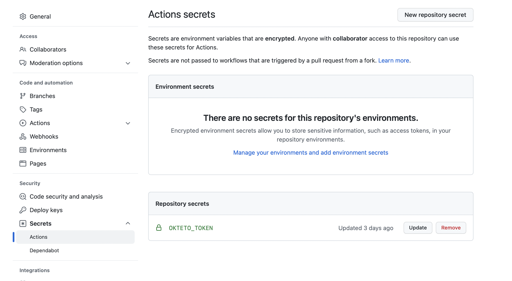
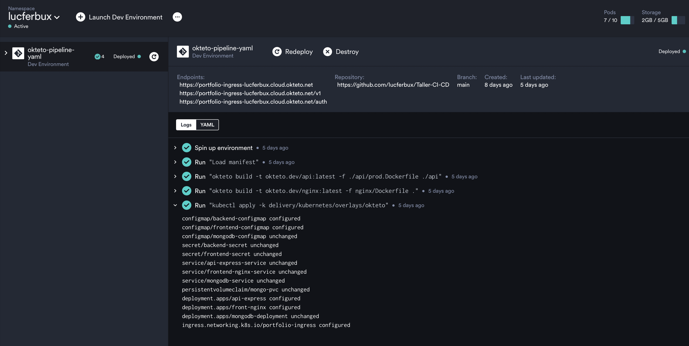

# Despliegue Continuo

## Action Script

```yaml title=".github/workflows/cd.yml"
# Linter work 
name: CD

# Controls when the workflow will run
on:
  push:
    branches:
      - main

  # Allows you to run this workflow manually from the Actions tab
  workflow_dispatch:


# A workflow run is made up of one or more jobs that can run sequentially or in parallel
jobs:
  # This workflow contains a single job called "build"
  deploy:
    # The type of runner that the job will run on
    runs-on: ubuntu-latest
    
    # Steps represent a sequence of tasks that will be executed as part of the job
    steps:
      - uses: actions/checkout@v2
     
      - name: context
        uses: okteto/context@latest
        with:
          // highlight-next-line
          token: ${{ secrets.OKTETO_TOKEN }}
     
      - name: Trigger Pipeline
        uses: okteto/pipeline@latest
        with:
          name: okteto-pipeline-yaml
          timeout: 8m

```

## Configuración Github






