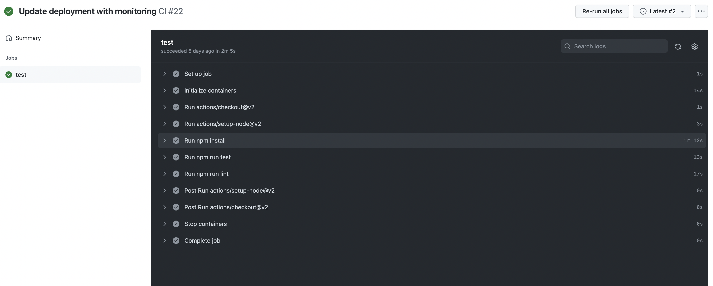

# Integración Continua

Ahora vamos a ver cómo implementar de una manera muy sencilla nuestro flujo de *Integración Continua*. Como ya sabéis, la *integración continua* es una práctica de desarrollo software mediante la cual los desarrolladores combinan los cambios en el código en un repositorio central de forma periódica, tras lo cual se ejecutan pruebase automáticas para comprobar si ese código puede *"integrarse"*.

Hay muchas herramientas y frameworks para implementar este proceso, pero nosotros vamos a usar [Gihub Actions](https://docs.github.com/en/actions) debido a su sencillez y a su integración con *Github*, el repositorio centra que hemos usado durante todo el taller.

## Action Script

Para crear un nuevo script para *Github Actions*, podemos bien navegar dentro de *Github* a la sección de *Actions*, o bien crear un nuevo fichero dentro de la ruta `.github/workflows`. Esto último hará que *Github* automáticamente detecte un nuevo archivo *Github Actions* una vez los cambios estén en la rama `main`. La estructura del fichero es bastante sencilla y viene muy bien detallada en su [documentación](https://docs.github.com/en/actions/learn-github-actions/understanding-github-actions). Vamos a ver qué es lo que hace nuestro *script*:

1. La directiva `on` indica cuando se va a ejecutar el *script*. En este caso hemos indicado que cada vez que se realice una *pull request* a la rama *main* vamos a ejecutar este flujo.
2. El comando `workflow_dispatch` también permite ejecutar el script manualmente con un botón que aparece en la intefaz de *GitHub*.
3. Ahora vamos a definir los `jobs`, que son los flujos que se ejecutarán secuencialmente o en paralelo cuando lanzamos el *script*.
4. Vamos a indicar que la imagen donde vamos a ejecutar el *script* es `ubuntu-latest`.
5. Después vamos a crear un [servicio](https://docs.github.com/en/actions/using-containerized-services/about-service-containers) para nuestra base de datos en mongo.
6. Por último vamos a ejecutar los pasos de nuestro `job`:
   1. `actions/checkout@v3` permite acceder al código de nuestro repositorio y usarlo.
   2. `actions/setup-node@v3` automatiza la instalación de node. En este caso node v18.
   3. `npm ci` instala las dependencias de nuestro proyecto.
   4. Ahora instalaremos playwright para poder ejecutar los tests de la interfaz de usuario.
   5. Por último tenemos `npm run test` para ejecutar los tests y `npm run lint` para ejecutar el linter.

```yaml title=".github/workflows/ci.yml"
# Linter work 

name: CI

# Controls when the workflow will run
on:
  pull_request:
    branches:
      - main

  # Allows you to run this workflow manually from the Actions tab
  workflow_dispatch:


# A workflow run is made up of one or more jobs that can run sequentially or in parallel
jobs:
  # This workflow contains a single job called "build"
  test:
    # The type of runner that the job will run on
    runs-on: ubuntu-latest
    
    env:
      MONGODB_URI: mongodb://localhost:27017/
      MONGODB_DB_MAIN: portfolio_db_test
      VITE_PROXY_HOST: http://localhost:4000
        
    services:
      mongodb:
        image: mongo
        env:
          MONGO_INITDB_DATABASE: portfolio_db_test
        ports:
          - 27017:27017

    # Steps represent a sequence of tasks that will be executed as part of the job
    steps:
      - uses: actions/checkout@v3
      - uses: actions/setup-node@v3
        with:
          node-version: '18.x'
          cache: 'npm'
      - name: Install dependencies
        run: npm ci
      - name: Install Playwright Browsers
        run: cd ui && npx playwright install --with-deps chromium
      - name: Run Lint
        run: npm run lint
      - name: Run Tests
        run: npm run test
      - uses: actions/upload-artifact@v3
        if: always()
        with:
          name: playwright-report
          path: ui/playwright-report/
          retention-days: 30
```

Ahora, al crear una nueva *Pull Request*, como veremos en la sección de [configuración de github](./github_config), lanzará automáticamente el flujo de *Github Actions* ejecutando todos los pasos como podemos ver en la imagen de abajo.


