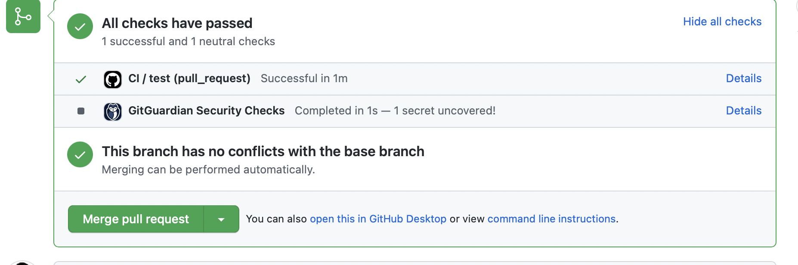

# Configuración Github

Además de crear esta configuración, es indispensable tener cierto control sobre ciertas ramas en nuestro repositorio central, para evitar que cualquiera pueda integrar su código de forma forzosa, saltandose así el flujo que acabamos de crear. Es por ello que *GitHub* nos proporciona unos mecanismos para controlar nuestro flujo de integración.

Dentro de `Settings > Branches`, podemos proteger determinadas ramas con ciertos requisitos, en nuestro caso, vamos a forzar que **sea necesario crear pull requests antes de poder integrar el código en main** y además **que sea necesario que todos los tests pasen antes de poder mergear esa pull request**. Con esto nos aseguramos que nadie pueda hacer un *push* a la rama principal y que al menos el código tenga el estilo determinado por el *lint* y que haya pasado todos los *test* creados.

Ahora, al crear una nueva *pull request*, deberíamos ver el mensaje de que **no es posible mergear sin pasar todos los requerimientos** (o como en la foto, si eres administrador un warning en rojo), y solo si se han pasado todos los test que hemos indicado, debería cambiar la interfaz para confirmar el *merge request*.

