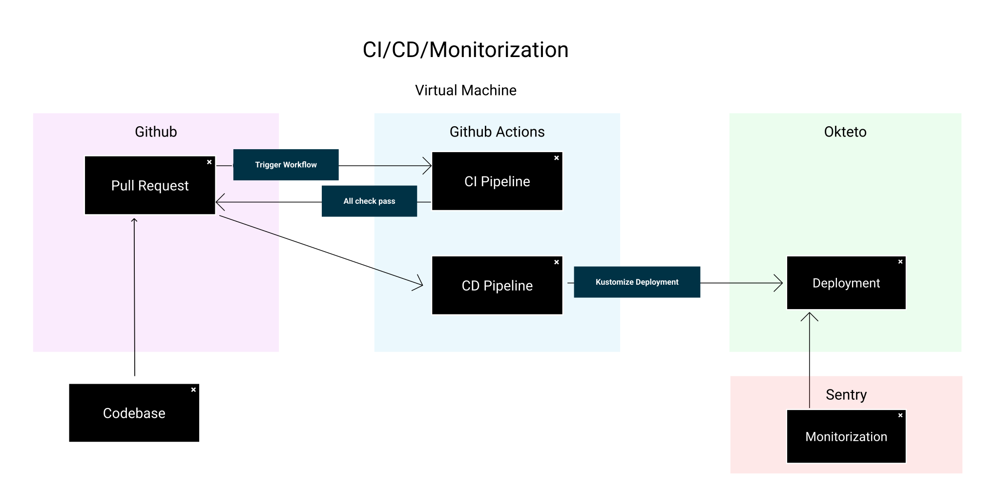

# Introducción

[Enlace del proyecto en Github](https://github.com/lucferbux/Taller-Containerization)

Ya por último vamos a ver como automatizar los flujos de *integración continua*, *despliegue continuo* y *monitorización*. Para recapitular un poco, a lo largo de este taller hemos ido viendo como crear las partes de nuestro proyecto, siendo estas el [frontend](../frontend/intro), el [backend](../backend/intro) y nuestra [base de datos](../bbdd/intro). En esta primera parte habíamos cubierto las primeras fases del *ciclo de vida del desarrollo software*, teniendo la **planificación**, el **análisis**, el **diseño** y la **implementación**. En la segunda parte del taller nos hemos estado centrando en añadir [testing y una capa de seguridad](../testing/intro), crear [contenedores](../containers-orchestation/docker-development) para nuestra arquitectura y [orquestarlos](../containers-orchestation/kubernetes) y ahora aprovechando todo ese trabajo, añadir los flujos de *CI, CD* y la monitorización de nuestro despliegue. Con esto ya cubriríamos todo el *ciclo de vida del desarrollo software* haciendo mucho más sencillo a partir de ahora diseñar nuevas funcionalidades y acortando el tiempo de *desarrollo* hasta el *despliegue*.

Nuestro flujo va a ser bastante sencillo, y haremos uso de plataformas bastante populares para su implementación. Básicamente intentaremos configurar nuestro repositorio de *Github* para proteger nuestra rama principal y forzar a que todo cambio pase antes por una *Pull Request*. Al hacerlo, lanzará un trabajo de *Integración Continua* que ejecutará nuestros tests y el *linter* al código que queremos cambiar. Si las pruebas pasan, podremos *mergear* los cambios, haciendo que se ejecute un nuevo flujo de *Despliegue Continuo*, que desplegará estos nuevos cambios en una plataforma *orquestada* mediante Kubernetes. Además de todo esto, nuestro código contará con una librería de monitorización que nos alertará de los problemas que surjan en nuestro despliegue, para poder detectar errores en producción.
