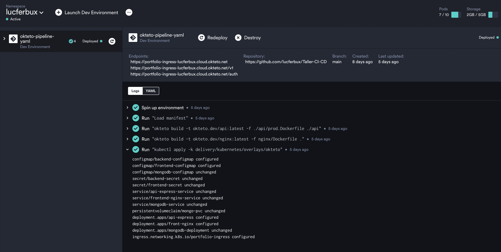

# Kubernetes

## Kustomize

Ahora toca el turno de modificar el despliegue orquestado que creamos en la [sesión anterior](../containers-orchestation/kubernetes.md). Nuestro problema ahora es que vamos a querer tener varios entornos de despliegue, más o menos igual que lo que nos pasó con docker, y por tanto algunos componentes variarán dependiendo del entorno.

Es por ello que vamos a utilizar [kustomize](https://kustomize.io), una herramienta de gestión de la configuración, directamente integrada en *kubernetes*, que permite crear diferentes despliegues de forma *declarativa*. Básicamente tendremos una configuración **base**, que mantendrá el mismo formato al que estamos acostumbrados y uno o varios **overlays**, donde incluiremos los archivos que extiendan, o reemplacen los valores y componentes de la instalación base. Cabe destacar que *kustomize* solo es capaz de **reemplazar** o **ampliar** componentes, no de eliminar archivos ni valores, por lo que la estrategia es que si en algún entorno no existe determinado archivo, este no se debe incluir en la base.


El archivo más importantes es `kustomization.yaml`, que se encontrará tanto en la carpeta *base* como en los *overlays* e indicará a *kustomize* que archivos va a incluir en el despliegue y las diferentes estrategias de extensión o inclusión de nuevos valores.

```yaml title="delivery/kubernetes/base/kustomization.yaml"
---
apiVersion: kustomize.config.k8s.io/v1beta1
kind: Kustomization

resources:
  - backend-configmap.yaml
  - backend-secret.yaml
  - backend.yaml
  - frontend-configmap.yaml
  - frontend-secret.yaml
  - frontend.yaml
  - mongo-configmap.yaml
  - mongo.yaml
```

Como podemos ver en el fichero `kutomize.yaml` del *overlay* para el despliegue en local, incluiremos todos los ficheros que encontrábamos en la *base*, añadiendo tres componentes más: `mongo-pv.yaml`, `ingress.yaml` y `mongo-pvc.yaml`. Estos archivos servirán para crear el [presistence volume](https://kubernetes.io/docs/concepts/storage/persistent-volumes/) local, asignar a mongo espacio con [persistence volume claim](https://kubernetes.io/docs/concepts/storage/persistent-volumes/#lifecycle-of-a-volume-and-claim) y crear un punto de acceso con [ingress](https://kubernetes.io/docs/concepts/services-networking/ingress/).

```yaml title="delivery/kubernetes/overlays/local/kustomization.yaml"
---
apiVersion: kustomize.config.k8s.io/v1beta1
kind: Kustomization

resources:
  - ../../base
  - mongo-pv.yaml
  - ingress.yaml
  - mongo-pvc.yaml

namespace: portfolio-app-local
```

Ahora solo tendremos que cambiar los comando en nuestro `makefile`, para que soporte *kustomize*, simplemente tendremos que añadir el flag *-k* y apuntar al *overlay* que queramos desplegar, por ejemplo `kubectl apply -k delivery/kubernetes/overlays/local`.

```makefile title="Makefile"
.PHONY: k8s-create-ns
k8s-create-ns:
  kubectl create namespace portfolio-app-local

.PHONY: k8s-deploy
k8s-deploy:
  // highlight-next-line
  kubectl apply -k delivery/kubernetes/overlays/local

.PHONY: k8s-status
k8s-status:
  kubectl get all -n portfolio-app-local

.PHONE: k8s-status-pods
k8s-status-pods:
  kubectl get pods -n portfolio-app-local

.PHONE: k8s-delete-all
k8s-delete-all:
  // highlight-next-line
  kubectl delete -k delivery/kubernetes/overlays/local

.PHONY: k8s-expose-service
k8s-expose-service:
  minikube service frontend-nginx-service --url -n portfolio-app-local 

.PHONY: k8s-ingress
k8s-ingress:
  minikube addons enable ingress && minikube tunnel

.PHONY: k8s-dashboard
k8s-dashboard:
  minikube dashboard
```

## Okteto

Okteto es un servicio de despliegue de infraestructura en Kubernetes, permite rápidamente crear un entorno a través de sus automatizaciones y cuenta con una versión gratuita limitando los recuros. Es una muy buena plataforma para hacer pruebas con nuestro entorno y desplegar nuestro código de forma automatizada, ya que cuenta con integraciones con *github actions*.



Para ello vamos a modificar nuestro proyecto, primero añadiendo el fichero [okteto-pipeline](https://www.okteto.com/docs/cloud/okteto-pipeline/), que permite indicar como vamos a desplegar nuestro entorno mediante el repositorio de github. Nosotros le vamos a indicar que construya las dos imagenes de nuestro front y nuestro back, y que luego aplique el *overlay* que hemos preparado para *okteto*.

```yaml title="okteto-pipeline"
deploy:
  - okteto build -t okteto.dev/api:latest -f ./api/prod.Dockerfile ./api
  - okteto build -t okteto.dev/nginx:latest -f nginx/Dockerfile .
  - kubectl apply -k delivery/kubernetes/overlays/okteto
```

Dentro de este *overlay* podemos observar como en el `kustomization.yaml` vamos a reemplazar los valores de la imagenes del despliegue por la última imágen que acabamos de construir con okteto, usando el recurso [patchesJson6902](https://kubernetes.io/docs/tasks/manage-kubernetes-objects/kustomization/#customizing) para reemplazar los valores de *base*.

```yaml title"delivery/kubernetes/overlays/okteto/overlay/kustomization.yaml"
---
apiVersion: kustomize.config.k8s.io/v1beta1
kind: Kustomization

resources:
  - ../../base
  - mongo-pvc.yaml
  - ingress.yaml

patchesJson6902:
  - patch: |
      - op: replace
        path: /spec/template/spec/containers/0/image
        value: "okteto.dev/api:latest"
    target:
      kind: Deployment
      name: api-express
      version: v1
  - patch: |
      - op: replace
        path: /spec/template/spec/containers/0/image
        value: "okteto.dev/nginx:latest"
    target:
      kind: Deployment
      name: front-nginx
      version: v1
```

Además de esto vamos a añadir un componente [ingress](https://kubernetes.io/docs/concepts/services-networking/ingress/), que actuará como un proxy inverso, redireccionando el tráfico a los diferentes pods dependiendo de la estructura de la url.

```yaml title"delivery/kubernetes/overlays/okteto/ingress.yaml"
apiVersion: networking.k8s.io/v1
kind: Ingress
metadata:
  name: portfolio-ingress
  annotations:
    dev.okteto.com/generate-host: "true"
spec:
  rules:
    - http:
        paths:
          - path: /
            pathType: Prefix
            backend:
              service:
                name: frontend-nginx-service
                port:
                  number: 80
          - path: /v1
            pathType: Prefix
            backend:
              service:
                name: api-express-service
                port:
                  number: 4000
          - path: /auth
            pathType: Prefix
            backend:
              service:
                name: api-express-service
                port:
                  number: 4000
```

Y por otro lado tendremos un [persistence volume claim](https://kubernetes.io/docs/concepts/storage/persistent-volumes/#lifecycle-of-a-volume-and-claim) para aisgnar a mongo parte del espacio que tenemos disponible en okteto.

```yaml title"delivery/kubernetes/overlays/okteto/mongo-pvc.yaml"
apiVersion: v1
kind: PersistentVolumeClaim
metadata:
  name: mongo-pvc
spec:
  accessModes:
    - ReadWriteOnce 
  resources:
    requests:
      storage: 2Gi
```

Una vez desplegado, podremos ver que todos nuestros componentes activos y la url que ha generado okteto para poder acceder a nuestra webapp.


