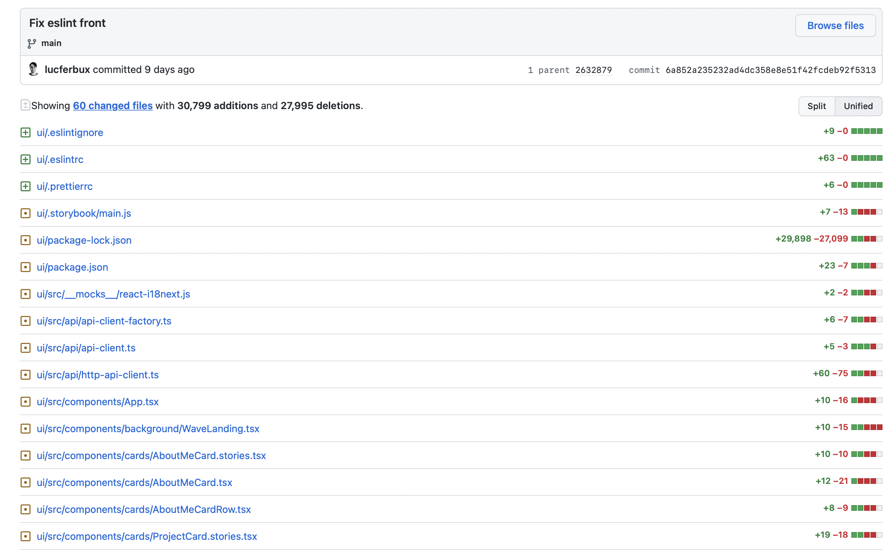
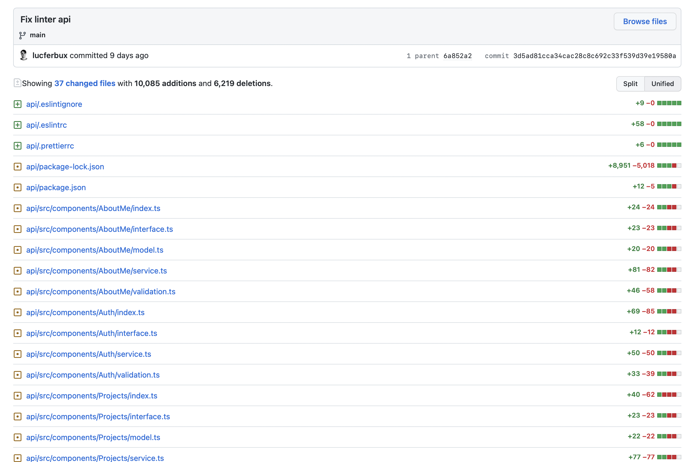

# Linter

Ya habíamos introducido discretamente las dependencias del *linter* en la sección de [testing y seguridad](../testing/intro.md), pero no habíamos creado una correcta configuración ni habíamos explorado todas las opciones que nos ofrece, vamos a arreglar ese primer punto antes de seguir con nuestros flujos *CI/CD*.

Lo primero de todo, ¿Qué significa la palabra **Lint**?. Lint es una herramienta de programación que analiza estáticamente el código para encontrar errores, bugs y construcciones sospechosas. Además se le puede configurar diversos parámetros, como la inclusión de guías de estilo que permitan mantener un código uniforme a lo largo del proyecto.

En nuestro caso, usaremos [Typescript ESLint](https://typescript-eslint.io) y [Prettier](https://prettier.io/) tanto para nuestro *frontend* como para nuestro *backend*. Además, la configuración será bastante similar en ambas partes, vamos a ver como lo hemos hecho.

## Frontend

Lo primero que tenemos que hacer es instalar las dependencias de eslint, para eso ejecutamos `cd ui && npm install --save-dev @typescript-eslint/eslint-plugin @typescript-eslint/parser eslint-config-airbnb-typescript eslint-plugin-jest`. Esto instalará todas las dependencias e indicará que son *dev dependencies* para no añadir estos módulos en producción al ser innecesarios. Ahora solo tendremos que instalar los paquetes de la guía de estilos de *Airbnb*, para ello instalaremos `npx install-peerdeps --dev eslint-config-airbnb`. Por último añadiremos *prettier* para nuestra guía de estilos con el siguiente comando `npm install --save-dev prettier eslint-config-prettier eslint-plugin-prettier`.

### Configuración ESLint

Ahora añadiremos los ficheros de configuración necesarios para poner en marcha nuestro *linter*, comenzaremos primero con `.eslintrc`.

```json title="ui/.eslintrc"
{
  "parser": "@typescript-eslint/parser",
  "parserOptions": {
    "ecmaFeatures": {
      "jsx": true,
      "useJSXTextNode": true
    },
    "ecmaVersion": 2018,
    "sourceType": "module",
    "project": "./tsconfig.json"
  },
  "extends": [
    "airbnb-typescript",
    "airbnb/hooks",
    "plugin:@typescript-eslint/recommended",
    "prettier",
    "plugin:prettier/recommended"
  ],
  "plugins": ["react", "react-hooks", "@typescript-eslint", "import"],
  "env": {
    "browser": true,
    "es6": true,
  },
  "globals": {
    "Atomics": "readonly",
    "SharedArrayBuffer": "readonly"
  },
  "rules": {
    "linebreak-style": "off",
    "react-hooks/rules-of-hooks": "error",
    "no-use-before-define": "off",
    "@typescript-eslint/no-use-before-define": "off",
    "react-hooks/exhaustive-deps": "warn",
    "@typescript-eslint/no-explicit-any": "off",
    "import/no-extraneous-dependencies": [
      "error",
      {
        "devDependencies": [
          "**/*.stories.*",
          "**/.storybook/**/*.*",
          "**/.jest-canvas-mock/**/*.*"
        ],
        "peerDependencies": true
      }
    ],
    "prettier/prettier": [
      "error",
      {
        "endOfLine": "auto"
      }
    ],
    "import/extensions": [
      "error",
      "ignorePackages",
      {
        "js": "never",
        "jsx": "never",
        "ts": "never",
        "tsx": "never"
      }
    ]
  }
}
```

De aquí lo que más nos interesa señalar es que estamos extendiendo las reglas de los plugins de `aribnb-typescript`, `airbnb/hooks`, `typescript-eslint` y `prettier` para analizar el código. Además estamos añadiendo una serie de reglas, como ignorar las dependencias de `jest` y `storybook` dentro de `import/no-extraneous-dependencies` para que no generen errores.

Además de este archivo tendremos otros dos, llamados `.eslintignore` y `.prettierrc`, el primero para indicar donde ignorar el análisis del código y el segundo para indicar las reglas de *prettier*. Como podemos ver, intentamos evitar carpetas y ficheros como `node_modeules`, `public/\*` o `.storybook` ya que contienen configuraciones y dependencias externas que queremos evitar.

```ignore-list title="ui/.eslintignore"
.idea
.storybook
.config
node_modules/*
config/*
public/*
build/*
scripts/*
src/react-app-env.d.ts
src/reportWebVitals.ts
```

```json title="ui/.prettierrc"
{
    "arrowParens": "always",
    "singleQuote": true,
    "printWidth": 100,
    "trailingComma": "none"
} 
```

Al aplicar esta configuración y ejecutar `npm run lint` podemos observar todos los archivos que necesitan ser modificados para adaptarse a esta nueva guía de estilos, en nuestro caso han sido una gran cantidad de ficheros que podéis revisar en el [siguiente commit](https://github.com/lucferbux/Taller-CI-CD/commit/6a852a235232ad4dc358e8e51f42fcdeb92f5313).



## Backend

La configuración del backend es muy similar a la anterior, solo tendremos que ejecutar otra vez `cd api && npm install --save-dev @typescript-eslint/eslint-plugin @typescript-eslint/parser eslint-config-airbnb-typescript eslint-plugin-jest`, instalando los requerimeintos como *devDependencies*. Procederemos ahora a instalar las dependencias de *Airbnb* con `npx install-peerdeps --dev eslint-config-airbnb`. Y por último añadiremos *prettier* para nuestra guía de estilos con el siguiente comando `npm install --save-dev prettier eslint-config-prettier eslint-plugin-prettier`.

### Fichero ESLint

El archivo de configuración de *eslint* es muy parecido al de *frontend*, con unas pequeñas diferencias, la primera es qe no tendremos las *devDependencies* de `storybook`, ni tendremos que indicar `jsx` y `tsx` como extensiones ya que no tendremos código de *react* en el backend. Por último, en nuestro backend usamos un **import alias** `@`, para indicar la base de la ruta de nuestro proyecto, mediante `'@': __dirname`. Es por ello que tenemos que añadir una extensión más de eslint para indicar este alias.

```json title="api/.eslintrc"
{
  "parser": "@typescript-eslint/parser",
  "parserOptions": {
    "ecmaFeatures": {
      "jsx": true,
      "useJSXTextNode": true
    },
    "ecmaVersion": 2018,
    "sourceType": "module",
    "project": "./tsconfig.json"
  },
  "extends": [
    "airbnb-typescript",
    "airbnb/hooks",
    "plugin:@typescript-eslint/recommended",
    "prettier",
    "plugin:prettier/recommended"
  ],
  "plugins": ["react", "react-hooks", "@typescript-eslint", "import"],
  "env": {
    "browser": true,
    "es6": true
  },
  "globals": {
    "Atomics": "readonly",
    "SharedArrayBuffer": "readonly"
  },
  "settings": {
    "import/resolver": {
      "alias": {
        "map": [["@", "./src/"]],
        "extensions": [".ts", ".js"]
      }
    }
  },
  "rules": {
    "linebreak-style": "off",
    "react-hooks/rules-of-hooks": "error",
    "no-use-before-define": "off",
    "@typescript-eslint/no-use-before-define": "off",
    "react-hooks/exhaustive-deps": "warn",
    "@typescript-eslint/no-explicit-any": "off",
    "prettier/prettier": [
      "error",
      {
        "endOfLine": "auto"
      }
    ],
    "import/extensions": [
      "error",
      "ignorePackages",
      {
        "js": "never",
        "ts": "never"
      }
    ]
  }
} 
```

Los ficheros de `.eslintignore` y `.prettierrc` sí que son identicos al frontend, ya que queremos mantener una estrucutra similar de estilo en todo el proyecto, y al ser los dos componentes en JavaScript comparten la misma estructura de carpetas. Aplicamos ahora también el linter ejecutando `npm run lint` y cambiamos los ficheros que debían adaptarse como [podemos ver en este commit](https://github.com/lucferbux/Taller-CI-CD/commit/3d5ad81cca34cac28c8c692c33f539d39e19580a).


