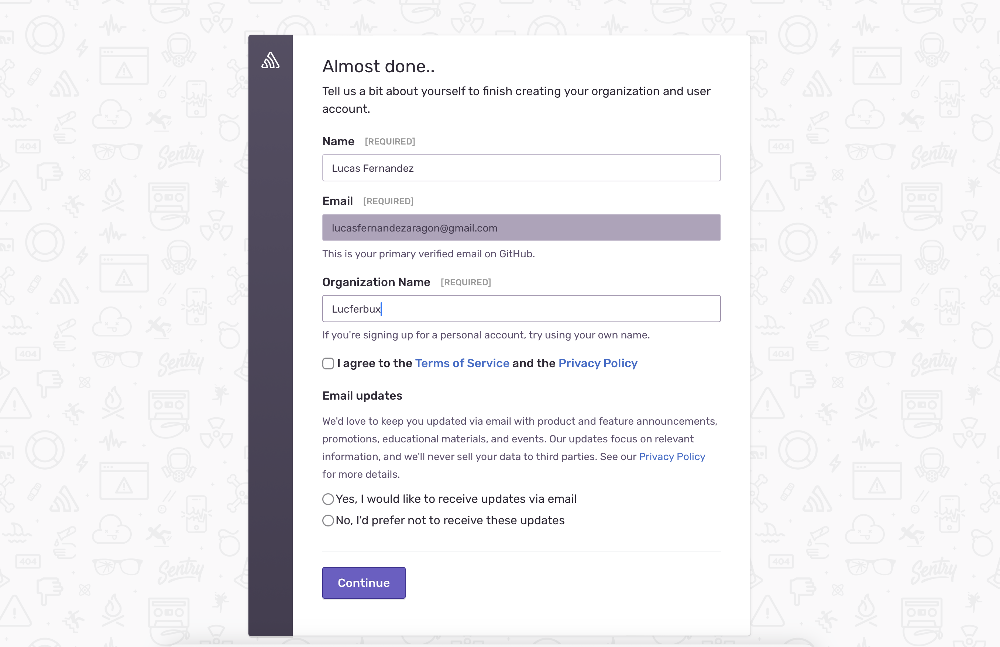

# Monitorización

Ya por fin llegamos al último apartado de la sesión. En este caso vamos a hablar de la **monitorización**. Una vez desplegado nuestro proyecto, es importante habilitar una forma en la que recoger datos acerca de nuestro proyecto. La recolección de errores, para arreglar problemas que puedan aparecer a nuestros usuarios, visualización de telemetría de usuarios, para conocer los comportamientos y mejorar la funcionalidad de nuestro servicio o la proyección de uso, para poder determinar la escalabilidad de nuestro despliegue son métricas muy interesantes que tenemos que tener presentes a la hora de poner en producción nuestro proyecto.

Vamos a empezar con el *tracking de errores* mediante [Sentry](https://sentry.io/welcome/), una plataforma muy popular para el seguimiento de errores, que cuenta con librerías para la mayoría de plataformas y un dashboard muy completo e intuitivo para la gestión de incidencias.

## Setup

Lo primero que tendremos que hacer es registrarnos en la plataforma, podemos hacerlo con nuestra cuenta de *GitHub* o *Google*, y simplemente tendremos que crear luego nuestra organización.

Ahora vamos a crear nuestro primer proyecto, pulsamos en el botón `Create Project` y seleccionamos `Express` como plataforma. Ahora nos aparecerá un bloque de código dando instrucciones de como añadir la librería a nuestro proyecto. Es importante copiar la url que aparece dentro de `Sentry.init({})`

Ahora crearemos otro proyecto, esta vez en `React`, nos aparecerá también un diálogo con las dependencias que tendremos que instalar en nuestro *frontend*, así como el código de inicialización.

## Cambios código

Ahora vamos a realizar los cambios en [nuestro repositorio](https://github.com/lucferbux/Taller-CI-CD/commit/33cda3346e787df6af0055add0ea8f333a8f377f). Simplemente instalaremos las dependencias que aparecían en el cuadro de diálogo dentro de nuestro *frontend* y nuestro *backend*. Por otro lado, crearemos un nuevo secreto llamado `SENTRY_API`, para no dejar visible la url de conexión a *Sentry*. En nuestro *backend* además usaremos el método `Sentry.captureException();` para capturar los errores dentro de las excepciones que nos interesen.

## Track de errores

Ahora simplemente tendremos que levantar nuestro proyecto y forzar algún cambio, crearemos una rama para [forzar los errores](https://github.com/lucferbux/Taller-CI-CD/tree/force_monitoring_fail) y así comprobar que nuestra monitorización funciona. Habiendo configurado todo correctamente deberíamos ver algunos erroes en nuestra bandeja de entrada.

