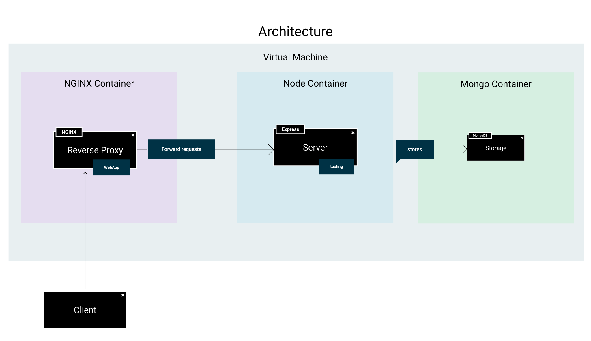
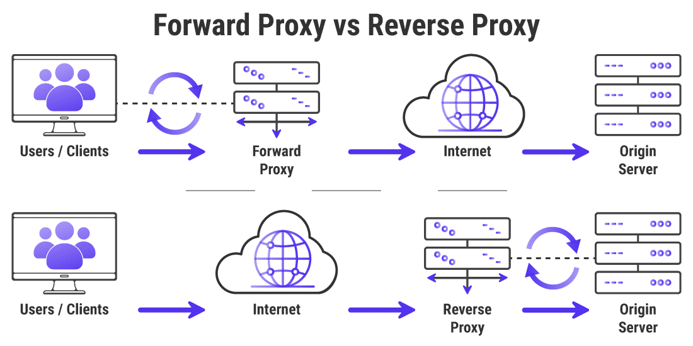

# Docker en Producción



Pasamos ahora a explicar la arquitectura que vamos a tener en producción. En este caso vamos a sustituir mayoritariamente el funcionamiento del *frontend*. Pasamos de tener un contenedor basado en una imagen de *node* a tener un *proxy inverso* gracias a una imagen de [nginx](https://hub.docker.com/_/nginx). Todo el tráfico pasará por este contenedor, que lo procesará y servirá ficheros estáticos cuando la *url* coincida con peticiones al *frontend* o redirigirá el tráfico al *backend* si la url lo indica.

## Arquitectura

Si nos fijamos en en el fichero de *Docker Compose*, vemos que tenemos los siguientes contenedores:

* **Backend:** Prácticamente igual que en su [versión de dearrollo](./docker-development), simplemente vamos a cambiar la *variable de entorno* `NODE_ENV` para indicar que vamos a desplegar nuestro servidor en *producción*.

* **Base de datos:** Al igual que el *backend*, no va a contar con muchos cambios, lo más relevante es que vamos a ocultar el puerto con el *host* para disminuir la superficie de ataque de nuestro despliegue.

* **Proxy inverso:** Este es el mayor cambio del despliegue, cambiamos nuestra imagen *node* por una basada en *nginx*, ahora vamos a abrir los puertos `80` y `443` para permitir el tráfico *HTTP* y *HTTPs* y vamos a definir las variables de entorno que parametrizan la configuración de *nginx*, en este caso para indicar los puertos abiertos con `NGINX_PORT` y `NGINX_HTTPS_PORT`, forzar la redirección a *https* con `FORCE_HTTPS` y la url de nuestro *backend* para redireccionar el tráficon con `BACKEND_API`.

Para ejecutar este entorno en nuestro proyecto, solo tenemos que ejecutar `docker-compose -f docker-compose.prod.yml up --build -d` para levantar el entorno y compilar los contenedores o mediante Make ejecutando `docker-prod-up`.

```yaml title="docker-compose.prod.yaml"
version: '3.9'

services:

  nginx:
    container_name: ui_nginx
    restart: always
    build:
      context: .
      dockerfile: nginx/Dockerfile
    environment:
      BACKEND_API: api:4000
      NGINX_PORT: 80
      NGINX_HTTPS_PORT: 443
      FORCE_HTTPS: 'false'
    ports:
      - 80:80
      - 443:443
    depends_on:
      - api
    networks:
      - mynet

  api:
    container_name: api_express
    build:
      context: ./api
      dockerfile: prod.Dockerfile
    depends_on:
      - mongodb
    ports:
      - 4000
    restart: always
    environment:
      NODE_ENV: production
      SECRET: e42d8dd28adf34fc489044d5aa21e5166f22a6ef
      MONGODB_URI: mongodb://mongodb:27017/
      MONGODB_DB_MAIN: portfolio_db
      PORT: 4000
    networks:
      - mynet

  mongodb:
    container_name: mongodb
    image: mongo:5.0.8
    restart: always
    environment:
        MONGO_INITDB_DATABASE: portfolio_db
    ports:
      - 27017
    volumes:
      - ./scripts/mongo-init.js:/docker-entrypoint-initdb.d/mongo-init.js:ro
    networks:
      - mynet


networks:
  mynet:
```

## Proxy Inverso

¿Qué es un proxy inverso?. Vamos primero a definir que es un *proxy*. Un proxy es básicamente una herramienta que permite redirigir las peticiones de una red *"aislada"* como puede ser una red local, a internet. Primero se asegura de que la petición es válida para luego intentar redirigirla hasta el servidor al que se peticiona.

Sabiendo esto podemos definir un proxy inverso como una herramienta que redirige tráfico de internet a una red aislada, permitiendo aceptar peticiones de internet para procesarlas internamente. Además cuenta con funcionalidades muy útiles como el uso de *"caché"* para disminuir el tráfico del servidor o el *"balanceo de carga"* para distribuir el tráfico si tenemos varios servidores.



En nuestro nuevo *Dockerfile* vamos a tener dos pasos, el primero para compilar la imagen de nuestro *frontend*, con una receta muy similar a la que teníamos en el [entorno de desarrollo](./docker-development), para luego definir el contenedor *nginx*, copiando la configuración definida, los certificados creados y el código compilado en el paso anterior gracias a la directiva `--from=builder` y haber llamado al primer paso `AS builder`.

```dockerfile title="nginx/Dockerfile"
FROM node:18-alpine3.17 AS builder
WORKDIR /usr/src/app
COPY ui/package*.json ./
ADD ui/package.json /usr/src/app/package.json
RUN npm install
COPY ./ui/ .
RUN npm run build


FROM nginx:1.21.6-alpine AS runtime
ENV NGINX_PORT 80
ENV NGINX_HTTPS_PORT 443
ENV FORCE_HTTPS 'false'
ENV BACKEND_API https://host.docker.internal:5000
# Copy custom nginx config with template value
COPY ./nginx/default.conf.template /etc/nginx/templates/
# Copy certificates
COPY ./nginx/certificates/ /var/certificates
# Copy deployment
COPY --from=builder /usr/src/app/dist/ /usr/share/nginx/html
```

Esta sería la configuración de `nginx`, no me voy a detener mucho porque tampoco es muy relevante que conozcáis esta herramienta en profundidad, pero básicamente definimos los puertos abiertos con `listen`, indicamos los certificados con `ssl_certificate`, indicamos si forzamos *https* con `if ($http_traffic = "true")`, y con la directiva `location /...` definimos las reglas para servir contenido, bien sea devolviendo contenido estático con `index  index.html index.htm;` o redirigiendo el tráfico a nuestro backend con `proxy_pass http://backendapi;`.

```nginx title="nginx/nginx.conf"
upstream backendapi {
    server ${BACKEND_API};
}

server {
    listen            ${NGINX_HTTPS_PORT} default_server ssl;
    listen            ${NGINX_PORT};
    listen       [::]:${NGINX_PORT};
    server_name  localhost;
    set $http_traffic "";

    gzip on;
    gzip_disable "msie6";

    ssl_certificate /var/certificates/localhost.crt;
    ssl_certificate_key /var/certificates/localhost.key;

    # Force https redirection
    if ($scheme = http) {
        set $http_traffic ${FORCE_HTTPS};
    }

    if ($http_traffic = "true") {
        return 301 https://$server_name$request_uri;
    }

    gzip_vary on;
    gzip_proxied any;
    gzip_comp_level 6;
    gzip_buffers 16 8k;
    gzip_http_version 1.1;
    gzip_min_length 0;
    gzip_types text/plain application/javascript text/css text/xml application/xml application/xml+rss text/javascript application/vnd.ms-fontobject application/x-font-ttf font/opentype;

    root   /usr/share/nginx/html;

    location / {
        index  index.html index.htm;
        expires -1;
        try_files $uri $uri/ /index.html;
    }

    location /v1 {
        proxy_pass http://backendapi;
    }

    location /auth {
        proxy_pass http://backendapi;
    }

    #error_page  404              /404.html;

    # redirect server error pages to the static page /50x.html
    #
    error_page   500 502 503 504  /50x.html;
    location = /50x.html {
        root   /usr/share/nginx/html;
    }

    location ~* \.(?:manifest|appcache|html?|xml|json)$ {
        expires -1;
        # access_log logs/static.log; # I don't usually include a static log
    }

    # Feed
    location ~* \.(?:rss|atom)$ {
        expires 1h;
        add_header Cache-Control "public";
    }

    # Media: images, icons, video, audio, HTC
    location ~* \.(?:jpg|jpeg|gif|png|ico|cur|gz|svg|svgz|mp4|ogg|ogv|webm|htc)$ {
        expires 1M;
        access_log off;
        add_header Cache-Control "public";
    }

    # CSS and Javascript
    location ~* \.(?:css|js)$ {
        expires 1y;
        access_log off;
        add_header Cache-Control "public";
    }
}
```

Además de esto hemos dejado un script para generar certificados autofirmados, aunque estos certicicados serán detectados en el navegador como potencialmente peligrosos (al estar firmados por nosotros mismos), servirá para ilustrar nuestro ejemplo, si en algún momento queréis incluir vuestros propios certificadods solo tendréis que actualizar con el mismo nombre los ficheros en la carpeta `nginx/certificates`.

```bash title="nginx/generate-certificates.sh"
openssl req -x509 -nodes -new -sha256 -days 1024 -newkey rsa:2048 -keyout localhost.key -out localhost.pem -subj "/C=US/CN=Example-Root-CA"
openssl x509 -outform pem -in localhost.pem -out localhost.crt

rm certificates/*
mv localhost.crt certificates/
mv localhost.key certificates/
mv localhost.pem certificates/
```

## Backend

En el *Dockerfile* del backend hacemos el mismo proceso que con *nginx*, primero definimos un primer paso para compilar el código para luego definir otro contenedor y ejecutar el servidor en producción.

```dockerfile title="api/prod.Dockerfile"
FROM node:18-alpine3.17 AS builder
WORKDIR /usr/src/app 
COPY package*.json ./
ADD package.json /usr/src/app/package.json
RUN npm install
COPY . .
RUN npm run build


FROM node:18-alpine3.17 as runtime
WORKDIR /usr/src/app 
COPY package*.json ./
ADD package.json /usr/src/app/package.json
RUN npm install
COPY --from=builder /usr/src/app/build  ./build
CMD ["npm", "run", "start"];
```

La base de datos en mongo sigue teniendo el mismo comportamiento, inicializándose con los datos del script, aunque en esta ocasión por motivos de seguridad no dejamos expuesto el puerto `27017` dentro del host.
