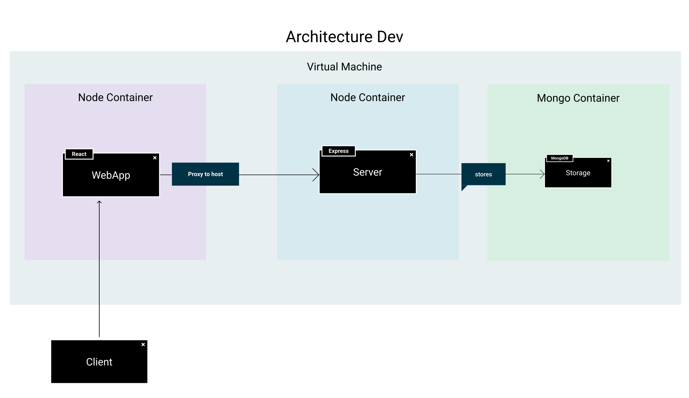

# Docker en Desarrollo

Vamos a explicar los distintos entornos de forma separada, aunque compartan la misma estructura, con [Dockerfiles](https://docs.docker.com/engine/reference/builder/) en cada una de las carpetas de nuestro proyecto monorrepo y un fichero [Docker Compose](https://docs.docker.com/compose/compose-file/) para definir la arquitectura. Es por tanto que es necesario tener en nuestra máquina instalado [Docker](https://docs.docker.com/get-docker/) y [Docker Compose](https://docs.docker.com/compose/install/).



En esta primera arquitectura para desarrollo, vamos a tener tres contenedores diferenciados. Básicamente crearemos un contenedor *node* que mantenga ejecutando nuestro frontend en *React*, seguido de otro contenedor *node* con nuestro backend en *Express* y por último nuestra base de datos contenida en un contenedor *mongoDB*. Al hacer una petición, React sirve la aplicación al navegador, y maneja mediante un proxy las peticiones al backend. El backend se conecta a través de la red interna de *Docker* para luego reenviarla a nuestra webapp. Esta es la arquitectura básica, ahora vamos a ver como la implementamos mediante *Docker Compose*

## Arquitectura

Como hemos comentado arriba, vamos a contar con tres contenedores en nuestra arquitectura. Si nos fijamos todos pertenecen a la misma red, llamada *mynet*. Esto permite que Docker internamente pueda redirigir el tráfico entre contenedores y poder realizar conexiones entre ellos. Vamos a hablar de los contenedores:

* **Frontend:** En desarrollo lo hemos llamado *ui*. Para *compilarlo* vamos a dejar el contexto en la carpeta *ui* para construir la imagen dentro de la propia ruta del frontend. Vamos a compartir el puerto interno **3000** con el puerto **3000** del host y vamos a indicar con la variable de entorno `REACT_APP_PROXY_HOST` la configuración del proxy de react para conectarse con el *backend*, la url debe tener el nombre del contenedor al que queremos conectarnos y su puerto. Por último, el comando `depends_on` indica a *Compose* que no inicie este contenedor hasta que el contenedor `api` esté listo.

* **Backend:** En este caso lo hemos llamado *api*. Al igual que el *frontend*, hemos elegido el contexto en la propia carpeta del *backend*. En este caso solo tiene expuesto el puerto `4000`, pero no lo comparte con el *host*, depende también de la *bbdd* para iniciarse, y dentro de las variables de entorno, podemos destacar que para conectarnos a *mongoDB* utilizamos el nombre del contenedor de la *bbdd* `mongodb`.

* **Base de datos:** Por último en la base de datos indicamos la propia imagen en el fichero de *Docker compose*, indicamos el nombre de la bbdd que vamos a utilizar mediante la variable `MONGO_INITDB_DATABASE`, compartimos el puerto para poder explorar la bbdd y compartimos el volumen para añadir el fichero `mongo-init-js` con los scripts para poblar la base de datos en la ruta `/docker-entrypoint-initdb.d/mongo-init.js:ro`.

Para ejecutar este entorno en nuestro proyecto, solo tenemos que ejecutar `docker-compose up --build -d` para levantar el entorno y compilar los contenedores o mediante Make ejecutando `docker-dev-up`.

```yaml title="docker-compose.yml"
version: '3.9'

services:

  ui:
    container_name: ui_react
    build:
      context: ./ui
      dockerfile: Dockerfile
    environment:
      REACT_APP_PROXY_HOST: http://api:4000
    ports:
      - 3000:3000
    depends_on:
      - api
    networks:
      - mynet

  api:
    container_name: api_express
    build:
      context: ./api
      dockerfile: Dockerfile
    depends_on:
      - mongodb
    expose:
      - 4000
    restart: always
    environment:
      NODE_ENV: development
      SECRET: e42d8dd28adf34fc489044d5aa21e5166f22a6ef
      MONGODB_URI: mongodb://mongodb:27017/
      MONGODB_DB_MAIN: portfolio_db
      PORT: 4000
    networks:
      - mynet

  mongodb:
    container_name: mongodb
    image: mongo:latest
    restart: always
    environment:
        MONGO_INITDB_DATABASE: portfolio_db
    ports:
      - 27017:27017
    volumes:
      - ./scripts/mongo-init.js:/docker-entrypoint-initdb.d/mongo-init.js:ro
    networks:
      - mynet

networks:
  mynet:
```

## Frontend

Viendo los ficheros para crear nuestro contenedor *frontend* nos podemos fijar primero en el *Dockerfile*. En este caso nos basamos en un contenedor base `node`, vamos a definir nuestro entorno en la ruta `/usr/src/app`, vamos a instalar la librería `react-script` para poder ejecutar la toolchain de *vite* y ya por último copiaremos el fichero `package.json`, isntalaremos las dependencicas y luego copiaremos el resto del código.

```dockerfile title="ui/Dockerfile"
FROM node:17-alpine3.14
WORKDIR /usr/src/app
RUN npm install react-scripts@4.0.3 -g
COPY package*.json ./
ADD package.json /usr/src/app/package.json
RUN npm install
COPY . .
CMD ["npm", "run", "start:docker"];
```

Para no copiar ciertas carpetas a nuestro contenedor como por ejemplo *build* o *node_modules*, que crearía incongruencias en nuestra instalación, contamos con un fichero llamado `.dockerignore` que funciona de forma similar a `.gitignore`, simplemente indicaremos que carpetas o ficheros excluiremos y docker los ignorará a la hora de crear nuestra imagen.

```.dockerignore title="ui/.dockerignore"
build
node_modules
```

Por otro lado, para poder parametrizar el valor del proxy que creamos en la clase anterior, creamos un nuevo fichero llamado `setUpProxy.js`, que se ejecutará al iniciar nuestro proyecto y creamos una nueva variable de entorno llamada `REACT_APP_PROXY_HOST` para parametrizar este valor.

```jsx title="ui/src/setUpProxy.js"
const { createProxyMiddleware } = require('http-proxy-middleware');

module.exports = function(app) {
  app.use(
    '/v1',
    createProxyMiddleware({
      target: process.env.REACT_APP_PROXY_HOST,
      changeOrigin: true,
    })
  );
  app.use(
    '/auth',
    createProxyMiddleware({
      target: process.env.REACT_APP_PROXY_HOST,
      changeOrigin: true,
    })
  );
};
```

## Backend y bbdd

El fichero *Dockerfile* del *backend* es bastante parecido al del *frontend*. Está basado también en una imagen `node` y básicamente reproduce los mismo pasos, cambia el directorio a `/usr/src/app`, copia el `package.json`, instala las dependencias y luego copia el código del backend. En esta copia también ignora las carpetas `build` y `node_modules` al incluirlas en el fichero `.dockerignore`.

```dockerfile title="api/Dockerfile"
FROM node:17-alpine3.14
WORKDIR /usr/src/app 
COPY package*.json ./
ADD package.json /usr/src/app/package.json
RUN npm install
COPY . .
CMD ["npm", "run", "start:dev"];
```

```.dockerignore title="api/.dockerignore"
build
node_modules
```

Por último vamos a repasar el archivo `mongo-init.js` que hemos visto en el fichero de *Docker compose* y que nos permite definir los datos con los que vamos a inicializar nuestra base de datos. En este caso creamos las colecciones `users`, `profile` y `project` y luego insertamos los datos, con esto vamos a conseguir que la propia imagen de MongoDB inicialice las colecciones al crear el contenedor.

```js title="scripts/mongo-init.js"
db = db.getSiblingDB('portfolio_db');

db.createCollection('users');
db.createCollection('profile');
db.createCollection('projects');

db.users.insertMany([
    {
        "email": "lucasfernandezaragon@gmail.com",
        "password": "$2b$10$JPu9IXwoLajqFiFFUTpE8OSC1RSK/XNb0n1hsx4ap7cghyo/YYDka",
        "tokens": []
    }
]
);
db.profile.insertMany([
    {
        "name": "Lucas Fernández Aragón",
        "birthday": 765817712000,
        "nationality": "Spain",
        "job": "Red Hat",
        "github": "https://github.com/lucferbux"
    }
]);
db.projects.insertMany([
    {
        "title": "React",
        "description": "React es el Framework web basado en componentes de Facebook. Cuenta con una curva de aprendizaje corta y mucha flexibilidad",
        "version": "17.0.1",
        "link": "https://reactjs.org/docs/hello-world.html",
        "tag": "JavaScript, Typescript, React",
        "timestamp": 765817712000
    },
    {
        "id":"789asdfas89",
        "title":"Vite",
        "description":"Toolchain para la creación de proyectos basados en React, contiene lo báisco para crear proyectos basados en single-page apps",
        "version":"4.0.3",
        "link":"https://vitejs.dev/",
        "tag":"Toolchain, React, Bootstraping",
        "timestamp":"765817712001"
    },
    {
        "title": "Styled components",
        "description": "Librería que permite usar template literals y css para crear estilos en componente con JavaScript",
        "version": "5.2.1",
        "link": "https://styled-components.com/docs",
        "tag": "CSS, JavaScript, Babel",
        "timestamp": 765817712002
    },
    {
        "title": "React i18next",
        "description": "Internacionalización de nuestro proyecto en React.",
        "version": "19.9.2",
        "link": "https://react.i18next.com",
        "tag": "JavaScript, i18n, React",
        "timestamp": 765817712003
    },
    {
        "title": "React Lottie",
        "description": "Animaciones en alta calidad que cuentan con distintos tipos de reproducción.",
        "version": "1.2.3",
        "link": "https://airbnb.design/lottie/",
        "tag": "Animation, React, Aribnb",
        "timestamp": 765817712004
    },
    {
        "title": "React Router",
        "description": "Navegación entre páginas dentro de nuestra web app.",
        "version": "5.2.0",
        "link": "https://reactrouter.com/web/guides/quick-start",
        "tag": "Navigation, routing",
        "timestamp": 765817712005
    },
    {
        "title": "Swagger",
        "description": "Herramienta para creación de especificaciones OpenAPI",
        "version": "3.0,2",
        "link": "https://app.swaggerhub.com/apis/lucferbux/ThreePoints/1.0.0",
        "tag": "API, OpenAPI",
        "timestamp": 765817712006
    },
    {
        "title": "Figma",
        "description": "Herramienta de diseño vectorial y prototipado",
        "version": "-",
        "link": "https://www.figma.com/proto/3e43h8TrzwpjfKwXvFxZoP/Taller?page-id=144%3A51&node-id=308%3A1187&viewport=254%2C48%2C0.12&scaling=min-zoom&starting-point-node-id=147%3A3",
        "tag": "Vector, UX, UI",
        "timestamp": 765817712007
    },
    {
        "title": "JWT",
        "description": "Estandar de autenticacion muy popular en APIs",
        "version": "6.1.0",
        "link": "https://jwt.io/",
        "tag": "Auth, Secure, Networking",
        "timestamp": 765817712008
    },
    {
        "title": "Express Router",
        "description": "Web Framework para Node.js que controla la navegación de la webapp",
        "version": "4.17.1",
        "link": "http://expressjs.com",
        "tag": "Server, Backend, Networking",
        "timestamp": 765817712009
    },
    {
        "title": "DotEnv",
        "description": "Herramienta gestión de variables entorno y su carga dinámica",
        "version": "10.0.0",
        "link": "https://github.com/motdotla/dotenv#readme",
        "tag": "Javascript, Env Variable",
        "timestamp": 765817712010
    },
    {
        "title": "Mongoose",
        "description": "Librería de express para modelado de objetos mongodb",
        "version": "6.0.13",
        "link": "https://mongoosejs.com/",
        "tag": "Javascript, Env Variable",
        "timestamp": 765817712011
    },
    {
        "title": "MongoDB",
        "description": "Base de Datos No Relacional orientado a documentos",
        "version": "10.0.0",
        "link": "https://github.com/motdotla/dotenv#readme",
        "tag": "Javascript, Env Variable",
        "timestamp": 765817712012
    },
    {
        "title": "Joi",
        "description": "Validador de datos y esquemas para JavaScript",
        "version": "17.5.0",
        "link": "https://github.com/sideway/joi",
        "tag": "Javascript, Schema, Validator",
        "timestamp": 765817712018
    }
    
]);
```
