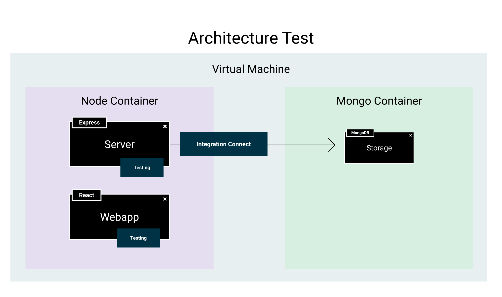

# Docker en Testing



Vamos a hablar por último de la arquitectura de *testing* dentro de la sección sobre *"contenerización"*. A diferencia del resto, esta arquitectura solo cuenta con dos contenedores, y es que vamos a tener una sola imagen node que **va a ejecutar los tests en el back y el front**, instalando las dependencias requeridas en cada una de las partes.

## Arquitectura

Vamos a tratar en conjunto este fichero de *Docker compose*. Básicamente el despliegue de la *base de datos* continúa igual, y lo que de verdad cambia es el contenedor `node`, que ahora se ejecutará en el contexto de la raiz del proyecto y contendrá tanto el *frontend* como el *backend*. También hay que destacar la nueva variable de entorno `CI`, que permite indicar a las distintas toolchains de testing que estamos ejecutando los comandos en modo *integración continua*.

Para ejecutar este entorno en nuestro proyecto, solo tenemos que ejecutar `docker-compose -f docker-compose.test.yml up --build -d` para levantar el entorno y compilar los contenedores o mediante Make ejecutando `docker-ci-up` seguido de `docker-ci-api`.

```yaml title="docker.compose.test.yml"
version: '3.9'

services:

  node:
    build:
      context: .
      dockerfile: delivery/Dockerfile
    command: ["true"]
    restart: "no"
    environment:
      NODE_ENV: test
      SECRET: e42d8dd28adf34fc489044d5aa21e5166f22a6ef
      MONGODB_URI: mongodb://mongodb:27017/
      MONGODB_DB_MAIN: portfolio_db_test
      VITE_PROXY_HOST: http://localhost:4000
      CI: true
      PORT: 4000
    networks:
      - mynet

  mongodb:
    container_name: mongodb
    image: mongo:latest
    restart: always
    environment:
        MONGO_INITDB_DATABASE: portfolio_db_test
    ports:
      - 27017
    volumes:
      - ./scripts/mongo-init.js:/docker-entrypoint-initdb.d/mongo-init.js:ro
    networks:
      - mynet


networks:
  mynet:
```

## Node build

Por último podemos ver que el *Dockerfile* de esta nueva imagen simplemente copia los contenidos del *frontend* y el *backend* e instala las dependencias globales y de ambos proyectos. Para luego ejecutar los tests tendremos que utilizar el comando `docker-compose -f docker-compose.test.yml run node npm run test` o simplemente utilizar el comando `docker-ci-up` seguido de `docker-ci-api`.

```dockerfile title="delivery/Dockerfile"
FROM mcr.microsoft.com/playwright:v1.37.0-jammy
WORKDIR /app
COPY ui/. ./ui
COPY api/. ./api
COPY package.json .
COPY package-lock.json .
RUN npm ci
RUN cd ui && npm ci
RUN cd api && npm ci
```

```makefile title="Makefile"
.PHONY: docker-ci-up
docker-ci-up:
    $(DOCKER_COMPOSE_PROD) up --build -d

.PHONY: docker-ci-api
docker-ci-api:
    $(DOCKER_COMPOSE_TEST) run node npm run test
    $(DOCKER_COMPOSE_TEST) run node npm run lint
```
