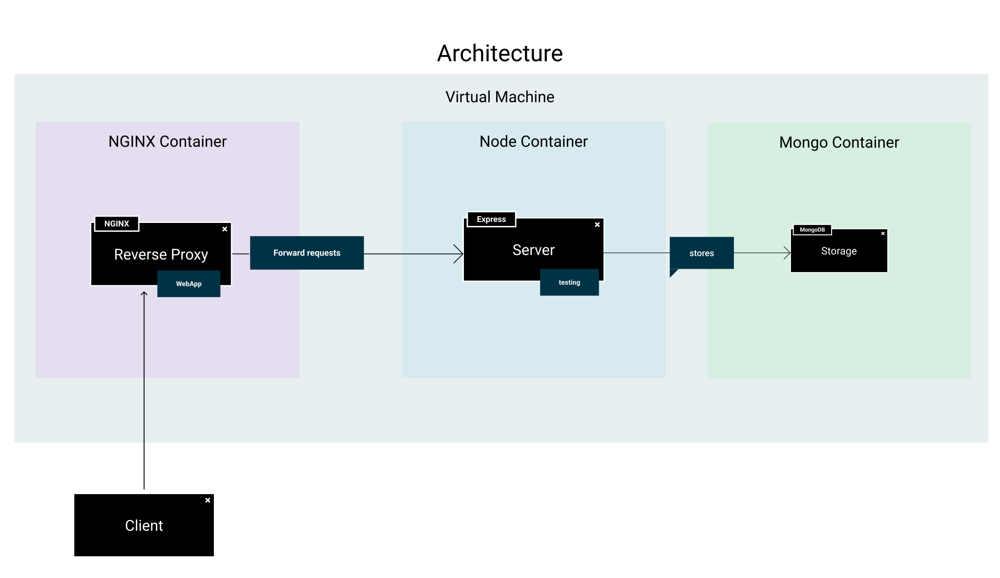

# Introducción

[Enlace del proyecto en Github](https://github.com/lucferbux/Taller-Containerization)

Estamos en la recta final del taller, después de haber creado una arquitectura simple pero robusta compuesta de un *frontend* en *React*, un *backend* con *Express* y una *base de datos* en *mongoDB*, conectada a través de una especificación API que permite controlar nuestro modelo de datos, una serie de tests que cubren un porcentaje de nuestro código y unas medidas de seguridad que otorgan cierta protección ante ataques, vamos a centrarnos en el **despliegue** de nuestro proyecto.

En este último módulo habéis visto una introducción a *contenedores* y *orquestación*, vamos a ver como podemos adapatar las herramientas más populares en nuestro proyecto para poder realizar acciones como un despliegue automatizado de los distintos entornos o la ejecución automática de tests de forma sencilla.
