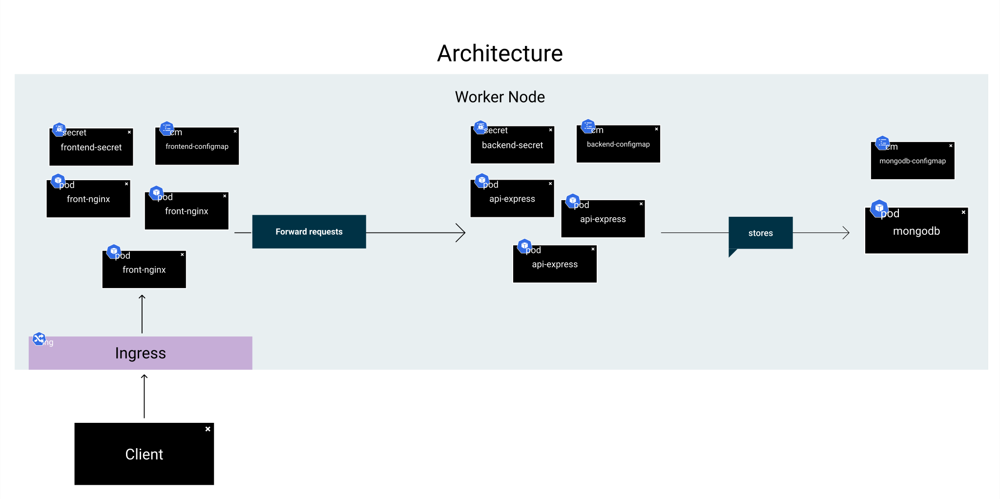

# Kubernetes




## Arquitectura

### Frontend

```yaml title="frontend.yaml"
apiVersion: apps/v1
kind: Deployment
metadata:
  name: front-nginx
  labels:
    app: front-nginx
spec:
  replicas: 3
  selector:
    matchLabels:
      app: front-nginx
  template:
    metadata:
      labels:
        app: front-nginx
    spec:
      containers:
      - name: front-nginx
        image: lucferbux/nginx:VERSION-feb12c8-SNAPSHOT
        resources:
          limits:
            cpu: 500m
            memory: 2Gi
          requests:
            cpu: 500m
            memory: 2Gi
        ports:
          - containerPort: 80
          - containerPort: 443
        env:
          - name: BACKEND_API
            valueFrom: 
              configMapKeyRef:
                name: backend-configmap
                key: api_url
          - name: NGINX_PORT
            valueFrom: 
              configMapKeyRef:
                name: frontend-configmap
                key: nginx_port
          - name: NGINX_HTTPS_PORT
            valueFrom: 
              configMapKeyRef:
                name: frontend-configmap
                key: nginx_https_port
          - name: FORCE_HTTPS
            valueFrom: 
              configMapKeyRef:
                name: frontend-configmap
                key: force_https
        volumeMounts:
          - name: certs-volume
            mountPath: /var/certificates/
      volumes:
        - name: certs-volume
          secret:
            secretName: frontend-secret
            items:
              - key: localhost.crt
                path: localhost.crt
              - key: localhost.key
                path: localhost.key
---
apiVersion: v1
kind: Service
metadata:
  name: frontend-nginx-service
spec:
  selector:
    app: front-nginx
  ports:
    - protocol: TCP
      port: 80
      targetPort: 80
      name: http
    - protocol: TCP
      port: 443
      targetPort: 443
      name: https
```

```yaml title="frontend-configmap.yaml"
apiVersion: v1
kind: ConfigMap
metadata:
  name: frontend-configmap
data:
  nginx_port: "80"
  nginx_https_port: "443"
  force_https: "false"
```

```yaml title="frontend-secret.yaml"
apiVersion: v1
kind: Secret
metadata:
    name: frontend-secret
type: Opaque
data:
    localhost.crt: LS0tLS1CRUdJTiBDRVJUSUZJQ0FURS0tLS0tCk1JSUMxakNDQWI0Q0NRQ01TbnZZUEZVSXlqQU5CZ2txaGtpRzl3MEJBUXNGQURBdE1Rc3dDUVlEVlFRR0V3SlYKVXpFZU1Cd0dBMVVFQXd3VlRYa3RVR1Z5YzI5dVlXd3RVRzl5ZEdadmJHbHZNQjRYRFRJeU1ETXhOVEV4TkRVeQpNVm9YRFRJMU1ERXdNakV4TkRVeU1Wb3dMVEVMTUFrR0ExVUVCaE1DVlZNeEhqQWNCZ05WQkFNTUZVMTVMVkJsCmNuTnZibUZzTFZCdmNuUm1iMnhwYnpDQ0FTSXdEUVlKS29aSWh2Y05BUUVCQlFBRGdnRVBBRENDQVFvQ2dnRUIKQU1BcDNiM1JkRUZHQ3B4R2hBNGttTTRYSlNsTGE4eTRhMFZGMmVGMzl4d1pSb2VKbCtqZ2ZYUlpaT01ZOWFiTAp1d2J5Q3hOd0h3R21KTTg3eFRxOEN2SzZWVWtsVnRrcTFlUlovaFdzZFZiZ1A1SjZ5YitweUtaL2lBWklLai9BCnVScG5BQlJvUExTcGh1VW5qQlpYM3pmOXdEMWM2RXlyVDcxYStJaGx4ekVXS1FzRjRZM2hzb2RmNko2U0RuZ1oKQ2VWSzYxalA4c2x5akZ5VU1UT3BtSEtxTS9KdklnTzFWdlpqcjZXWGdvN0lGbzhSMlEwR2xyZjFOU1R5YXFNRgpoS0VkWlN6UnA3YktmOW1ZRkg0ayttbnN4YXI4VGdueGdvblFhK3NzblUxbDA4ZG00MForRjJkUDJaTTBZb2FNCmZlK1VVZWRZc3c5MVJYTENKQThwSjYwQ0F3RUFBVEFOQmdrcWhraUc5dzBCQVFzRkFBT0NBUUVBdWhsdFllOVcKR2M4YU5mUGNtRThVQUdGZDBtK25iTGVzTVM2aFllV0VwWlM4SXhId0tvbmpUM2ZLT3JHVFgvZFRNZDczUCsvcwpVVHl5ZWtVSzc3VGxBZHdrUFFwT3dkUjFNRWRxOEwwN1Z4a3o3c1o1ZmtQVUtETUUxenNzRWpmeE8xM3FsN3ZzCnhmdHNBc3VydUdRMm1DZHlqMW03RVlxbCszMTF4OWtoWnExV01SMmlOTGsxU2lhY3kvaExZVDdGbTd0UHFEbWwKOFQwd2tsMHI0aWttTkJxaDB4NENBM294R0RPdlFlcXJURGZRelczVGxyNElmOHF0UUtiWVh5NzB2aFpIZEtMTwplUXFZVXF5aUlHcnJEbVJ6RXJ2TVRhdzdXdlcvTXdTYm1KUWQvWTdEb0hJZHRsSGdReWRaOExTWTMwTEFzdWtyCjZjQ2F3QzBoYU84NmZBPT0KLS0tLS1FTkQgQ0VSVElGSUNBVEUtLS0tLQ==
    localhost.key: LS0tLS1CRUdJTiBQUklWQVRFIEtFWS0tLS0tCk1JSUV2d0lCQURBTkJna3Foa2lHOXcwQkFRRUZBQVNDQktrd2dnU2xBZ0VBQW9JQkFRREFLZDI5MFhSQlJncWMKUm9RT0pKak9GeVVwUzJ2TXVHdEZSZG5oZC9jY0dVYUhpWmZvNEgxMFdXVGpHUFdteTdzRzhnc1RjQjhCcGlUUApPOFU2dkFyeXVsVkpKVmJaS3RYa1dmNFZySFZXNEQrU2VzbS9xY2ltZjRnR1NDby93TGthWndBVWFEeTBxWWJsCko0d1dWOTgzL2NBOVhPaE1xMCs5V3ZpSVpjY3hGaWtMQmVHTjRiS0hYK2lla2c1NEdRbmxTdXRZei9MSmNveGMKbERFenFaaHlxalB5YnlJRHRWYjJZNitsbDRLT3lCYVBFZGtOQnBhMzlUVWs4bXFqQllTaEhXVXMwYWUyeW4vWgptQlIrSlBwcDdNV3EvRTRKOFlLSjBHdnJMSjFOWmRQSFp1TkdmaGRuVDltVE5HS0dqSDN2bEZIbldMTVBkVVZ5CndpUVBLU2V0QWdNQkFBRUNnZ0VCQUlSams1ZzEySEVyN3gxeFc0TmU1VU4vSUtRTmlRdzJ0Zmk0d2Y0YkowemQKZ1FEWjQ2V1dHL2h2cWhqblZqNSt0N0IyU3ZrdVVyNVJGNlVLV2J3NFZ4YVpGeTdZb2JmbVVnd0xrQWlna3dxeQpYam50akZjV2d0MXFtVzB5aEtEOWhzbFEwdlk4Umk1MWFURXhDTXRQNk1KcmVPa052Q0V1R1Rhc21QTm5vMDhGCjhzQ1hVcVd2MXlnRk1YZ2grVHZBTWY0M3M2VWlkdkcvdkJjZ1F2ZEMzQ0dCdHF4WWZ0WWZWS3dvdVF2R1VueXMKMG02YkN4OWl4U0hEOFV3VlA3QW1EaDhTWFFVRy81V21IUnBmaGNma3ZERVZMSTlmNWlPRy9hTDJKNzJJT1c4KwpBNXloUk1Na3dIODFGRXRUTUlySWp1ckh3VHlPTU1tenpvbkRGYTYwTFlVQ2dZRUE0ZVp1cDg5d2gzWnIwb0kyCnBoZ1QxT3JhZ1hLK0JaV282TkNtQU1HWmVhQXQ3NTJCY1MzM2RvVXN2WGI1ejF6RDNmSlg0QjN0dEhKdXhSdUsKL0JDcCsrczkxUDRvUzNGMGhFYjh0WGZEVFRpbndsV2pzajM2NFZLRUVPL2ROd0VBT1pRMHpwczFGbXVGRHpzUwpJSmYra2VTVzltZlFWeFNHeDJBWEp4K3dzbXNDZ1lFQTJjU3BjUVQwbEZ5dkVIa2JtN3Y0eE1yQjNpSEFHVUdFCkptRW1PVmF2SnZUVmxzUDdydFhzRk9ReENXL2lxVHBQUzVIZkk5QU9LTU1QcU1sSHk1NFo3cU1KQnNKenZpUHUKUlY1dDVlUkFjSGF0ajhpOGtMdC9WRWdxMDFUOEkwb1IxNSttUW5xdmxGSWtFaWFhMVdlNEF0blNqamFkcEZ0TApFWkk1bUFxYUJFY0NnWUVBa010WnpCZ3JvYmhtL2lSV2tQbkg1R2F3cmQ1MUxERTBkaDRlK1VjZWI1WWJPNFl5CmpQQVF1Umc5aUNlMWtaTjlQRXIweG9PSWRHd1EwaWlJV203MzliQmdEcURtQlExd3lNU1RnR0dHZm4yOUVkUkEKdTZQOHBlWjFIa0lSQWd1VE1GVHQwQ3d0eC9RYzhwbERVajc2ZmxzTjVGekFic0NLYjBzSkxCdWs3NGNDZ1lBTwpJMzJZeitpTlJXTThYNUNTVU9iNjUrc2tYKzZYOVMvK1NlcHdhSmRnb1I3STlocCtKSGQ2ZDhKVFNZZGUwMkZZCmw3VDBIMHI4RElZVXdGUy8vSmpVYkpObWMvT04wY2xqaVpqN0J4SEQrNENUU0VZdDQyNkY2MVdVZVAwUjBYcE4KRkpsMzBYMWExT1p3b3o4RVFnS3BkTGo5OEwvVmJ2UDF4UmVtTG5JSGV3S0JnUUN5Ny9USEl1T25WT3NyYURHSApIQVNwblJ1ODNJZm8zbG5vZjV5dTZ5U0thOXFqZ3NyMlpHUFZ4TktYUEdnVE1scXJZSDNpSXY2aXRGUkplcnc5Cnlzdi9LOHVjTXhHUUYwaFA3Ylc1R0Z2dUNrNUpGV1E1TmxBTGtpdTFlQU50UFBNUzNqV3BRWmZNMHZoTWM0UFkKOFFUckQrWVdHUkpwZ0pXam1rSURqWnJtT1E9PQotLS0tLUVORCBQUklWQVRFIEtFWS0tLS0t
```

### Backend

```yaml title="backend.yaml"
apiVersion: apps/v1
kind: Deployment
metadata:
  name: api-express
  labels:
    app: api-express
spec:
  replicas: 3
  selector:
    matchLabels:
      app: api-express
  template:
    metadata:
      labels:
        app: api-express
    spec:
      containers:
      - name: api-express
        image: lucferbux/api:VERSION-feb12c8-SNAPSHOT
        resources:
          limits:
            cpu: 500m
            memory: 2Gi
          requests:
            cpu: 500m
            memory: 2Gi
        ports:
          - containerPort: 4000
        env:
          - name: SECRET
            valueFrom:
              secretKeyRef:
                name: backend-secret
                key: jwt-secret
          - name: PORT
            valueFrom: 
              configMapKeyRef:
                name: backend-configmap
                key: node_port
          - name: MONGODB_URI
            valueFrom: 
              configMapKeyRef:
                name: mongodb-configmap
                key: database_url
          - name: MONGODB_DB_MAIN
            valueFrom: 
              configMapKeyRef:
                name: mongodb-configmap
                key: database_name
---
apiVersion: v1
kind: Service
metadata:
  name: api-express-service
spec:
  selector:
    app: api-express
  ports:
    - protocol: TCP
      port: 4000
      targetPort: 4000
```

```yaml title="backend-configmap.yaml"
apiVersion: v1
kind: ConfigMap
metadata:
  name: backend-configmap
data:
  node_env: production
  node_port: "4000"
  api_url: api-express-service:4000
```

```yaml title="backend-secret.yaml"
apiVersion: v1
kind: Secret
metadata:
    name: backend-secret
type: Opaque
data:
    jwt-secret: ZTQyZDhkZDI4YWRmMzRmYzQ4OTA0NGQ1YWEyMWU1MTY2ZjIyYTZlZgo=
```

### BBDD

```yaml title="mongo.yaml"
apiVersion: apps/v1
kind: Deployment
metadata:
  name: mongodb-deployment
  labels:
    app: mongodb
spec:
  replicas: 1
  selector:
    matchLabels:
      app: mongodb
  template:
    metadata:
      labels:
        app: mongodb
    spec:
      containers:
      - name: mongodb
        image: mongo
        resources:
          limits:
            cpu: 500m
            memory: 2Gi
          requests:
            cpu: 500m
            memory: 2Gi
        ports:
          - containerPort: 27017
        env:
          - name: MONGO_INITDB_DATABASE
            valueFrom:
              configMapKeyRef:
                name: mongodb-configmap
                key: database_name
        volumeMounts:
          - name: init-script-volume
            mountPath: /docker-entrypoint-initdb.d/mongo-init.js
            subPath: mongo-init.js
      volumes:
        - name: init-script-volume
          configMap:
            name: mongodb-configmap
            items:
            - key: mongo-init.js
              path: mongo-init.js
---
apiVersion: v1
kind: Service
metadata:
  name: mongodb-service
spec:
  selector:
    app: mongodb
  ports:
    - protocol: TCP
      port: 27017
      targetPort: 27017
```

```yaml title="mongo-configmap.yaml"
apiVersion: v1
kind: ConfigMap
metadata:
  name: mongodb-configmap
data:
  database_url: mongodb://mongodb-service:27017/
  database_name: portfolio_db
  mongo-init.js: |
    db = db.getSiblingDB('portfolio_db');

    db.createCollection('users');
    db.createCollection('profile');
    db.createCollection('profile');

    db.users.insertMany([
        {
            "email": "lucasfernandezaragon@gmail.com",
            "password": "$2b$10$JPu9IXwoLajqFiFFUTpE8OSC1RSK/XNb0n1hsx4ap7cghyo/YYDka",
            "tokens": []
        }
    ]
    );
    db.profile.insertMany([
        {
            "name": "Lucas Fernández Aragón",
            "birthday": 765817712000,
            "nationality": "Spain",
            "job": "Red Hat",
            "github": "https://github.com/lucferbux"
        }
    ]);
    db.projects.insertMany([
        {
            "title": "React",
            "description": "React es el Framework web basado en componentes de Facebook. Cuenta con una curva de aprendizaje corta y mucha flexibilidad",
            "version": "17.0.1",
            "link": "https://reactjs.org/docs/hello-world.html",
            "tag": "JavaScript, Typescript, React",
            "timestamp": 765817712000
        },
        {
            "title": "Create React App",
            "description": "Toolchain para la creación de proyectos basados en React, contiene lo báisco para crear proyectos basados en single-page apps",
            "version": "4.0.3",
            "link": "https://create-react-app.dev",
            "tag": "Toolchain, React, Bootstraping",
            "timestamp": 765817712001
        },
        {
            "title": "Styled components",
            "description": "Librería que permite usar template literals y css para crear estilos en componente con JavaScript",
            "version": "5.2.1",
            "link": "https://styled-components.com/docs",
            "tag": "CSS, JavaScript, Babel",
            "timestamp": 765817712002
        },
        {
            "title": "React i18next",
            "description": "Internacionalización de nuestro proyecto en React.",
            "version": "19.9.2",
            "link": "https://react.i18next.com",
            "tag": "JavaScript, i18n, React",
            "timestamp": 765817712003
        },
        {
            "title": "React Lottie",
            "description": "Animaciones en alta calidad que cuentan con distintos tipos de reproducción.",
            "version": "1.2.3",
            "link": "https://airbnb.design/lottie/",
            "tag": "Animation, React, Aribnb",
            "timestamp": 765817712004
        },
        {
            "title": "React Router",
            "description": "Navegación entre páginas dentro de nuestra web app.",
            "version": "5.2.0",
            "link": "https://reactrouter.com/web/guides/quick-start",
            "tag": "Navigation, routing",
            "timestamp": 765817712005
        },
        {
            "title": "Swagger",
            "description": "Herramienta para creación de especificaciones OpenAPI",
            "version": "3.0,2",
            "link": "https://app.swaggerhub.com/apis/lucferbux/ThreePoints/1.0.0",
            "tag": "API, OpenAPI",
            "timestamp": 765817712006
        },
        {
            "title": "Figma",
            "description": "Herramienta de diseño vectorial y prototipado",
            "version": "-",
            "link": "https://www.figma.com/proto/3e43h8TrzwpjfKwXvFxZoP/Taller?page-id=144%3A51&node-id=308%3A1187&viewport=254%2C48%2C0.12&scaling=min-zoom&starting-point-node-id=147%3A3",
            "tag": "Vector, UX, UI",
            "timestamp": 765817712007
        },
        {
            "title": "JWT",
            "description": "Estandar de autenticacion muy popular en APIs",
            "version": "6.1.0",
            "link": "https://jwt.io/",
            "tag": "Auth, Secure, Networking",
            "timestamp": 765817712008
        },
        {
            "title": "Express Router",
            "description": "Web Framework para Node.js que controla la navegación de la webapp",
            "version": "4.17.1",
            "link": "http://expressjs.com",
            "tag": "Server, Backend, Networking",
            "timestamp": 765817712009
        },
        {
            "title": "DotEnv",
            "description": "Herramienta gestión de variables entorno y su carga dinámica",
            "version": "10.0.0",
            "link": "https://github.com/motdotla/dotenv#readme",
            "tag": "Javascript, Env Variable",
            "timestamp": 765817712010
        },
        {
            "title": "Mongoose",
            "description": "Librería de express para modelado de objetos mongodb",
            "version": "6.0.13",
            "link": "https://mongoosejs.com/",
            "tag": "Javascript, Env Variable",
            "timestamp": 765817712011
        },
        {
            "title": "MongoDB",
            "description": "Base de Datos No Relacional orientado a documentos",
            "version": "10.0.0",
            "link": "https://github.com/motdotla/dotenv#readme",
            "tag": "Javascript, Env Variable",
            "timestamp": 765817712012
        },
        {
            "title": "Joi",
            "description": "Validador de datos y esquemas para JavaScript",
            "version": "17.5.0",
            "link": "https://github.com/sideway/joi",
            "tag": "Javascript, Schema, Validator",
            "timestamp": 765817712018
        }
        
    ]);
```

## Deployment

```bash title="kubernetes deployment"
kubectl get all -n porfolio-app
NAME                                     READY   STATUS    RESTARTS   AGE
pod/api-express-58854547b5-4d5sb         1/1     Running   0          16s
pod/api-express-58854547b5-4zc7z         1/1     Running   0          16s
pod/api-express-58854547b5-wzmbg         1/1     Running   0          16s
pod/front-nginx-6cfbc8c476-79mmh         1/1     Running   0          16s
pod/front-nginx-6cfbc8c476-99wkg         1/1     Running   0          16s
pod/front-nginx-6cfbc8c476-l79s8         1/1     Running   0          16s
pod/mongodb-deployment-8575f75cf-xfbdj   1/1     Running   0          16s

NAME                             TYPE        CLUSTER-IP       EXTERNAL-IP   PORT(S)          AGE
service/api-express-service      ClusterIP   10.105.27.188    <none>        4000/TCP         16s
service/frontend-nginx-service   ClusterIP   10.98.33.56      <none>        80/TCP,443/TCP   16s
service/mongodb-service          ClusterIP   10.101.228.139   <none>        27017/TCP        16s

NAME                                 READY   UP-TO-DATE   AVAILABLE   AGE
deployment.apps/api-express          3/3     3            3           16s
deployment.apps/front-nginx          3/3     3            3           16s
deployment.apps/mongodb-deployment   1/1     1            1           16s

NAME                                           DESIRED   CURRENT   READY   AGE
replicaset.apps/api-express-58854547b5         3         3         3       16s
replicaset.apps/front-nginx-6cfbc8c476         3         3         3       16s
replicaset.apps/mongodb-deployment-8575f75cf   1         1         1       16s
```