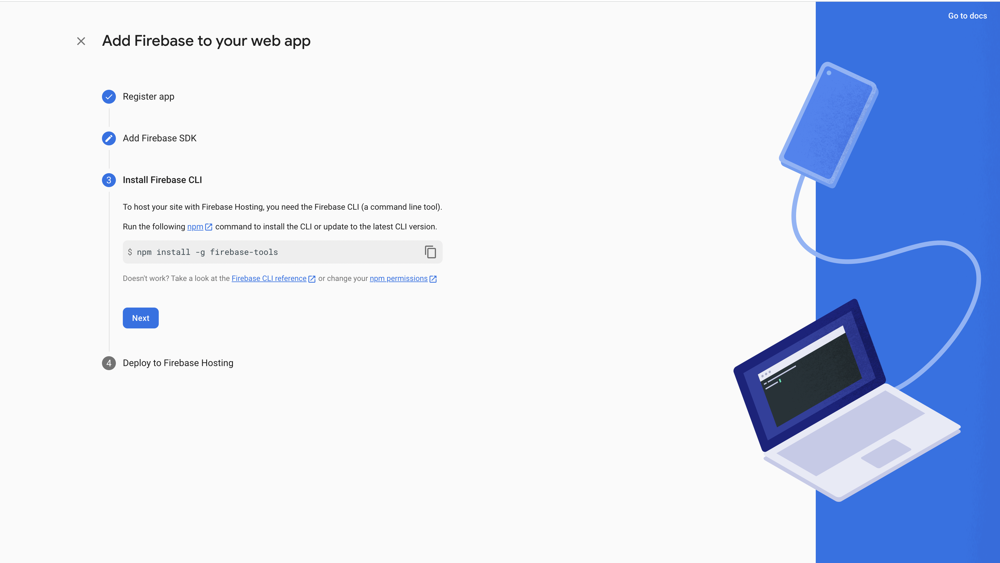

# Firebase

Esta sección está pensada para el proyecto de [firebase](https://github.com/lucferbux/Taller-Firebase)

Como complemento adicional al despliegue en [Netlify, Render y Atlass](./backendbbddrender), vamos a comentar rápidamente otras alternativas a estos servicios antes mencionados. En este caso vamos a hablar de [Firebase](https://firebase.google.com/) por la simple razón de ser una plataforma muy completa que he usado extensamente a lo largo de muchos años en diversos proyectos.

**Firebase** se podría definir de muchas maneras. La más general podría ser que es una plataforma que ofrece servicios para acelerar el desarrollo de aplicaciones. Tiene un enfoque **BaaS** o **Backend as a Service**, ofreciendo servicios como **autenticación**, **bbdd en tiempo real**, **hosting**, **funciones de ML**, **analíticas**, **mensajería**, **notificationes** y mucho más.

Además, una de las grandes ventajas es que cuenta con **SDKs** para múltiples plataformas, por lo que es posible integrarlo en **proyectos web**, **apps móviles**, **programas de escritorio** abarcando todo el abanico multiplataforma.

En este caso vamos a ver como podemos adaptar el proyecto que estamos construyendo para integrarlo con Firebase. En realidad es bastante fácil, sólo necesitaremos integrar los servicios de [firestore](https://firebase.google.com/docs/firestore), la base de datos en tiempo real y su sdk en nuestro proyecto. Así, la arquitectura del proyecto quedaría de la siguiente forma.

## Dashboard

1. Registrate o accede a la web de [Firebase](https://firebase.google.com/), lo puedes hacer perfectamente con tu cuenta de Google y en la consola pulsa **Add project**

2. En el primer paso del *Wizard* añade el nombre que quieres darle al proyecto, si no se genrará uno por defecto.

3. En la siguiente ventana te preguntarán si quieres añadir [Google Analytics](https://analytics.google.com/) a tu proyecto. Por simplicidad deshabilitaremos esta opción de momento.

4. Una vez completado el *Wizard*, llegaremos a la página principal de nuestro proyecto. Ahora toca hablitar el proyecto para nuestra webapp, así, pulsaremos el botón para conectar un proyecto web indicado en la imagen de abajo.

5. Ahora nos presentará con otro *Wizard*, al que podremos indicar que queremos habilitar **Firebase Hosting** y ponerle el nombre que queramos a la integración.

6. En el paso de **Add Firebase SDK** copiaremos las credenciales para luego integrarlas en el proyecto, también aprovecharemos e instalaremos las *firebase-tools* en nuestra máquina ejecutando en una terminal `npm install -g firebase-tools`. El paso final podemos ignorarlo de momento.

7. Ahora nos dirigiremos a la sección de **Firestore Database** y crearemos una nueva instancia en el cluster que queramos.

8. Ahora solo tendremos que añadir información desde el Dashboard, al menos tendremos que crear una colección llamada **aboutme** con los mismos datos que tengáis en el objeto *aboutme* y una colección **project** con el mismo formato que el objeto *project*

9. En la sección de reglas, podremos añadir lo que aparece en la imagen de abajo o esperar a importarlo desde el proyecto en la siguiente sección.

10. Por último nos dirigiremos a la sección de **Hosting** y pulsaremos el botón **Get started** para habilitar el servicio.

Ahora tendremos que realizar algunos cambios en el proyecto para tener el despliegue completo.

## Proyecto

Ahora nos iremos a nuestro [proyecto firebase](https://github.com/lucferbux/Taller-Firebase) para terminar el despliegue.

1. Primero nos dirigiremos al fichero `.env.local` y añadiremos cada atributo de la clave en la variable de entorno correspondiente, cada variable tiene el nombre de la clave con el prefijo **REACT_APP**.

1. Ahora logearemos nuestra terminal con firebase mediante el comando `firebase login` y una vez accedamos ejecutamos el comando `firebase init`. Nos pedirá seleccionar las funcionalidades que queremos activar. De momento habilitaremos **Firestore** y **Hosting** presionando la barra espaciadora.

3. Ahora nos pedirá seleccionar el proyecto que queremos conectar. Elegimos el proyecto que acabamos de crear en el paso anterior.

4. Lo siguiente será la configuración de **Firestore**. Como el proyecto ya incluye los archivos [firestore.rules](https://firebase.google.com/docs/firestore/security/get-started) y [firestore.indexes.json](https://firebase.google.com/docs/firestore/query-data/indexing) solo tendremos que presionar **Enter** para dejar por defecto el fichero y luego elegir **No** cuando pregunten si queremos sobreescribirlo, tal y como aparece en la foto.

5. Ahora configuraremos el servicio de **Hosting**. Pondremos como carpeta principal **build**, que es la carpeta resultante de la compilación de nuestro proyecto, diremos que queremos configurar una **Single-page-app** y diremos que **no** queremos usar la integración de **Github** ni sobreescribir nuestro **build/index.html**.

6. Por último, solo tendremos que compilar nuestro proyecto ejecutando `npm run build` y luego ejecutar `firebase deploy` para desplegar nuestro proyecto en **Firebase**

Ahora podremos acceder a la url que indica la ejecución anterior para ver nuestro proyecto desplegado.
