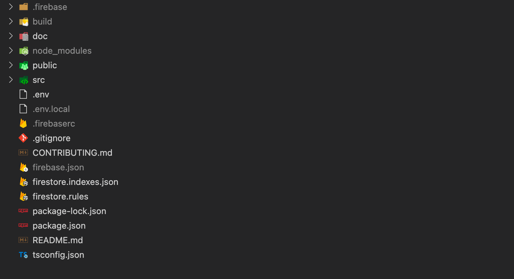

# Cambios en el Frontend

## Arquitectura general

Vamos a comparar el [proyecto de firebase](https://github.com/lucferbux/Taller-Firebase) con el proyecto de la [sesión de bbdd](https://github.com/lucferbux/Taller-BBDD) para darnos cuenta de una serie de cambios fundamentales:

* **Eliminación de la bbdd y el backend**: Firebase se va a ocupar de la lógica de nuestros proyectos, así que podemos perfectamente eliminar tanto las dependencias del backend como de la base de datos al no hacernos falta.
* **Eliminación de la api en el frontend**: Firebase tiene un *sdk* para casi cualquier plataforma, y *React* no es menos. En vez de mantener una API conjunta para la comunicacón entre *backend/frontend* y un objeto para manejar las peticiones, haremos uso del *sdk* interno de Firebase.
* **Eliminación de todo lo referente a la autenticación**: Para mantener simple el proyecto, y no inundar de funcionalidades el proyecto, hemos rebajado algunas de las características de nuestra webapp como la autenticación y la capacidad de editar los proyectos. Todo esto se podría conseguir de forma relativamente fácil con servicios como [firebase auth](https://firebase.google.com/docs/auth).



## Variables de entorno

Ahora vamos a tener nuevos valores dentro de nuestros ficheros de entorno, todo esto son las credenciales de firebase que hemos obtenido en la [sección de despliegue en firebase](../deployment/firebase#proyecto) y que servirá para iniciar la librería de [firebase reactfire](https://github.com/FirebaseExtended/reactfire).

```env title=".env"
REACT_APP_LOCALE=es-ES

REACT_APP_FIREBASE_API_KEY=
REACT_APP_AUTH_DOMAIN=
REACT_APP_PROJECT_ID=
REACT_APP_STORAGE_BUCKET=
REACT_APP_MESSAGING_SENDER_ID=
REACT_APP_APP_ID=
```

```ts title="src/utils/firebase.ts"
export const firebaseConfig = {
  apiKey: process.env.REACT_APP_FIREBASE_API_KEY,
  authDomain: process.env.REACT_APP_AUTH_DOMAIN,
  projectId: process.env.REACT_APP_PROJECT_ID,
  storageBucket: process.env.REACT_APP_STORAGE_BUCKET,
  messagingSenderId: process.env.REACT_APP_MESSAGING_SENDER_ID,
  appId: process.env.REACT_APP_APP_ID,
};
```

## Inicialización

Ahora inicializaremos la librería [reactfire](https://github.com/FirebaseExtended/reactfire) añadiendo nuestras credenticales al contexto de *FirebaseAppProvider* primero y luego al contexto de *FirestoreProvider*. El primero sirve para inicializar la conexión de **Firebase** global y el segundo para conectarse a la base de datos de **firestore**.

```tsx title="src/indext.tsx"
ReactDOM.render(
  <React.StrictMode>
    <HelmetProvider>
      <FirebaseAppProvider firebaseConfig={firebaseConfig}>
          <AppProvider>
              <App />
          </AppProvider>
      </FirebaseAppProvider>
    </HelmetProvider>
  </React.StrictMode>,
  document.getElementById("root")
);
```

```tsx title="src/app.tsx"
const App = () => {
  const firestoreInstance = getFirestore(useFirebaseApp());

  useEffect(() => {

    console.log(firebaseConfig);
  }, []);
  
  // TODO: Change redirect to Dashboard
  return (
    <FirestoreProvider sdk={firestoreInstance}>
      <Router>
        <Layout>
          <Switch>
            <Route exact path="/">
              <LandingPage />
            </Route>
            <Route path="/dashboard">
              <Dashboard />
            </Route>
            <Redirect from="*" to="/" />
          </Switch>
          <Loader/>
        </Layout>
      </Router>
    </FirestoreProvider>
  );
};

export default App;
```

## Dashboard

Ahora en el *Dashboard* eliminaremos las conexiones al backend y directamente crearemos referencias a las colecciones de Firestore. Estas colecciones son *reactivas* y dispararán renderizados cuando detecten cambios en *firestore*. Así, al cambiar cualquier dato dentro de nuestras colecciones, **inmediatamente se verá reflejado en nuestro proyecto**.

```tsx title="src/components/routes/Dashboard.tsx"
const Dashboard = () => {
  const { t } = useTranslation();

  const aboutMeCollectionRef: CollectionReference<DocumentData> = collection(
    useFirestore(),
    "aboutme"
  );
  const projectsCollectionRef: CollectionReference<DocumentData> = collection(
    useFirestore(),
    "project"
  );

  const { status: statusAboutme, data: dataAboutMe }: AboutMeResponse =
    useFirestoreCollectionData(aboutMeCollectionRef);
  const { status: statusProjects, data: dataProjects }: ProjectResponse =
    useFirestoreCollectionData(projectsCollectionRef);

  return (
    <Wrapper>
      <ContentWrapper>
        <ResponseWrapper>
          <AboutMeWrapper>
            {statusAboutme === "error" && <ErrorMsg>{t("dashboard.error")}</ErrorMsg>}
            {statusAboutme === "success" && (
              dataAboutMe?.map((aboutMe, index) => (
                <AboutMeCard aboutMe={aboutMe as AboutMe} key={index} />
              ))
            )}
          </AboutMeWrapper>
          <ProjectWrapper>
            {statusProjects === "error" && <ErrorMsg>{t("dashboard.error")}</ErrorMsg>}
            {statusAboutme === "success" &&
              dataProjects?.map((project, index) => (
                <ProjectCard project={project as Project} key={index} />
              ))}
            {}
          </ProjectWrapper>
        </ResponseWrapper>
      </ContentWrapper>
    </Wrapper>
  );
};
```
