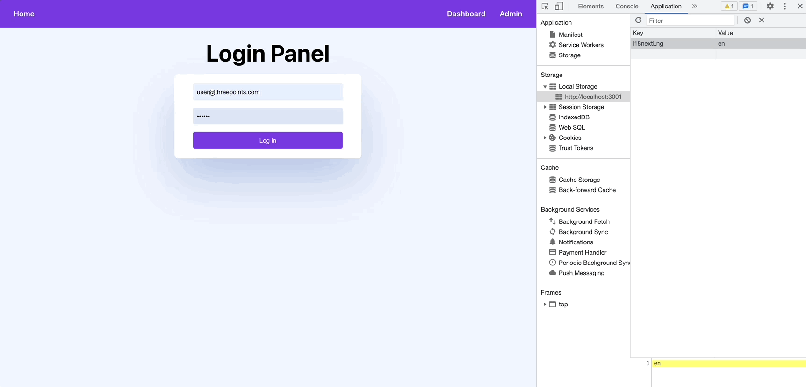

# Autenticación

Para ir acabando esta sesión vamos a hablar de uno de los aspectos más importantes de nuestar *webapp*: la **lógica de la autenticación**. Es muy importante tener una lógica robusta para el acceso de contenido en nuestros proyectos. Es un **esfuerzo combinado** entre el servidor, que solo **proveerá la información requerida** para cada rol, y el frontal, que **mantendrá el estado de la autenticación** en cada momento e implementará determinadas lógicas dependiendo de si estamos autenticados o no.

En el caso de nuestra aplicación, de momento impediremos entrar a ciertas rutas protegidas como ya vimos en la sección de [navegación](./navigation), pero en un futuro podremos editar o eliminar proyectos solo si estamos autenticados.

La implementación actual de autenticación en nuestro frontal se encuentra principalmente en dos ficheros, `auth.ts` y  `AuthContext.tsx`.

## Auth code

Dentro de `auth.ts` vamos a encontrar la lógica que **procesa el token de autenticación, lo guarda en la sesión del navegador, comprueba si es valido y lo elimina en caso contrario**. `setAuthToken` **recibe ese token, lo decodifica, crea el objeto** `Token` con los atributos de expiración `notBeforeTimestampInMillis` y `expirationTimestampInMillis` y luego almacena el token en **localStorage** de la página, mientras que tenemos `remoteAuthToken()` para eliminar el valor cuando ha expirado.

```tsx title="src/utils/auth.ts"
export function setAuthToken(accessToken: string) {
  const tokenPayload = getPayload(accessToken);
  const token: Token = {
    accessToken: accessToken,
    notBeforeTimestampInMillis: tokenPayload.iat * 1000,
    expirationTimestampInMillis: tokenPayload.exp * 1000,
  };
  localStorage.setItem(tokenKey, JSON.stringify(token));
}

export function removeAuthToken() {
  localStorage.removeItem(tokenKey);
}
```

Esto hace que cuando realizamos un login correcto, nuestra webapp almacene el token en la sesión. Como ya veremos en futuras sesiones este no es el mejor método y hay otras formas de hacerlo más seguras.



Podemos encontrar también en este fichero funciones para decodificar el token, extraerlo de la sesión del navegador y comprobar si todavía es válido.

```tsx title="src/utils/auth.ts"
function getPayload(token: string): JWTPayload {
  return jwt_decode(token);
}

function getToken(): Token | null {
  let token: Token;
  const tokenJson = localStorage.getItem(tokenKey);
  if (tokenJson) {
    token = JSON.parse(tokenJson);
    return token;
  }
  return null;
}

function getAccessToken(): string {
  const token = getToken();
  if (token) {
    return token.accessToken;
  }
  return "";
}

function isTokenActive(): boolean {
  const token = getToken();
  // TODO: check token expiration
  return !!(
    token 
  );
}
```

Y por último tenemos la función que devuelve **el usuario autenticado si es válido** y la función `setLogoutIfExpiredHandler`, que terminaremos de implementar en la siguiente sesión y básicamente termina la sesión si el token ha expirado si el usuario sigue navegando.

```tsx title="src/utils/auth.ts"
export function getCurrentUser(): User | undefined {
  const token = getToken();
  if (token) {
    if (!isTokenActive()) {
      logout();
      return undefined;
    }
    const tokenPayload = getPayload(token.accessToken);
    return {
      id: tokenPayload.id,
      active: true,
      email: tokenPayload.email
    };
  } else {
    return undefined;
  }
}

export function setLogoutIfExpiredHandler(
    setUser: (user: any) => void
) {
  if (!isTokenActive()) {
    return;
  }
  const token = getToken();
  if (!token) {
    return;
  }

  // TODO: change dynamically in next session
  logoutIfExpiredHandlerId = setTimeout(
    () => setUser(undefined),
    1800000
  );
}
```

## Auth context

En el archivo `AuthContext.tsx` tenemos toda la lógica para mantener el estado de la autenticación tal y como comentamos en la sección de [contextos](./context). Los métodos de `login` y `logout` hacen precisamente lo que su nombre indican, autentican o desautentican al usuario mediante usuario y contraseña. Ambos utilizan las funciones del fichero `auth.ts` para completar la lógica de la aplicación.

```tsx title="src/context/AuthContext.tsx"
const login = useCallback(
    async (username: string, password: string) => {
      try {
        const result = await mockLogin(username, password);
        console.log(result);
        setAuthToken(result.token);
        setLogoutIfExpiredHandler(setUser);
        loadUser();
      } catch (apiError) {
        throw new Error();
      }
    },
    [setUser, loadUser]
);

const logout = useCallback(() => {
    logoutService();
    setUser(undefined);
}, []);
```

Por otro lado tenemos un estado interno dentro del contexto llamado `user`, este estado determinará si nuestra webapp está autenticada, siendo *undefined* cuando no estamos loggeados y un objeto de valor [User](./models#user). Dentro del control de ciclo de vida, cada vez que se recargue el contexto comprobará el valor del JWT almacenado para actualizar el estado de `user`.

```tsx title="src/context/AuthContext.tsx"
const [user, setUser] = useState<User | undefined>(getCurrentUser());

const loadUser = useCallback(() => {
const currentUser = getCurrentUser();
setUser(currentUser);
}, []);

useEffect(() => {
if (isTokenActive()) {
    setLogoutIfExpiredHandler(setUser);
    loadUser();
} else {
    logoutService();
    setUser(undefined);
}
}, [loadUser]);
```
