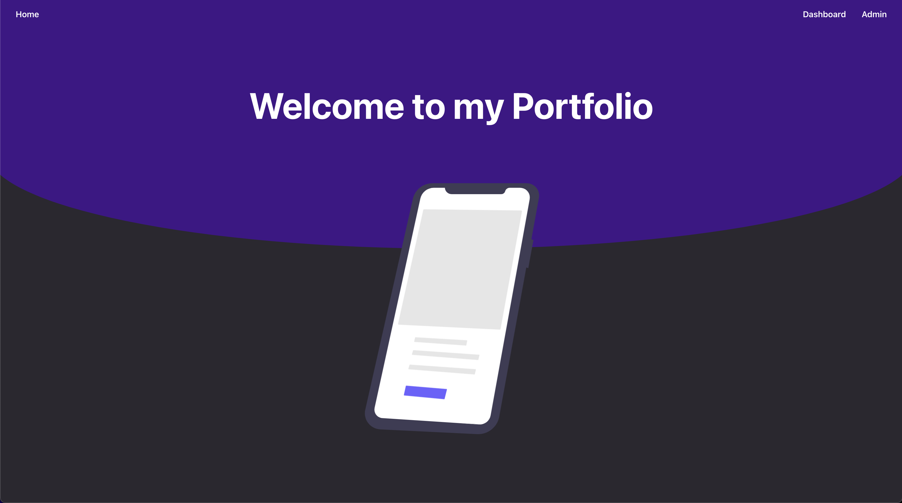

# Internacionalización

Hay muchas características que diferencian una webapp simple de un proyecto profesional. Cosas como la seguridad (que veremos en próximas sesiones), la [accesibilidad de la página](https://reactjs.org/docs/accessibility.html), el diseño multipantalla, o la internacionalización del contenido hacen que nuestro proyecto pueda llegar a muchas más personas de una manera más segura. En esta sección nos vamos a detener en la internacionalización de la página con el framework [i18next](https://www.i18next.com).

## Configuración

Primero vamos a configurar el *framework*. Para ello crearemos el archivo `i18n.ts` y lo importaremos en nuestro fichero de inicio `indext.tsx`. Ahora empezaremos la configuración. Primero crearemos los ficheros donde almacenaremos las localizaciones, de momento en inglés `en-us.json` y en español `es-es.json`. Ahora importaremos esos ficheros y los agruparemos en un objeto llamado *resources* indicando el código de idioma de cada fichero (*en* para inglés y *es* para español).


```json title="src/locale/es-es.json"
{
    "meta": {
        "title": "Portfolio",
        "description": "Personal Portfolio Webpage"
    },
    "app": {
        "title": "Bienvenid@s a mi Web Portfolio"
    },
    "landing": {
        "title": "Bienvenido a mi Portfolio"
    },
    "loader" : {
        "text": "cargando..."
    },
    "dashboard" : {
        "error": "Error en la búsqueda"
    },
...
```

Por último iniciaremos el objeto **i18n** con varios parámetros extra:

* **LanguageDetector**: Nos permitirá reconocer el idioma del navegador y aplicarlo a la página.
* **initReactI18next**: Inicia el objeto i18n y se lo pasa a la librería react-i18next.
* **resources**: El objeto con los ficheros de las localizaciones.
* **fallback**: El lenguaje por defecto si no se identifica el idioma del navegador o no está en la lista de localizaciones permitidas.
* **interpolation**: Para la interpolación de cadenas, *escapeValue* evita ataques de XSS, aquí no hace falta habilitarlo ya que **React** por defecto escapa valores en la interpolación de cadenas.

```tsx title="src/i18n.ts"
import i18n from "i18next";
import { initReactI18next } from "react-i18next";
import LanguageDetector from 'i18next-browser-languagedetector';

import enus from "./locales/en-us.json";
import eses from "./locales/es-es.json";


const resources = {
    en: {
        translation: enus
    },
    es: {
        translation: eses
    }
} as const;

i18n
    .use(LanguageDetector)
    .use(initReactI18next) // passes i18n down to react-i18next
    .init({
        resources: resources,
        fallbackLng: 'en',

        interpolation: {
            escapeValue: false, // not needed for react as it escapes by default
        }
    });

export default i18n;
```

## Implementación

Ahora solo tendremos que implementar la localización en nuestros componentes. Para ello, tenemos el *hook* `useTranslation()` con el objeto `t` que permite llamar a la traducción que estamos buscando. El fichero de localización es un *json* con datos clave/valor anidados, para elegir uno de ellos, solo tenemos que ir seleccionando las distintas claves separadas por puntos hasta llegar al valor que queramos. Abajo tenemos un ejemplo con la localización de la **Landing Page**.

```tsx title="src/components/routes/LandingPage.tsx"
const LandingPage = () => {

    const { t } = useTranslation();

    const defaultOptions = {
      loop: true,
      autoplay: true, 
      animationData: animationData,
      rendererSettings: {
        preserveAspectRatio: 'xMidYMid slice'
      }
    };

    return(
        <Wrapper>
            <WaveLanding/>
            <ContentWrapper>
                <Title>{t("landing.title")}</Title>
            </ContentWrapper>
            <LottieWrapper>
              <Lottie 
                options={defaultOptions}
                />
            </LottieWrapper>
        </Wrapper>   
    )

}
```

Ahora podremos jugar con el idioma de nuestro dispositivo para ver los cambios. Yo personalmente uso una [extensión de Chrome](https://chrome.google.com/webstore/detail/locale-switcher/kngfjpghaokedippaapkfihdlmmlafcc) que permite cambiar el idioma del navegador. Recuerda **borrar la caché de la última hora** para forzar el cambio.


*Landing Page en Inglés*


*Landing Page en Español*
