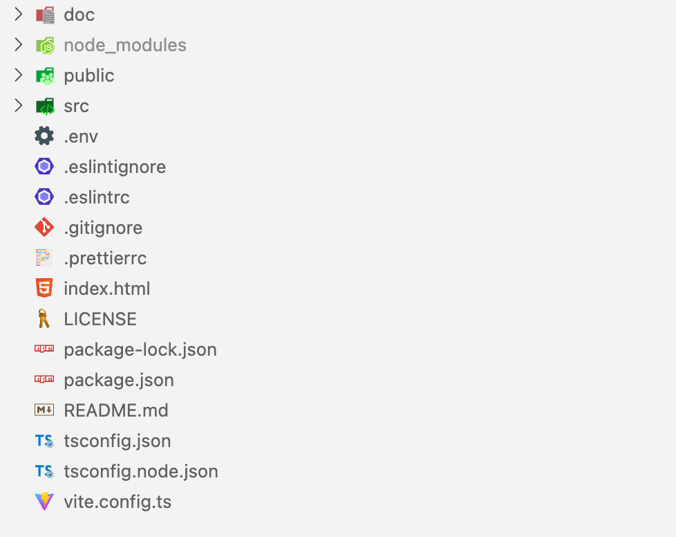

# Estructura

Ahora vamos a hablar de la estructura general del repositorio, también llamado **scaffolding**. **Create react app** tiene bastante libertad en la forma de organizar nuestro código, no es un Framework tan restrictivo como puede ser [Gatsby](https://www.gatsbyjs.com) o [Nextjs](https://nextjs.org), con todas sus ventajas e inconvenientes. Como ventajas tenemos una mayor libertad a la hora de organizar el proyecto, pudiendo personalizar más nuestra *codebase*, pero precisamente esa puede ser también una desventaja, pudiendo convertir nuestro proyecto en un autentico *cajón de sastre* si no organizamos bien el código.


*Estructura general del proyecto*

En este caso en particular, hemos usado una estructura bastante genérica. Tenemos en la raiz del respositorio todos los ficheros de configuración y documentación, la carpeta **public** con los ficheros de la página estática y luego la carpeta **src** con todo el código de *React* organizado.

## Ficheros de configuración

En la **raíz del proyecto** encontramos diversos archivos de configuración y documentación general. Estos ficheros se encuentran aquí por su facilidad de acceso y debido a que por convención, todas las herramientas esperan esta información y configuración en la carpeta principal del proyecto. Estos archivos son:

* **package.json & package-lock.json**: Especificación de la configuración que espera un proyecto **npm**. Aquí se encuentran las dependencias, metadatos, comandos de ejecución y demás información acerca de nuestro proyecto en formato *JSON*. **Package-lock.json** se genera automáticamente en cada operación que **npm** modifique el **package.json** o **node_modules**.
* **node_modules**: Carpeta que aparecerá una vez ejecutemos `npm install`. Contiene el código de todas las dependencias de nuestro proyecto.
* **tsconfig.ts**: Fichero de configuración de typescript. Podéis ver sus opciones en el [curso de TypeScript](https://javascript-course-threepoints.netlify.app/typescript/3_entorno/index.html).
* **README**: Archivo que contiene información acerca del proyecto en formato **markdown**. En muchos proveedores de control de versiones como [Github](https://github.com) o [Gitlab](https://about.gitlab.com) convierten este fichero en **HTML** para renderizarlo en la página principal.
* **LICENSE**: Licencia del proyecto, es recomendable elegir una licencia para tu proyecto en caso de hacerlo público, para proteger el código de uso indebido. Hay bastantes guías acerca de la elección de licencias como [esta de GitHub](https://docs.github.com/en/repositories/managing-your-repositorys-settings-and-features/customizing-your-repository/licensing-a-repository).
* **.gitignore**: Fichero que indica a git que archivos ignorar y no incluir en el control de versiones. Muy útil para excluir cosas como **node_modules** o ficheros de configuración como **.env**.
* **.env**: Fichero de configuración que permite almacenar variables de entorno que luego librerías de JavaScript o en este caso el propio framework de [Create React App](https://create-react-app.dev/docs/adding-custom-environment-variables/) transformará en variables en tiempo de compilación. En el caso de nuestro proyecto tienen que empezar con el prefijo `REACT_APP_`.
* **doc**: Carpeta donde almacenar documentación y recursos.

## Carpeta public

Dentro de la carpeta **Public** se encuentran los archivos estáticos que [Create React App](https://create-react-app.dev/docs/using-the-public-folder/) usa en tiempo de compliación para construir nuestra página. Aquí podremos cambiar metadatos en la cabeza del archivo `index.html`.

```html title="public/index.html"
<head>
    <meta charset="utf-8" />
    <link rel="icon" href="%PUBLIC_URL%/favicon.ico" />
    <meta name="viewport" content="width=device-width, initial-scale=1" />
    <link rel="apple-touch-icon" href="%PUBLIC_URL%/logo192.png" />
    <!--
      manifest.json provides metadata used when your web app is installed on a
      user's mobile device or desktop. See https://developers.google.com/web/fundamentals/web-app-manifest/
    -->
    <link rel="manifest" href="%PUBLIC_URL%/manifest.json" />
    <!--
      Notice the use of %PUBLIC_URL% in the tags above.
      It will be replaced with the URL of the `public` folder during the build.
      Only files inside the `public` folder can be referenced from the HTML.

      Unlike "/favicon.ico" or "favicon.ico", "%PUBLIC_URL%/favicon.ico" will
      work correctly both with client-side routing and a non-root public URL.
      Learn how to configure a non-root public URL by running `npm run build`.
    -->
</head>
```

O por el contrario añadir más elementos al cuerpo. Fijaos como el elemento principal es un `<div id="root"></div>`, que será el elemento que utilizará **React** para inyectar el **DOM** generado.

```html title="public/index.html"
<body>
    <noscript>You need to enable JavaScript to run this app.</noscript>
    <div id="root"></div>
    <!--
      This HTML file is a template.
      If you open it directly in the browser, you will see an empty page.

      You can add webfonts, meta tags, or analytics to this file.
      The build step will place the bundled scripts into the <body> tag.

      To begin the development, run `npm start` or `yarn start`.
      To create a production bundle, use `npm run build` or `yarn build`.
    -->
</body>
```

También tenemos `manifest.json` para configurar nuestra [progressive web app](https://web.dev/progressive-web-apps/), `robots.txt` para la [idexación de navegadores](https://developers.google.com/search/docs/advanced/robots/intro) y varios recursos gráficos.

## Carpeta src

Por último tenemos la carpeta **src**. Aquí tendremos nuestra *codebase* principal de **React**. Vamos a repasar algunos de los archivos y carpetas más importantes para entender la estructura de nuestro proyecto:

* **index.tsx**: Fichero principal y entrypoint de **React**. Aquí declararemos los **contextos globales** del proyecto y llamaremos al `ReactDOM.render` principal.
* **i18n.ts**: Fichero de configuración principal de nuestra **herramienta de internacionalización**, para el control de los idiomas de nuestra app.
* **utils**: La carpeta utils contiene archivos que aportan funcionalidad a nuestro proyecto, como `auth.ts` que contendrá la lógica de autenticación, `config.ts` que consumirá las variables de entorno y `mock-responses.ts`, que contiene las respuestas *moqueadas* del futuro backend.
* **styles**: Contiene todos los archivos para los estilos generales del proyecto, hablaremos en más dentenimiento de estos ficheros.
* **model**: Aquí encontramos los modelos de los objetos que consumiremos en nuestra app.
* **locales**: Recoge las frases que queremos *localizar* en los diferentes idiomas que soporte nuestro proyecto.
* **hooks**: Contiene los [hooks](https://reactjs.org/docs/hooks-intro.html) para los contextos globales de nuestro proyecto.
* **context**: Contiene los contextos globales que utilizaremos en el proyecto.
* **constants**: Solo contiene una constante para el **JWT**, pero es un ejemplo de carpeta que puede encontrarse en otros proyectos.
* **components**: Contienen todos los componentes de **React** de nuestra aplicación, tanto de **navegación**, **páginas** y **componentes del sistema**.