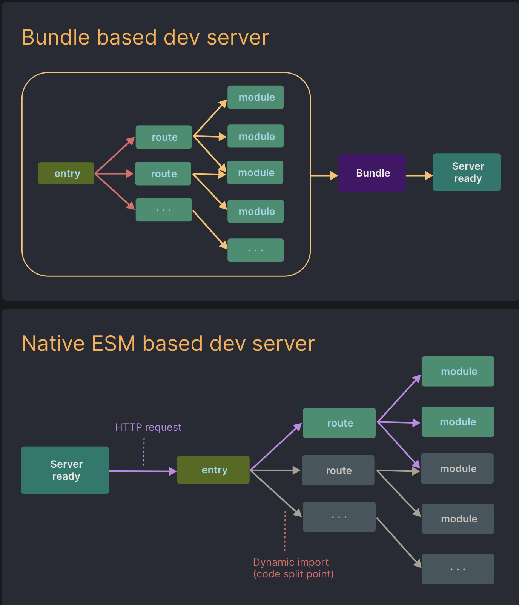

# Vite

[Create React App](https://create-react-app.dev) ha sido durante muchos años la herramienta por defecto para crear *Single Page Applications* en React. La propia documentación de React lo recomienda como el framework recomendado para crear aplicaciones. El problema es que tiene alguna desventaja de rapidez y rendimiento que **es cada vez más evidente** comparado con nuevas herramientas.

CRA usa [webpack](https://webpack.js.org) como bundler o *empaquetador*. Si queréis un poco más de información hablamos de ello en el [curso de JavaScript](https://javascript-course-threepoints.netlify.app/project/1_entorno/index.html#webpack). El problema de *webpack* es que es bastante lento al levantar un entorno de desarrollo, pudiendo tardar hasta **varios minutos** en proyectos pesados.

[Vite](https://vitejs.dev/) intenta solucionar estos problemas con varias tecnologías que permiten incrementar el rendimiento y la rapidez de forma drástica.

## Inicio lento del servidor

En *webpack*, cuando se inicia el servidor de desarrollo, tiene que analizar y compilar de forma estricta **toda la aplicación** antes de que pueda ser servida.

Vite toma otra aproximación, dividiendo primero los módulos de una aplicación en dos categorías: dependencias y código fuente. Las **dependencias** son en su mayoría código que no cambia con frecuencia en el desarrollo pero muy pesadas mientras que el código fuente suele ser más liviano pero sujeto a cambios en el desarrollo.

Vite empaqueta con antelación las dependencias usando [esbuild](https://esbuild.github.io/), herramienta escrita en **Go** que empaqueta dependencias de **10 a 100 veces más rápido que otras alternativas**.

Vite sirve el código fuente sobre ESM nativo. Básicamente permitirá que el navegador se haga cargo de parte del trabajo de un empaquetador: Vite solo necesita transformar y servir código fuente a petición según como lo solicite el navegador.

*Webpack vs ESBuild*

## Actualizaciones lentas

Como estamos viendo, con *empaquetadores* tradicionales, el rendimiento será directamente proporcional al tamaño del código, ya que necesita recompilar la aplicación entera en cada actualización. Es por ello que algunos empaquetadores tienen la opción de **Hot Module Replacement** (HMR). Esta funcionalidad permite que un modulo se **reemplace en caliente** a sí mismo sin afectar al resto de la página.

En Vite, el **HMR** es realizado sobre ESM nativo. Cuando se edita un archivo, Vite solo necesita invalidar la relación entre el módulo editado y sus límites HMR más cercanos, lo que hace que las actualizaciones sean consistentemente rápidas independientemente del tamaño de la aplicación.

Es por ello que podemos ver que nuestro proyecto, al ser bastante liviano, tenga actualizaciones inmediatas. Por comparación, antes de la migración desde CRA, el proyecto podría tener actualizaciones de 15 o 20 segundos comparado con **actualizaciones de menos de un segundo** con Vite.
