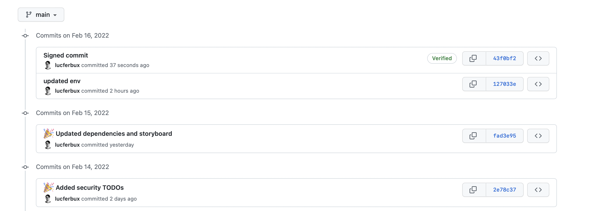

# Configuración global

## NPM Audit

NPM Audit es un comando de Node que envía una descripción de las dependencias configuradas de nuestro proyecto a nuestro registry (por defecto npmjs.com) y pide un reporte de las vulnerabilidades conocidas. Si existe alguna vulnerabilidad conocida, devuelve una descripción con la severidad de la vulnerabilidad, la forma de mitigarlo y las versiones afectadas.

Es tan fácil como ejecutar el siguiente comando en el directorio donde se encuentre nuestro fichero *package.json*: `npm audit`.

```bash title="Ejemplo de reporte"
# npm audit report

ansi-html  *
Severity: high
Uncontrolled Resource Consumption in ansi-html - https://github.com/advisories/GHSA-whgm-jr23-g3j9
fix available via `npm audit fix --force`
Will install react-scripts@5.0.0, which is a breaking change
node_modules/ansi-html
  @pmmmwh/react-refresh-webpack-plugin  <=0.5.0-rc.6
  Depends on vulnerable versions of ansi-html
  node_modules/@pmmmwh/react-refresh-webpack-plugin
    react-scripts  >=0.1.0
    Depends on vulnerable versions of @pmmmwh/react-refresh-webpack-plugin
    Depends on vulnerable versions of @svgr/webpack
    Depends on vulnerable versions of css-loader
    Depends on vulnerable versions of optimize-css-assets-webpack-plugin
    Depends on vulnerable versions of postcss-flexbugs-fixes
    Depends on vulnerable versions of postcss-normalize
    Depends on vulnerable versions of react-dev-utils
    Depends on vulnerable versions of resolve-url-loader
    Depends on vulnerable versions of webpack
    Depends on vulnerable versions of webpack-dev-server
    node_modules/react-scripts
  webpack-dev-server  2.0.0-beta - 4.7.2
  Depends on vulnerable versions of ansi-html
  Depends on vulnerable versions of chokidar
  Depends on vulnerable versions of selfsigned
  Depends on vulnerable versions of yargs
```

Podemos intentar arreglar automáticamente estas vulnerabilidades añadiendo el siguiente flag: `npm auidt fix`. Con ello, se intentará acutalizar todas las dependencias a las versiones no vulnerables. Esto es muy útil porque automatiza de forma muy eficiente el control de vulnerabilidades en dependencias externas.

## Ficheros de entorno

Ya hemos hablado anteriormente de los ficheros de entorno. Estos ficheros nos ayudan a configurar ciertos aspectos de nuesro código, como el entorno donde se ejecuta, los endpoints en las conexiones o la inserción de credenciales y similares.

Hast ahora hemos tenido un fichero `.env` en el que íbamos añadiendo nuestra información, y ésta era procesada por la librería [dotenv](https://github.com/motdotla/dotenv) en el backend y por el propio [vite](https://vitejs.dev/guide/env-and-mode.html) en el frontend. El problema que se nos presenta es que estos ficheros los tenemos incluidos en el control de versiones de nuestro proyecto, y esto puede llevar a situaciones no deseadas, como añadir nuestras propias credenciales, olvidarnos de ello, **commitear** los cambios y **pushearlos** a nuestro repositorio.

Para ello hay ciertas estrategias, hoy os voy a enseñar una de ellas que es bastante popular y aceptada. El uso de múltiples arcihvos de entorno. Su configuración es bastante sencilla.

### Frontend

En el frontend no hacer falta hacer nada, *vite* ya viene por defecto configurado para el uso de múltiples ficheros de entorno, simplemente tendremos que crear `.env.local` en el mismo directorio que `.env`, y sobreescribir los valores sensibles en ese archivo, ya que también está incluído en nuestro `.gitignore`.

### Backend

Vamos a intentar imitar este funcionamiento también en nuestro backend. Simplemente vamoa a tener que hacer lo siguiente:

1. Instalar [dotenv-flow](https://www.npmjs.com/package/dotenv-flow) ejecutando `npm install dotenv-flow --save` en el backend.
2. Sustituir la configuración de `dotenv` por `dotenv-flow` en `backend/src/config/env/index.ts`.

```ts
import * as flow from 'dotenv-flow';

flow.config();
```

3. Crear el archivo `.env.local` en la misma carpeta que `.env`
4. Añadir a gitignore el tracking de todos los .env locales

```.env
.env.local
.env.development.local
.env.test.local
.env.production.local
```

## Cifrado de archivos

A lo mejor es necesario el cifrado de ciertos archivos, como por ejemplo secretos en nuestra aplicación o ficheros de configuración para entornos como producción. Es por ello qeu os dejo dos herramientas muy útiles que permiten trabajar entre equipos con ficheros sensibles:

* [Git crypt](https://github.com/AGWA/git-crypt): Herrammienta que permite cifrar archivos a través de claves gpg o secretos. Mediante el fichero `.gitattributes` seleccionamos que directorios queremos cifrar y aplicamos el cifrado.
* [Sops](https://github.com/mozilla/sops): Editor de archivos cifrados que soporta ficheros como *YAML*, *JSON*, *ENV*, *INI* y *BINARIO*. Es muy útil para cifrar archivos de configuración de nuestra *orquestación*.

## Firma de commits

Git tiene una feature fundamental, y es que cada *commit* está firmado con un usuario y un email. Es por ello que si ejecutamos `git config --list` podemos ver la información con la que firmamos nuestros cambios. Un problema que podemos encontrar es que esta información no se verifica, y puede dar problemas a la hora de suplantar a personas.

Vamos a ver un ejemplo. En este caso vamos a querer que [Dan Abramov](https://github.com/gaearon) participe en nuestro proyecto. Lo único que necesitamos es saber su email y su nombre.


Ahora vamos a crear un nuevo commit en nuestro proyecto, para ello añadimos unas lineas en el `README.md`, y antes de realizar los commits vamos a ejecutar los siguientes comandos:

`git config user.email "dan.abramov@gmail.com"`

`git config user.name "gaeron"`

Con esto vamos a configurar nuestro proyecto para que los commits sean firmados con su información. Ahora ejecutamos `` y `` para commitear los proyectos. Si nos fijamos en nuestros commits en Github, podremos ver que reconoce a Dan como su autor.


Evidentemente ahora tendremos que eliminar el commit con `git reset --hard HEAD~1` y `git push --force`. Y desconfigruar a Dan de nuestro proyecto ejecutando los comandos de arriba sustituyendo la información con la nuestra.

Para evitar esto, podemos [añadir nuestra clave gpg](https://docs.github.com/en/authentication/managing-commit-signature-verification/about-commit-signature-verification) a nuestra configuración y firmar nuestros commits. Una vez generada y añadida la clave, para configurar git solo tenemos que ejecutar lo siguiente:

1. `gpg --list-secret-keys --keyid-format=long`
2. Elegir la clave correspondiente a nuestro correo y que [hemos añadido anteriormente a github](https://docs.github.com/en/authentication/managing-commit-signature-verification/adding-a-new-gpg-key-to-your-github-account)
3. Copiar el id largo, tiene que tener un formato similar a este: `3AA5C34371567BD2`
4. Configurar la clave `git config --global user.signingkey 3AA5C34371567BD2` sustityendo la clave de ejemplo con la tuya.
5. Crea un nuevo commit, esta vez con el flag "-S", de esta manera `git commit -S -m "your commit message"`

Con esto podremos crear nuevos commits firmados como podemos ver en el log de github. Si nos fijamos el último commit tiene una etiqueta verde que indica que está verificado.


