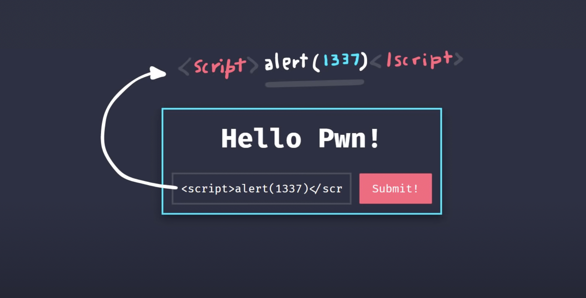
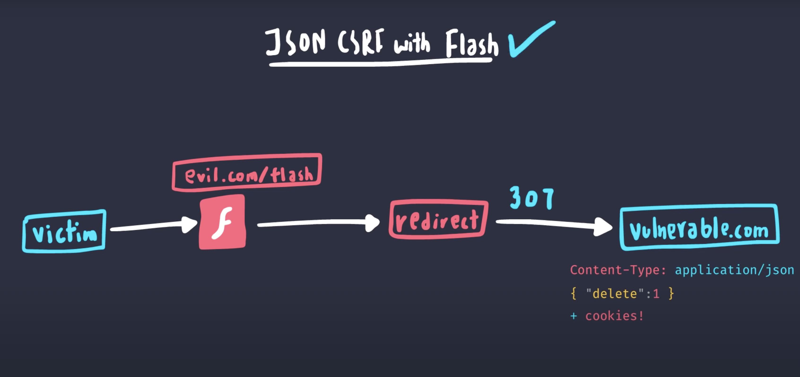
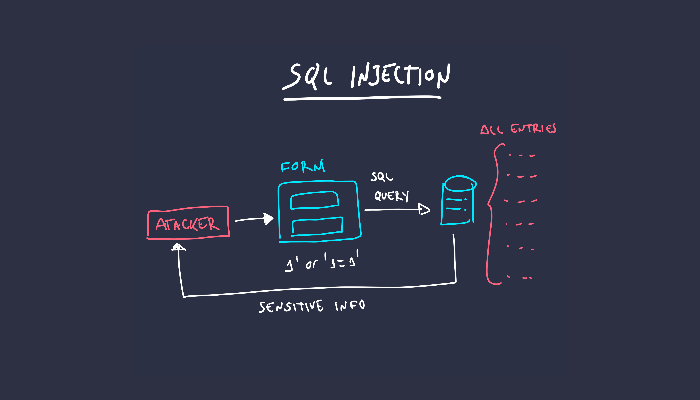

# Introducción

[Enlace del proyecto en Github](https://github.com/lucferbux/Taller-Testing-Security)

En esta nueva sección vamos a hablar de dos aspectos muy importantes y muy buenos indicativos de la robustez de un proyecto: el testing y la seguridad. Ya hemos pasado la primera mitad de nuestro taller, en el que nos focalizamos en desarrollar la arquitectura y el código para dotar a nuestra webapp de la funcionalidad que requería. En esta sesión iremos modificando pequeños detalles para hacer nuestro código más seguro y a la vez iremos añadiendo tests para cubrir la lógica principal de nuestra aplicación. Si seguimos utilizando el diagrama de la arquitectura, nuestro proyecto quedaría de la siguiente manera.


Como podemos observar, vamos a añadir módulos de testing tanto al *frontend* como al *backend*. Otro de los cambios que podemos observar es que moveremos el JWT a una cookie de sesión para mejorar la seguridad de las conexiones de nuestra aplicación. Antes de comenzar con la sesión, estaría bien repasar algunos conceptos para poder aplicarlos correctamente en las siguientes secciones.

## Conceptos importantes

### XSS



Ataque a aplicaciones web en el que *scripts* maliciosos son inyectados a una página con la intención de ejecutar código arbitrario para alterar el funcionamiento inicial.

[Video explicativo](https://youtu.be/EoaDgUgS6QA)

En lineas generales, **React está protegido de xss** ya que tiene sanetización de entradas. Pero vamos a crear un componente en la [sección inicial](https://github.com/lucferbux/Taller-Testing-Security) donde pondremos un ejemplo de vulnerabilidad XSS mediante la función [dangerouslySetInnerHTML](https://reactjs.org/docs/dom-elements.html).

```ts title="ui/src/components/routes/Admin.tsx"

const [evilInput, setEvilInput] = useState("");
...
  function onChangeEvilInput(e: ChangeEvent<HTMLInputElement>) {
    setEvilInput(e.target.value);
    onChangeAnyInput();
  }
...
      <ContentWrapper>
        <EvilInput>
          <LoginForm
            name="img"
            type="text"
            placeholder="image"
            value={evilInput}
            onChange={onChangeEvilInput}
          />
          <EvilDiv
            dangerouslySetInnerHTML={{
              __html: ``,
            }}
          />
        </EvilInput>
      </ContentWrapper>
...

const EvilDiv = styled.div`
  padding: 20px 40px;
`;

const LoginForm = styled.input`
  border: none;
  border-radius: 3px;
  width: 100%;
  height: 36px;
  color: ${themes.light.text1};
  background-color: ${themes.light.backgroundForm};
  padding-left: 8px;

  @media (prefers-color-scheme: dark) {
    color: ${themes.dark.text1};
    background-color: ${themes.dark.backgroundForm};
  }
`;
```

En este caso, vamos a crear un nuevo formulario simple, en el que al pasarle una url de una imagen nos la renderiza `https://vitejs.dev/logo-with-shadow.png`.


El problema viene que al ser una entrada no sanetizada, al no cerrar las comillas en `src="${evilInput}"` podemos forzar a ejecutar código JavaScript arbitrario como por ejemplo `https://badimageforceonerror.com/320/320/any" onerror="alert(window.localStorage.token)`, nos dará como resultado una desagradable sorpresa. Este mismo mecanismo puede ser usado por web maliciosas para inyectar código en la misma sesión del navegador de un usuario.

### CSRF



El Cross-Site Request Forgery es un ataque que fuerza a usuarios autenticado a realizar peticiones a una aplicación web a la que están autenticados. Estos ataques explotan la confianza que tiene esta web en sus usuarios autenticados permitiendo realizar tareas que de otra forma necesitan privilegios.

[Video explicativo](https://www.youtube.com/watch?v=eWEgUcHPle0)

Imaginad que una web consigue mediante un ataque de xss robar nuestro token de sesión, ahora, con solo añadir ese token a una llamada al backend, podemos eliminar información del usuario.

```bash
curl -X GET \
  'http://localhost:4000/v1/projects' \
  --header 'Accept: */*' \
  --header 'Authorization: Bearer <localstorage.token>' \
  --header 'Content-Type: application/json' 
```

Con esto primero cogeremos todos los proyectos de la base de datos de la víctima.

```bash
curl -X DELETE \
  'http://localhost:4000/v1/projects' \
  --header 'Accept: */*' \
  --header 'Authorization: Bearer <localstorage.token>' \
  --header 'Content-Type: application/json' \
  --data-raw '{"id":"<project-id>"}'
```

Y con esto podremos eliminar el proyecto que queramos.

### SQL Injection



Vector de ataque que intenta manipular una base de datos para acceder a información que en principio no debería ser extraída. Suele producirse al no sanetizar las consultas a la base de datos a través de formularios o parámetros url, pudiendo formar consultas maliciosas que devuelven información sensible.

[Video explicativo](https://www.youtube.com/watch?v=ciNHn38EyRc&t=646s)
