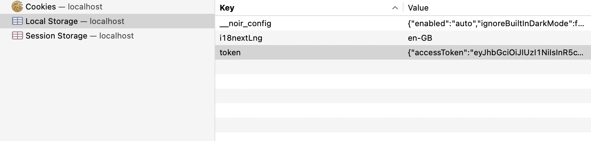
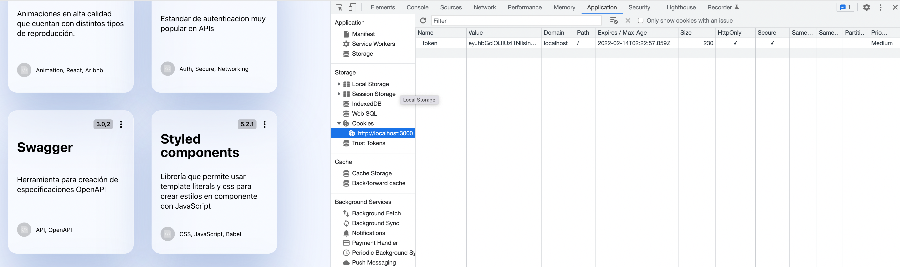

# JWT

Hasta el momento, hemos usado para securizar la comunicaciíon entre el *frontend* y el *backend* [JWT](../backend/jwt). Como vimos, al autenticar nuestro usuario mediante *email* y *contraseña*, el *backend* generaba un *token de sesión* que el *frontend* almacenaba mediante [local storage](https://developer.mozilla.org/en-US/docs/Web/API/Window/localStorage).



El problema es que usar **JWT** para el control de sesiones tiene [múltiples problemas](http://cryto.net/~joepie91/blog/2016/06/13/stop-using-jwt-for-sessions/), entre ellos que si te roban el token, pueden **controlar tu sesión** hasta que ese mismo token expire. *Local Storage* es una propiedad del navegador relativamente insegura, ya que es vulnerable a [XSS](https://owasp.org/www-community/attacks/xss/) y el backend no tiene control de esta información, por lo que no puede acutalizar los valores una vez que han sido almacenados.

## Opiones a considerar

Una vez que hemos decidido mover los *JWT* del *local storage* tenemos que considerar las opciones que tenemos:

* Memoria "en caliente": Sería la opción más segura, ya que estaríamos usando los estados de *React*. El problema es que cada vez que se recarga la página, se cierra la pestaña o se utilizan pestañas diferentes la sesión cambiaría.
* Cookie HttpOnly: Al igual que *local storage* es vulnerable a ataques [CRSF](https://owasp.org/www-community/attacks/csrf), pero hay una diferencia fundamental, si un atacante accede a *local storage* puede leer el token de sesión con *JavaScript* pero con la *Cookie HttpOnly* solo podría hacer llamadas al backend pero no podría leer ese token.

Al final, si queremos estar casi completamente seguros lo ideal sería no almacenar el token, pero claro, eso genera muchas fricciones en la funcionalidad. Es por ello, pese a que presente también varios problemas, el usar una *Cookie HTTP* hace que nuestro proyecto esté protegido antes ataques masivos en los que quieran leer tokens de sesión mediante local storage, además añadiendo ciertas cabeceras a nuestra *Cookie* podemos reducir bastante el riesgo y los vectores de ataque en general.

## Cookie HttpOnly

Ya hemos decidido usar una *Cookie HttpOnly*, ahora tenemos que implementarlo en nuestro proyecto. El funcionamiento de esta misma es el siguiente: Al realizar un log in correcto, las cookies se almacenan en el navegador si la *respuesta HTTP* contiene la cabecera `Set-Cookie`. Esta cabecera tiene una cadena de claves y valores junto a una serie de ajustes adicionales para las *cookies*.

Lo primero que haremos es instalar la librería *cookie-parser* en nuestro *backend* ejecutando `npm i cookie-parser`. Esto hará que sea luego fácil leer la cookie que venga de las request de nuestro *frontend*. Ahora vamos a cambiar la respuesta de nuestro backend para que en vez de devolver el token en la cabecera lo devuelva en una cookie.

```ts title="backend/src/components/Auth/index.ts"
export async function login(
  req: Request,
  res: Response,
  next: NextFunction
): Promise<void> {
  try {
    const user: IUserModel = await AuthService.getUser(req.body);

    const token: string = jwt.sign(
      { id: user._id, email: user.email },
      app.get("secret"),
      {
        expiresIn: "60m",
      }
    );

    res.cookie("token", token, {
      expires: new Date(Date.now() + 60 * 60 * 1000),
      httpOnly: true,
      secure: true,
      sameSite: true,
    });

    res.status(HttpStatus.OK).send({
      token: token,
    });
  } catch (error) {
    if (error.code === 500) {
      return next(new HttpError(error.message.status, error.message));
    }
    res.status(HttpStatus.BAD_REQUEST).send({
      message: "Invalid Login",
    });
  }
}
```

Con esto creamos una *Cookie* que tiene una fecha de expiración igual a nuestro *JWT*, así caducarán al mismo tiempo. Además, la cabecera `httpOnly` hace que sea imposible de leer mediante JavaScript, `Secure` indica que solo se puede enviar con conexiones cifradas como *HTTPS*, y `SameSite` es una cabecera que protege de ataques de *CRSF*, al indicar que solo puede provenir de peticiones lanzadas desde la misma *URL*.

### HTTP Proxy

Uno de los primeros cambios para nuestro desarrollo es añadir un proxy a nuestro frontend. En la fase de desarrollo, usamos el *frotnend* en el puerto *3000* y el *backend* en el puerto *4000* (según lo teníamos configurado en su [variable de entorno](../frontend/scaffolding#ficheros-de-configuración)). El problema es que una cookie necesita que las dos aplicaciones se ejecuten en el mismo puerto, esto es fácil usando un [proxy de las apis](https://create-react-app.dev/docs/proxying-api-requests-in-development/) en desarrollo. Solo tendremos que añadir la siguiente linea a nuestro *package.json* para habilitarlo.

```json title="ui/package.json"
{
  "name": "personal-portfolio-frontend",
  "version": "0.1.0",
  ...
  "proxy": "http://localhost:4000"
}
```

Además de esto, tendremos que eliminar el endpoint de nuestro fichero `.env` ya que ahora react será el que haga el proxy en desarrollo a la dirección que le hemos indicado.

```bash title="ui/.env"
REACT_APP_LOCALE=es-

REACT_APP_BASE_URI=
REACT_APP_API_URI=
```

### Añadir ruta logout

Al no poder leer el token con JavaScript se nos presenta un problema, ¿Cómo vamos a controlar el estado de nuestra aplicación?. Pues tenemos que hacer unos cuantos cambios para adaptarnos a las *Cookies HttpOnly*. El primero de ellos va a ser añadir una nueva ruta de logout en el *backend* ya que será el responsable de devolvernos una coockie vacia de nuevo para poder desautenticarnos completamente.

```ts title="backend/src/routes/AuthRouter.ts"
router.post('/logout', jwtConfig.isAuthenticated, AuthComponent.logout)
```

```tsx title="backend/src/components/Auth/index.tsx"
/**
 * @export
 * @param {Request} req
 * @param {Response} res
 * @param {NextFunction} next
 * @returns {Promise < void >}
 */
export async function logout(
  req: Request,
  res: Response,
  next: NextFunction
): Promise<void> {
  try {

    res.cookie("token", "none", {
      expires: new Date(Date.now() + 5 * 1000),
      httpOnly: true,
    });

    res.status(HttpStatus.OK).send({
      message: "User logged out successfully",
    });

  } catch (error) {
    if (error.code === 500) {
      return next(new HttpError(error.message.status, error.message));
    }
    res.status(HttpStatus.BAD_REQUEST).send({
      message: "Invalid Login",
    });
  }
}
```

Además tendremos que adaptar el middleware del backend para que acepte una cookie en vez de la cabecera *Authorization*.

```ts title="backend/src/config/middleware/jwtAuth.ts"
export function isAuthenticated(req: RequestWithUser, res: Response, next: NextFunction): void {

    const token: any = req.cookies.token;

    if (token) {
        try {
            const user: object | string = jwt.verify(token, app.get('secret'));

            req.user = user;

            return next();
        } catch (error) {
            return next(new HttpError(HttpStatus.UNAUTHORIZED, http.STATUS_CODES[HttpStatus.UNAUTHORIZED]));
        }
    }

    return next(new HttpError(HttpStatus.BAD_REQUEST, 'No token provided'));
}
```

### Adaptar auth frontend

Ahora vamos a cambiar un poco la lógica de nuestro *frontend*. Empezaremos cambiando la lógica de gestión de nuestro *JWT*. Ahora no almacenaremos el token, solamente el momento de expiración, el mail del usuario y su id, así podremos seguir utilizando la misma lógica pero sin el riesgo de que capturen nuestro token.

```ts title="ui/src/utils/auth.ts"
interface UserToken {
  id: string;
  email: string;
  notBeforeTimestampInMillis: number;
  expirationTimestampInMillis: number;
}

interface JWTPayload {
  _id: string;
  email: string;
  iat: number;
  exp: number;
}

class WrongCredentialsException extends Error {}

let logoutIfExpiredHandlerId: NodeJS.Timeout;

export function setLogoutIfExpiredHandler(
    setUser: (user: any) => void
) {
  if (!isUserActive()) {
    return;
  }
  const token = getUserStorage();
  if (!token) {
    return;
  }

  logoutIfExpiredHandlerId = setTimeout(
    () => setUser(undefined),
    token.expirationTimestampInMillis - Date.now()
  );
}

export function setUserToken(accessToken: string) {
   
  const tokenPayload = getPayload(accessToken);
  const token: UserToken = {
    id: tokenPayload._id,
    email: tokenPayload.email,
    notBeforeTimestampInMillis: tokenPayload.iat * 1000,
    expirationTimestampInMillis: tokenPayload.exp * 1000,
  };
  localStorage.setItem(userKey, JSON.stringify(token));
}

async function logout() {
  try {
    if(isUserActive()){
      const api = createApiClient();
      await api.logout();
    }
    removeUser();
    clearTimeout(logoutIfExpiredHandlerId);
  } catch (error) {
    console.log("Error in logout")
  }
}

function getPayload(token: string): JWTPayload {
  return jwt_decode(token);
}

export function removeUser() {
  localStorage.removeItem(userKey);
}

function getUserStorage(): UserToken | null {
  let user: UserToken;
  const userJson = localStorage.getItem(userKey);
  if (userJson) {
    user = JSON.parse(userJson);
    return user;
  }
  return null;
}

export function getCurrentUser(): User | undefined {
  const user = getUserStorage();
  if (user) {
    if (!isUserActive()) {
      logout();
      return undefined;
    }
    return {
      _id:  user.id,
      active: true,
      email: user.email
    };
  } else {
    return undefined;
  }
}

function isUserActive(): boolean {
  const user = getUserStorage();
  const currentTimestamp = Date.now();

  return !!(
    user &&
    user.expirationTimestampInMillis - currentTimestamp > 0 &&
    user.notBeforeTimestampInMillis <= currentTimestamp
  );
}

export { WrongCredentialsException, logout, isUserActive };
```

## Modificar los endpoints

También eliminaremos la cabecera *Authorization* de todas las llamadas de nuestra API, ya que ahora automáticamente se mandará la cookie de sesión con nuestras peticiones. Por otro lado añadiremos el endpoint `logout` para poder notificar al backend y que éste elimine la *cookie*.

```ts title="ui/src/api/http-api-client.ts"
async logout(): Promise<void> {
    const response = await fetch(this.baseUrl + "/auth/logout", {
      method: "POST",
    });
    if (!response.ok) {
      throw await createApiError(response);
    }
    return response.json();
}
```

Ahora podemos probar nuestra conexión, limpiaremos los valores de *local storage* para dejar la webapp vacía y probaremos a realizar un nuevo *login*. Una vez hecho, al inspeccionar las *cookies* con nuestras *dev tools* podremos ver que nuestro navegador ahora tiene la cookie almacenada.


