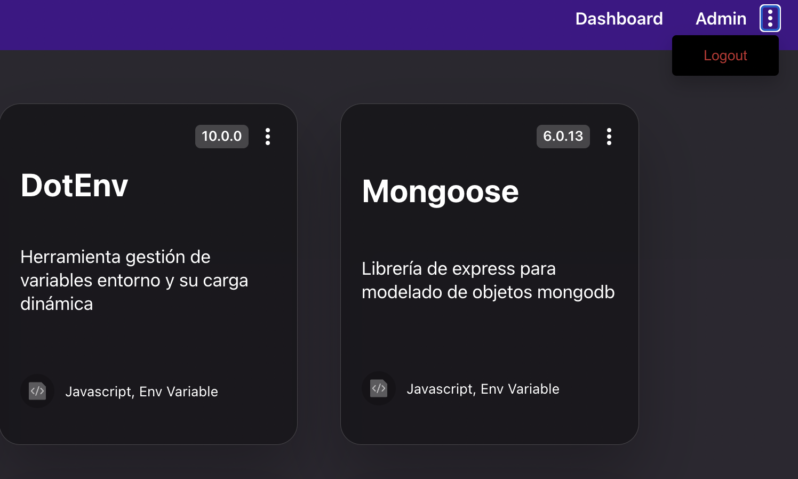

# Logout

Aprovechando que en la sección anterior hemos creado un endpoint para finalizar nuestra sesión, vamos a adaptar nuestro *frontend* para tener un botón que admita esta funcionalidad.

## Menú desplegable

Ya que tenemos el proyecto relativamente avanzado, vamos a aprovechar y reutilizar lo máximo posible. Teníamos en nuestros *ProjectCard* un menú desplegable que hacía uso del `useToggle()`. El problema es que ese componente está acoplado dentro de *ProjectCard*, pero eso tiene fácil solución.

Lo primero es crear un nuevo componente funcional llamado `MenuButton.tsx`, que va a necesitar la siguiente información:

* Si el menú está visible.
* La acción de ocultar/mostrar el menú.
* Los botones del menú desplegable, en este caso tendrán una etiqueta, un indicador de si tiene el estilo de warning y la acción.

Moviendo rápidamente los componentes nos quedamos con la siguiente función:

```tsx title="ui/src/components/elements/MenuButton.tsx"
interface MenuButtonProps {
  isVisible: Boolean;
  toggle: () => void;
  actions: Array<MenuAction>;
  xAxis?: number;
  yAxis?: number;
  dotButtonColorLight?: Boolean;
}

export interface MenuAction {
  title: string;
  isWarning: boolean;
  action: (e: React.MouseEvent<HTMLElement>) => void;
}

export function MenuButton(props: MenuButtonProps) {
  const toggleMenu = (element: React.MouseEvent<HTMLElement>) => {
    element.preventDefault();
    element.stopPropagation();
    props.toggle();
  };

  return (
    <>
      <KebabButton
        onClick={(e: React.MouseEvent<HTMLElement>) => toggleMenu(e)}
      >
        <KebabDot dotButtonColorLight={props.dotButtonColorLight} />
        <KebabDot dotButtonColorLight={props.dotButtonColorLight} />
        <KebabDot dotButtonColorLight={props.dotButtonColorLight} />
      </KebabButton>
      {props.isVisible && (
        <>
          <MenuDropDownOverlay onClick={toggleMenu} />
          <MenuDropDown xAxis={props.xAxis} yAxis={props.yAxis}>
            {props.actions.map((action, index) => (
              <MenuDropDownItem
                isWarning={action.isWarning}
                onClick={action.action}
                key={index}
              >
                {action.title}
              </MenuDropDownItem>
            ))}
          </MenuDropDown>
        </>
      )}
    </>
  );
}


const KebabButton = styled.button`
  border: none;
  background: none;
  margin-left: 10px;
  cursor: pointer;
`;

interface KebabDotProps {
  dotButtonColorLight?: Boolean;
}

const KebabDot = styled.div<KebabDotProps>`
  width: 4px;
  height: 4px;
  border-radius: 2px;
  background: ${(props) => (props.dotButtonColorLight ? themes.dark.text1 : themes.light.text1)};
  margin: 2px 0;

  @media (prefers-color-scheme: dark) {
    background: ${themes.dark.text1};
  }
`;

interface MenuDropDownProps {
  xAxis?: number;
  yAxis?: number;
}

const MenuDropDown = styled.div<MenuDropDownProps>`
  position: absolute;

  right: ${(props) => props.xAxis ? `${props.xAxis}px` : "6px"};
  top: ${(props) => props.yAxis ? `${props.yAxis}px` : "30px"};

  border-radius: 4px;
  background-color: ${themes.light.card.backgroundColorFull};
  box-shadow: 0px 8px 16px 0px rgba(0, 0, 0, 0.2);
  display: flex;
  flex-direction: column;
  z-index: 2;

  @media (prefers-color-scheme: dark) {
    background-color: ${themes.dark.card.backgroundColorFull};
  }
`;

const MenuDropDownOverlay = styled.div`
  position: absolute;
  width: 100%;
  height: 100%;
  z-index: 2;
  opacity: 0;
`;

interface MenuDropDownItemProps {
  isWarning: Boolean;
}

const MenuDropDownItem = styled.button<MenuDropDownItemProps>`
  height: 26px;
  width: 100px;
  border: none;
  background: none;
  margin: 6px 0px;
  cursor: pointer;
  color: ${(props) =>
    props.isWarning ? themes.light.warning : themes.light.text1};

  @media (prefers-color-scheme: dark) {
    color: ${(props) =>
      props.isWarning ? themes.light.warning : themes.dark.text1};
  }
`;
```

Básicamente es la lógica que teníamos ya implementada, pero ahora desacoplada del componente padre, que se quedaría de la siguiente manera:

```tsx title="ui/src/components/cards/ProjectCard.tsx"
  ...
    <CardInfo>
      <CardVersion>
        <CardVersionText>{project.version}</CardVersionText>
      </CardVersion>
      {user && (
        <MenuButton
          isVisible={isVisible}
          toggle={toggle}
          actions={
            [{ title: "Update", isWarning: false, action: (e: React.MouseEvent<HTMLElement>) => {
              props.updateButton(e, project);
            }},
            { title: "Delete", isWarning: true, action: (e: React.MouseEvent<HTMLElement>) => {
              props.closeButton(e, project._id ?? "");
              toggle();
            }}]
          }
        />
      )}
    </CardInfo>
  ...
```

## Navbar

Ahora podemos reutilizar nuestro componente en la navbar de una forma sencilla. Básicamente vamos a coger el componente `MenuButton`, lo vamos a añadir al *header* de la aplicación y le vamos a añadir una nueva acción de `logout` que básicamente llama a la funcionalidad *logout* que hemos creado en el apartado anterior.

```tsx title="ui/src/components/layout"
const Header = () => {
  const { t } = useTranslation();
  const { user, logout } = useAuth();

  const [isVisible, toggle] = useToggle(false);

  return (
    <Wrapper>
      <Link to={home.link}>
        <LinkButton>{t(home.title)}</LinkButton>
      </Link>
      <LogoutWrapper>
        <MenuWrapper count={menuData.length}>
          {menuData.map((item, index) => (
            <Link to={item.link} key={index}>
              <LinkButton>{t(item.title)}</LinkButton>
            </Link>
          ))}
        </MenuWrapper>
        {user && (
          <MenuButton
            isVisible={isVisible}
            toggle={toggle}
            actions={[
              {
                title: "Logout",
                isWarning: true,
                action: (e: React.MouseEvent<HTMLElement>) => {
                  logout();
                  toggle();
                },
              },
            ]}
            xAxis={30}
            yAxis={46}
          />
        )}
      </LogoutWrapper>
    </Wrapper>
  );
};
```


