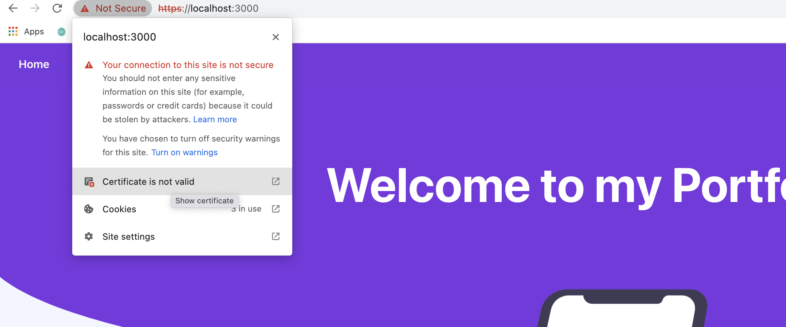

# Cambios en Node

## Rate Limit

Ahora vamos a añadir una nueva configuración a nuestro *backend* para limitar la cantidad de llamadas que pueden realizarse mediante un cliente a un endpoint determinado. Vamos a utilzar una librería llamada [express-rate-limit](https://github.com/nfriedly/express-rate-limit) ejecutando en el backend `npm install express-rate-limit` (acuerdate de estar primero en el directorio del backend `cd backend`).

Una vez hecho esto solo tendremos que añadir la configuración al middleware con los atributos que nos interese, en nuestro caso tener una ventana de 15 minutos, limitar a cada ip con 100 peticiones cada 15 minutos y que devuelva en las cabeceras el límite que queda.

```ts title=""
const limiter = rateLimit({
  windowMs: 15 * 60 * 1000, // 15 minutes
  max: 100, // Limit each IP to 100 requests per `window` (here, per 15 minutes)
  standardHeaders: true, // Return rate limit info in the `RateLimit-*` headers
  legacyHeaders: false, // Disable the `X-RateLimit-*` headers
})

/**
 * @export
 * @param {express.Application} app
 */
export function configure(app: express.Application): void {
    // express middleware
    app.use(
        bodyParser.urlencoded({
            extended: false,
        })
    );
    app.use(bodyParser.json());
    // parse Cookie header and populate req.cookies with an object keyed by the cookie names.
    app.use(cookieParser());
    // returns the compression middleware
    app.use(compression());
    // helps you secure your Express apps by setting various HTTP headers
    app.use(helmet());
    // providing a Connect/Express middleware that can be used to enable CORS with various options
    app.use(cors({
        exposedHeaders: ['Authorization'],
        optionsSuccessStatus: HttpStatus.OK,
    }));

    // Apply the rate limiting middleware to all requests
    app.use(limiter)

    // custom errors
    app.use(sendHttpErrorModule);
}
```

Ahora al hacer peticiones podremos ver en la cabecera el límite y las peticiones restantes que nos quedan.


## Helmet

Pese a que esta libería ya venía instalada de antes (sinceramente, se me olvidó eliminarla para poder incluirla en esta sección), vamos a hablar un poco de su funcionamiento. Básicamente añadiendo una línea de código en nuestra aplicación:

```ts
app.use(helmet())
```

Nos va a añadir 11 paquetes que ayudará a nuestra aplicación a bloquear código malicioso, vamos a comentar algunas de las librerías.

* **helmet-csp:** Habilita la cabecera *Content-Security-Policy HTTP*. Esta cabecera define los orígenes de confianza del contenido (como scripts, imágenes y otros tipos de contenidos) que son permitidos por nuestra webapp.

* **dns-prefetch-control:** El pre-fetching de DNS suele ser bueno para acelerar los tiempos de carga. Al desahibiltar el pre-fecthing podemos limitar información sensible acerca de servicios externos usados por nuestra webapp.

* **frameguard:** Habilita la cabecera *X-Frame-Options HTTP*. Esta cabecera bloquea los intentos de *clickjacking* para deshabilitar la opción de que la página se renderice en algún otro sitio.

* **hpkp:** Añade cabeceras para *Public Key Pinning*, que básicamente ayudan a prevenir ataques de *Man In The Middle* con certificados falsos.

* **hsts:** Habilita la cabecera *Sctrict-Transport-Security*, que fuerza todas las conexiones a realizarse sobre HTTPs.

Si queréis consultar todas las librerías, las tenéis recogidas junto a las cabeceras que añaden en el [repositorio oficial](https://github.com/helmetjs/helmet).

## Forzar http en desarrollo

Podemos probar si nuestra aplicación funciona correctamente mediante *https* levantando el entorno de desarrollo con *https* habilitado. Para ello solo tendremos que ejecutar `HTTPS=true npm start` o añadir un nuevo comando a nuestro `package.json`. Al hacerlo levantaremos nuestro entorno usando *https*, aunque sea con un certificado invalido

```json title="ui/package.json"
{
  ...
  "scripts": {
    "start": "react-scripts start",
    "build": "react-scripts build",
    "test": "react-scripts test",
    "eject": "react-scripts eject",
    "start-secure": "HTTPS=true npm start"
  },
  ...
}
```


