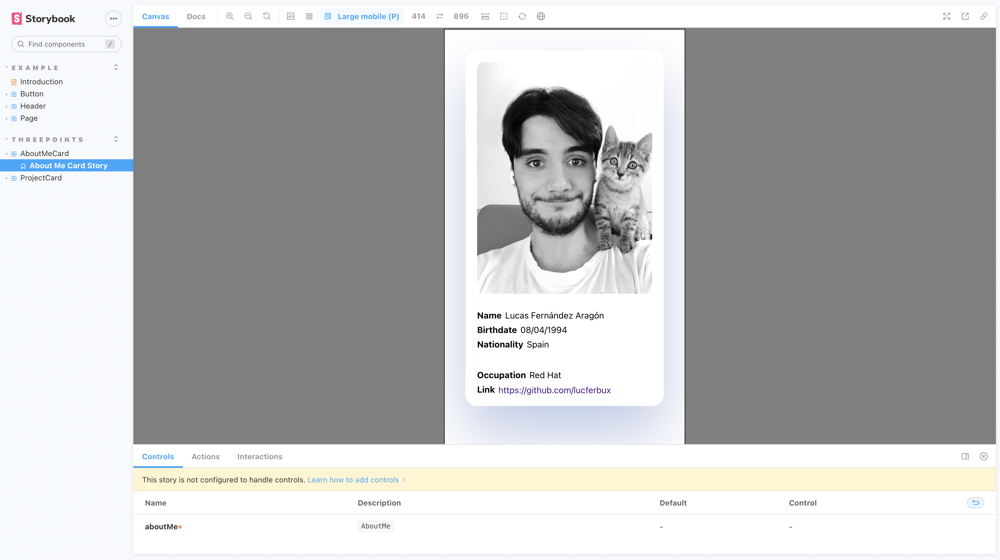
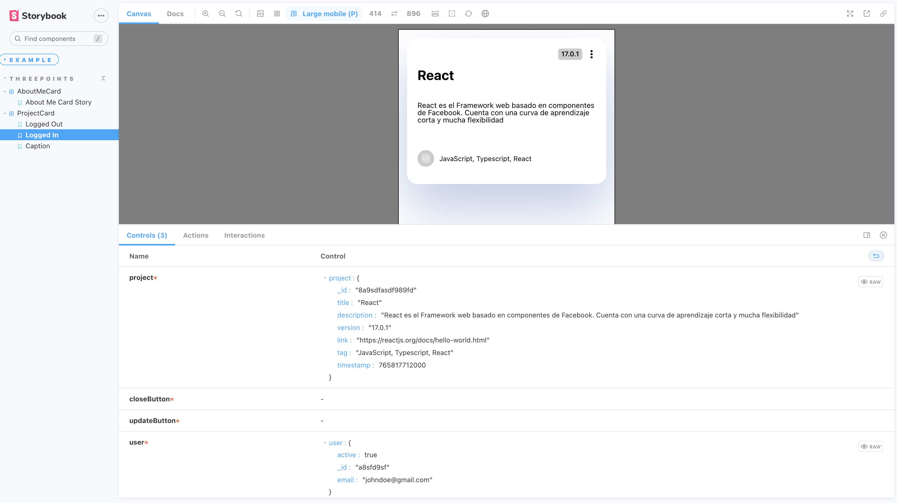

# Storybook

Por último vamos a hablar de Storybook. Storybook es una herramienta *open source* que nos permite desarrollar componentes y páginas de forma aislada, permitiendo probar atributos como *props*, *estado*, *ciclos de vida*...

## Instalación

Primero tenemos que instalar *Storybook* en nuestro proyecto. Para ello la herramienta cuenta con una utilidad para instalar sus dependencias y comandos de forma sencilla. Solo tenemos que ejecutar `npx sb init` dentro de la carpeta `ui` y seguir las instrucciones para instalarlo.

Una vez completado, vamos a comprobar que todo funciona correctamente ejecutando el comando `npm run storybook` y añadiendo un nuevo *PHONY target* a nuestro fichero *Make*. Una vez ejecutado podremos ver los ejemplos por defecto.


## Añadir un nuevo componente

Podemos añadir nuevos componentes en cualquier parte de nuestro proyecto creando un nuevo fichero con la extensión `.storyboard.tsx`. Vamos a probar a replicar el componente *AboutMeCard*, para ello crearemos un nuevo fichero llamado `AboutMeCard.storyboard.tsx` en el mismo directorio y añadiremos lo siguiente

```ts title="ui/src/components/cards/AboutMeCard.storyboard.tsx"
import React from "react";
import { ComponentStory, ComponentMeta } from "@storybook/react";

import AboutMeCard from "./AboutMeCard";

export default {
  title: "ThreePoints/AboutMeCard",
  component: AboutMeCard,
} as ComponentMeta<typeof AboutMeCard>;

export const AboutMeCardStory: ComponentStory<typeof AboutMeCard> = () => {
  const aboutMe = {
    _id: "8a9sdfasdf989fd",
    name: "Lucas Fernández Aragón",
    birthday: 765817712000,
    nationality: "Spain",
    job: "Red Hat",
    github: "https://github.com/lucferbux",
  };

  return <AboutMeCard aboutMe={aboutMe} />;
};
```

Al hacerlo, automáticamente nos aparecerá un nuevo componente en nuestro libro. Aunque tenemos que hacer algunos ajustes más para que funcione correctamente. Primero tenemos que dar soporte a `i18next` dentro de *storybook*. Para ello tenemos que instalar la siguiente dependencia: `npm i -D storybook-react-i18next` y añadir los siguientes archivos a la carpeta `.storyboard`.

```js title="main.js"
module.exports = {
  "stories": [
    "../src/**/*.stories.mdx",
    "../src/**/*.stories.@(js|jsx|ts|tsx)"
  ],
  "addons": [
    "@storybook/addon-links",
    "@storybook/addon-essentials",
    "@storybook/addon-interactions",
    'storybook-react-i18next',
  ],
  "framework": "@storybook/react"
}
```

```js title="i18next.js"
import i18n from "i18next";
import { initReactI18next } from "react-i18next";
import LanguageDetector from 'i18next-browser-languagedetector';

import enus from "../src/locales/en-us.json";
import eses from "../src/locales/es-es.json";


const resources = {
    en: {
        translation: enus
    },
    es: {
        translation: eses
    }
};

i18n
    .use(LanguageDetector)
    .use(initReactI18next) // passes i18n down to react-i18next
    .init({
        resources: resources,
        fallbackLng: 'en',

        interpolation: {
            escapeValue: false, // not needed for react as it escapes by default
        }
    });

export default i18n;
```

```js title="preview.js"
import {i18n} from './i18next.js';

export const parameters = {
  actions: { argTypesRegex: "^on[A-Z].*" },
  i18n,
  locale: 'en',
  locales: {
    en: 'English',
    es: 'Spanish',   
  },
  controls: {
    matchers: {
      color: /(background|color)$/i,
      date: /Date$/,
    },
  },
}
```

Con esto conseguiremos visualizar correctamente nuestro componente.



## Componente con diferentes argumentos

Ahora vamos a explorar un componente más complejo. Vamos a utilizar `ProjectCard` como ejemplo para ver como crear variaciones del `ComponentStory` dependiendo de los argumentos.

```tsx title="ui/src/components/cards/ProjectCard.stories.tsx"
export default {
  title: "ThreePoints/ProjectCard",
  component: ProjectCard,
} as ComponentMeta<typeof ProjectCard>;

const project: Project = {
  _id: "8a9sdfasdf989fd",
  title: "React",
  description: "React es el Framework web basado en componentes de Facebook. Cuenta con una curva de aprendizaje corta y mucha flexibilidad",
  version: "17.0.1",
  link: "https://reactjs.org/docs/hello-world.html",
  tag: "JavaScript, Typescript, React",
  timestamp: 765817712000
};

const userLoggged: User = { active: true, _id: "a8sfd9sf", email: "johndoe@gmail.com" }

const Template: ComponentStory<typeof ProjectCard> = (args) => <ProjectCard {...args} />;

export const LoggedOut = Template.bind({});
LoggedOut.args = {
  project: project,
  closeButton: () => {},
  updateButton: () => {},
  user: undefined
}

export const LoggedIn = Template.bind({});
LoggedIn.args = {
  project: project,
  closeButton: () => {},
  updateButton: () => {},
  user: userLoggged
}

export const Caption = Template.bind({});
Caption.args = {
  project: project,
  closeButton: () => {},
  updateButton: () => {},
  user: undefined,
  captionText: "New version"
}
```

Como podemos observar, ahora vamos a ir cambiando los argumentos que se pasarán como props para observar como reacciona nuestro componente. Así podremos desde la UI de Storyboard hacer testing visual dependiendo de *estados*, *acciones* y *props*.


