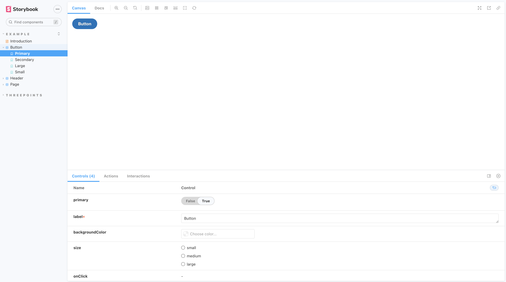

# Storybook

Por último vamos a hablar de Storybook. Storybook es una herramienta *open source* que nos permite desarrollar componentes y páginas de forma aislada, permitiendo probar atributos como *props*, *estado*, *ciclos de vida*...
Es una gran herramienta para complementar nuestro stack de testing y añadir una capa de documentación a nuestros components.

## Instalación

Primero tenemos que instalar *Storybook* en nuestro proyecto. Para ello la herramienta cuenta con una utilidad para instalar sus dependencias y comandos de forma sencilla. Solo tenemos que ejecutar `npx sb@next init --builder=vite` dentro de la carpeta `ui` y seguir las instrucciones para instalarlo.

Una vez completado, vamos a comprobar que todo funciona correctamente ejecutando el comando `npm run storybook` y añadiendo un nuevo *PHONY target* a nuestro fichero *Make*. Una vez ejecutado podremos ver los ejemplos por defecto.



## Añadir un nuevo componente

Para empezar a añadir componentes a **Storyboard**, se recomienda usar el [Component Story Format](https://storybook.js.org/docs/7.0/react/api/csf) (CSF), que es un estandard abierto basado en módulos ES6.

Podemos añadir nuevos componentes en cualquier parte de nuestro proyecto creando un nuevo fichero con la extensión `.storyboard.tsx`. Las stories por defecto van a tener dos componentes principales, **Meta**, que contendrá los metadatos de la Story y **StoryObj** que definirá el objeto a partir de los metadatos.

```ts title="ui/src/components/cards/AboutMeCard.storyboard.tsx"
import type { Meta, StoryObj } from '@storybook/react';

import AboutMeCard from './AboutMeCard';

const meta: Meta = {
  title: 'ThreePoints/AboutMeCard',
  component: AboutMeCard,
  tags: ['autodocs'],
  parameters: {
    layout: 'centered'
  }
} satisfies Meta<typeof AboutMeCard>;

export default meta;
type Story = StoryObj<typeof meta>;

export const Primary: Story = {
  args: {
    aboutMe: {
      _id: '8a9sdfasdf989fd',
      name: 'Lucas Fernández Aragón',
      birthday: 765817712000,
      nationality: 'Spain',
      job: 'Red Hat',
      github: 'https://github.com/lucferbux'
    }
  }
};
```

Al hacerlo, automáticamente nos aparecerá un nuevo componente en nuestro libro. Aunque tenemos que hacer algunos ajustes más para que funcione correctamente. Primero tenemos que dar soporte a `i18next` dentro de *storybook*. Para ello tenemos que instalar la siguiente dependencia: `npm i -D storybook-react-i18next` y añadir los siguientes archivos a la carpeta `.storyboard`.

```js title="main.ts"
import type { StorybookConfig } from "@storybook/react-vite";
const config: StorybookConfig = {
  stories: ["../src/**/*.mdx", "../src/**/*.stories.@(js|jsx|ts|tsx)"],
  addons: [
    "@storybook/addon-links",
    "@storybook/addon-essentials",
    "@storybook/addon-interactions",
  ],
  framework: {
    name: "@storybook/react-vite",
    options: {},
  },
  docs: {
    autodocs: "tag",
  },
};
export default config;
```

```js title="i18next.ts"
import i18n from "i18next";
import { initReactI18next } from "react-i18next";
import LanguageDetector from 'i18next-browser-languagedetector';

import enus from "../src/locales/en-us.json";
import eses from "../src/locales/es-es.json";


const resources = {
    en: {
        translation: enus
    },
    es: {
        translation: eses
    }
};

i18n
    .use(LanguageDetector)
    .use(initReactI18next) // passes i18n down to react-i18next
    .init({
        resources: resources,
        fallbackLng: 'en',

        interpolation: {
            escapeValue: false, // not needed for react as it escapes by default
        }
    });

export default i18n;
```

```js title="preview.ts"
import type { Preview } from "@storybook/react";
import i18n from './i18next.js';
import '../src/main.css';

const preview: Preview = {
  parameters: {
    backgrounds: {
      default: "light",
    },
    i18n,
    locale: 'en',
    locales: {
      en: 'English',
      es: 'Spanish',   
    },
    actions: { argTypesRegex: "^on[A-Z].*" },
    controls: {
      matchers: {
        color: /(background|color)$/i,
        date: /Date$/,
      },
    },
  },
};

export default preview;
```

Con esto conseguiremos visualizar correctamente nuestro componente.


## Componente con diferentes argumentos

Ahora vamos a explorar un componente más complejo. Vamos a utilizar `ProjectCard` como ejemplo para ver como crear variaciones del `ComponentStory` dependiendo de los argumentos.

```tsx title="ui/src/components/cards/ProjectCard.stories.tsx"
import type { Meta, StoryObj } from '@storybook/react';
import ProjectCard from './ProjectCard';

import { Project } from '../../model/project';
import { User } from '../../model/user';

const project: Project = {
  _id: '8a9sdfasdf989fd',
  title: 'React',
  description:
    'React es el Framework web basado en componentes de Facebook. Cuenta con una curva de aprendizaje corta y mucha flexibilidad',
  version: '17.0.1',
  link: 'https://reactjs.org/docs/hello-world.html',
  tag: 'JavaScript, Typescript, React',
  timestamp: 765817712000
};

const userLoggged: User = {
  active: true,
  id: 'a8sfd9sf',
  email: 'johndoe@gmail.com'
};

const meta: Meta = {
  title: 'ThreePoints/ProjectCard',
  component: ProjectCard,
  tags: ['autodocs'],
  parameters: {
    layout: 'padded'
  }
} satisfies Meta<typeof ProjectCard>;

export default meta;
type Story = StoryObj<typeof meta>;

export const LoggedOut: Story = {
  args: {
    project: project,
    closeButton: () => {},
    updateButton: () => {},
    user: undefined
  }
};

export const LoggedIn: Story = {
  args: {
    project: project,
    closeButton: () => {},
    updateButton: () => {},
    user: userLoggged
  }
};

export const Caption: Story = {
  args: {
    project: project,
    closeButton: () => {},
    updateButton: () => {},
    user: undefined,
    captionText: 'New version'
  }
};
```

Como podemos observar, ahora vamos a ir cambiando los argumentos que se pasarán como props para observar como reacciona nuestro componente. Así podremos desde la UI de Storyboard hacer testing visual dependiendo de *estados*, *acciones* y *props*.


