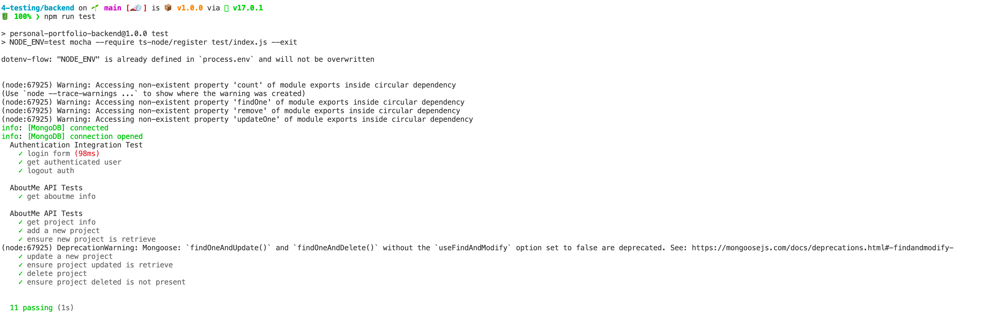

# Testing Backend

Para realizar tests de integración en el *BackEnd* y poder probar todos nuestros endpoinst vamos a hacer uso de tres librerías diferentes: *Mocha*, para crear el entorno de los tests, *Chai*, para los *asserts* y *Supertest*, para realizar las peticiones *http*.
La configuración es relativamente sencilla, aunque ya la hemos realizado *previamente en el proyecto principal*, sería instalar las dependencias, añadir un nuevo script para test en nuestro *package.json*, `"test": "NODE_ENV=test mocha --require ts-node/register test/index.js --exit",` y por ultimo crear la carpeta `test` donde almacenar la lógica de nuestros tests.

## Ejecutar Tests en Node

Lo primero de todo, es que si nos fijamos bien en el script de testing, `NODE_ENV=test mocha --require ts-node/register test/index.js --exit`, estamos directamente indicando a *mocha* el fichero de entrada de nuestros test, en nuestro caso `test/index.js`, vamos a ver qué incluye.

```js title="backend/test/index.js"
const alias = require('module-alias');
alias.addAliases({
    '@': __dirname + '/../src'
});

require('./setup');
require('./authIntegration');
require('./aboutMeIntegration');
require('./projectIntegration');
```

Básicamente hemos creado un alias para poder importar los archivos que tienen la notación moderna de *ES* y a parte todos los ficheros de nuestros test, importados en orden de ejecución, esto va a ser importante, porque nos interesa que nuestro pirmer test sea `setup.js`

```js title="backend/test/setup.js"

   
const UserModel = require("../src/components/User/model").default;
const ProjectModel = require("../src/components/Projects/model").default;
const AboutMeModel = require("../src/components/AboutMe/model").default;
const AuthService = require("../src/components/Auth/service").default;


const user = require("./fixtures/user.json");
const aboutme = require("./fixtures/aboutme.json");
const projects = require("./fixtures/projects.json");

const chai = require("chai");

// Assertion style
chai.should();

before("setup database", async () => {
  try {
    await UserModel.deleteMany({});
    await ProjectModel.deleteMany({});
    await AboutMeModel.deleteMany({});
  } catch (error) {
    console.error("Error Deletion AboutMe API Test");
    console.error(error);
  }

  try {
    await AuthService.createUser(user);
    await AboutMeModel.create(aboutme);
    await ProjectModel.create(projects);
  } catch (error) {
    console.error("Error Insertion AboutMe API Test");
    console.error(error);
  }
});
```

Básicamente aquí estamos haciendo uso de los [hooks](https://mochajs.org/#hooks) de *mocha* para ejecutar código antes de cualquier test. Así podemos añadir a nuestra base de datos los *datos mocks* que necesitemos y siempre tener el estado ideal al inicio de nuestros tests. Además, vamos a inicializar *chai* con el tipo *assertion*.

Para empezar a probar los endpoints que hemos creado, vamos a finjarnos en el ejemplo de api de autenticación.

```js title="backend/test/authentication.js"
const request = require("supertest");

const app = require("../src/config/server/server").default;

const user = require("./fixtures/user.json");

/**
 * storing globals to access them in API requests
 */
 global.token = "";

describe("Authentication Integration Test", () => {
  it("login form", (done) => {
    request(app)
      .post("/auth/login")
      .type("form")
      .send(user)
      .expect((res) => {
        res.status.should.equal(200);
        res.body.token.should.be.a("string");
        global.token = res.body.token;
      })
      .end(done);
  });

  it("get authenticated user", (done) => {
    request(app)
      .get("/v1/users/")
      .set("Cookie", [`token=${global.token}`])
      .expect((res) => {
        res.status.should.equal(200);
        res.body.should.not.null;
        res.body.length.should.be.above(0);
        res.body[0].email.should.equal(user.email);
      })
      .end(done);
  });

  it("logout auth", (done) => {
    request(app)
      .post("/auth/logout")
      .expect((res) => {
        res.status.should.equal(200);
        res.body.message.should.be.a("string");
      })
      .end(done);
  });
});
```

Como podemos observar, realizamos la autenticación de formulario con un username/password mockeado para probar si efectivamente nuestro backend está aceptando las conexiones.

En este caso estamos realizando peticiones con *supertest*, como podemos ver en `request(app).post("/auth/login")` y luego comprobando si el resultado es correcto con *chai* como podemos ver en `res.status.should.equal(200);`. Esta es la dinámica que vamos a seguir en todos los test de integración que realicemos de la api.

Ahora solo tendremos que ejecutar `npm run test` para ver si nuestros tests se ejecutan correctamente.


