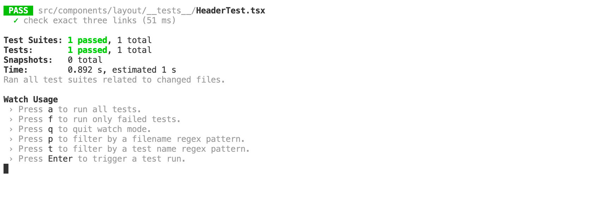

# Testing FrontEnd

Ahora vamos a hablar de *Jest* y *React Testing library*. Jest es una librería open source escrita en JavaScript, muy optimizada para apliaciones *React* que permite implementar *tests unitarios* y junto a *react-testing-library*, escribir test de integración en nuestro proyecto.

Ambas librerías vienen instaladas por defecto en nuestro proyecto, ya que lo creamos con la *toolchain* `create-react-app`. Ahora bien, si fuese necesario incluirlo, solo habría que ejecutar los siguientes comandos:

* `npm install --save-dev jest`
* `npm install --save-dev @testing-library/react`

## Ejecutar Tests en React

Para empezar a crear tests en react, solo tenemos que empezar a crear ficheros con una convención específica para que *create-react-app* identifique que son tests:

* Archivos con extensión `.ts` dentro de carpetas `__tests__`. (Puede haber tantas carpetas `__tests__` como queramos).
* Archivos con extensión `.test.ts`.
* Archivos con extensión `.spec.js`.

Desde la documentación oficial de *create-react-app* recomiendan utilizar la primera opción, mantener carpetas `__tests__` en los directorios donde estemos testeando nuestro código, así las importaciones se mantienen cortas. Vamos a crear un par de ejemplos para probar algunos componentes.

```ts title="ui/src/components/layouts/__tests__/HeaderTest.tsx"
import React from "react";
import Header from "../header";
import {render, fireEvent, screen} from '@testing-library/react';
import { MemoryRouter } from "react-router-dom";

jest.mock('react-i18next')

test('check exact three links', () => {
  render(
    <MemoryRouter>
      <Header />
    </MemoryRouter>
  
  )
  expect(screen.getAllByRole("link").length).toEqual(3);

  expect(screen.getByText("nav.home")).toBeInTheDocument();
  expect(screen.getByText("nav.dashboard")).toBeInTheDocument();
  expect(screen.getByText("nav.admin")).toBeInTheDocument();
})
```

Este ejemplo sencillo comprueba los tags que usamos con i18next para traducir nuestros textos. Comprueba que tengamos 3 links en la navbar y que cada uno tiene el tag que le corresponde. Al ejecutar `npm run test` tenemos lo siguiente.



Ya tenemos nuestro primer test, vamos a añadir unos cuantos componentes más para aumentar el coverage de nuestro proyecto.

```ts title="ui/src/components/card/__tests__/ProjectCardTests.tsx"
const projectMock: Project = {
  _id: "8a9sdfasdf989fd",
  title: "React",
  description: "React es el Framework web basado en componentes de Facebook. Cuenta con una curva de aprendizaje corta y mucha flexibilidad",
  version: "17.0.1",
  link: "https://reactjs.org/docs/hello-world.html",
  tag: "JavaScript, Typescript, React",
  timestamp: 765817712000
};

const userLogggedMock: User = { active: true, _id: "a8sfd9sf", email: "johndoe@gmail.com" }


const mockFeatured = "FEATURED";

test('Card Title', () => {
  const { getByText } = render(<ProjectCard project={projectMock} user={undefined} closeButton={() => {}} updateButton={() => {}}/>)
  expect(getByText(projectMock.title)).toBeInTheDocument();
})

test('Card Description', () => {
  const { getByText } = render(<ProjectCard project={projectMock} user={undefined} closeButton={() => {}} updateButton={() => {}}/>)
  expect(getByText(projectMock.description)).toBeInTheDocument();
})

test('Card Version', () => {
  const { getByText } = render(<ProjectCard project={projectMock} user={undefined} closeButton={() => {}} updateButton={() => {}}/>)
  expect(getByText(projectMock.version)).toBeInTheDocument();
})

test('Featured filled', () => {
  const { getByText } = render(<ProjectCard project={projectMock} user={undefined} captionText={mockFeatured} closeButton={() => {}} updateButton={() => {}}/>)
  expect(getByText(mockFeatured)).toBeInTheDocument();
})

test('Featured empty', () => {
  render(<ProjectCard project={projectMock} user={undefined} closeButton={() => {}} updateButton={() => {}}/>)
  expect(screen.getByTestId("caption").textContent).toBe("");
})

test('User logged', () => {
  render(<ProjectCard project={projectMock} user={userLogggedMock} closeButton={() => {}} updateButton={() => {}}/>)
  expect(screen.getByTestId("menuButton")).toBeInTheDocument();
})

test('Caption empty', () => {
  render(<ProjectCard project={projectMock} user={undefined} closeButton={() => {}} updateButton={() => {}} />)
  expect(screen.getByTestId("caption").textContent).toBe("");
})

test('External link', () => {
  render(<ProjectCard project={projectMock} user={undefined} closeButton={() => {}} updateButton={() => {}}/>)
  expect(screen.getByRole("link")).toHaveAttribute("href", projectMock.link);
})
```

Como podemos ver aquí tenemos un test más complejo, estamos haciendo uso de *mockData* para comprobar el estado del componente y hacemos uso de métodos como `getByTestId` para referenciar un elemento al que hayamos incluido el tag `data-testid`.

```tsx
<CardCaption data-testid="caption">
    {props.captionText ? props.captionText : ""}
</CardCaption>
```
